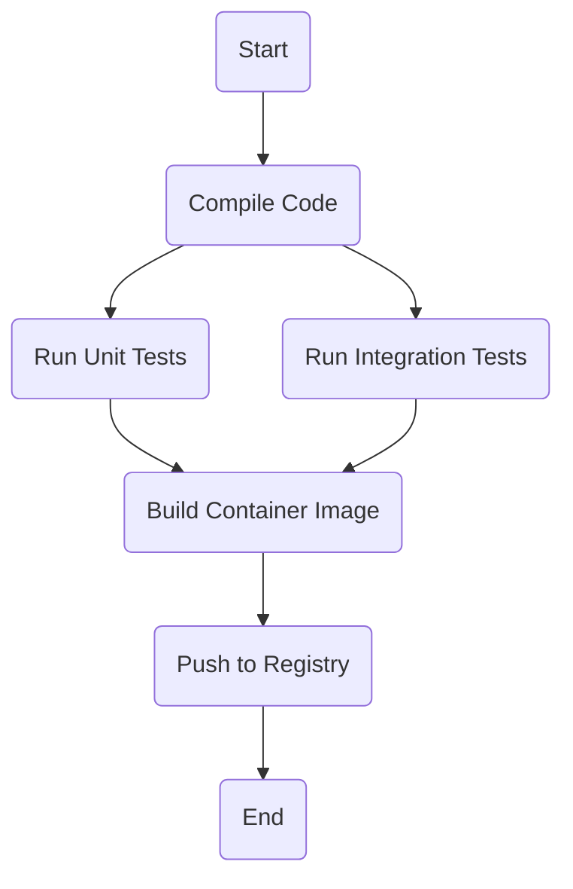

# Argo Workflows Exploration

[`Argo Workflows`](https://argoproj.github.io/argo-workflows/) is an open source container-native workflow engine for orchestrating parallel jobs on Kubernetes. Argo Workflows is implemented as a Kubernetes CRD (Custom Resource Definition).

## What is a Workflow Engine?

Think of a complex task, like building a piece of software. It involves several steps that must happen in a specific order: compile the code, run tests, build a container image, and then push that image to a registry. Some of these steps can even run in parallel.

A workflow engine is a tool that automates and manages this entire sequence. You define the steps and their dependencies, and the engine takes care of executing them in the correct order, handling failures, and providing visibility into the process.

Argo Workflows is special because it's designed to run on Kubernetes. Each step in a workflow is a container, which makes it incredibly flexible and scalable.

## How Argo Workflows Works

You define a `Workflow` as a series of steps in a YAML file. This `Workflow` is a custom Kubernetes resource. The Argo Workflows controller, running in your cluster, detects new `Workflow` resources and begins executing them.

*   **Workflow:** The definition of the entire process, including all steps and their relationships.
*   **Template:** A single step in the workflow. This can be a container to run, a script, or even another workflow.
*   **DAG (Directed Acyclic Graph):** You can define complex dependencies between steps, such as "don't start step C until both A and B have finished."



### Core Components

When you install Argo Workflows, it deploys a few key components into your cluster:

*   **Argo Server (UI):** A web server that provides a user interface for managing and observing workflows. This is the main point of interaction for users.
*   **Workflow Controller:** This is the heart of Argo Workflows. It is a Kubernetes controller that watches for `Workflow` resources. When it finds one, it orchestrates the creation of pods to execute the steps defined in the workflow.

## Verifiable Demo: A Simple CI Pipeline

This demo will provide a verifiable example of a simple CI (Continuous Integration) pipeline implemented as an Argo Workflow. The workflow will have two steps: a "build" step that simulates compiling code, and a "test" step that runs after the build is successful.

### Manual Walkthrough

This guide provides a manual, UI-driven walkthrough for the demo.

**IMPORTANT:** Run all commands from the root of the `cncf-projects` repository.

#### Step 1: Start Minikube & Install Argo Workflows

```bash
# Start Minikube
minikube start --profile argo-workflows-demo --cpus 4 --memory 8192

# Install Argo Workflows
kubectl create namespace argo
kubectl apply -n argo -f https://raw.githubusercontent.com/argoproj/argo-workflows/stable/manifests/install.yaml

# Wait for all services to be ready
echo "--> Waiting for Argo Workflows..."
kubectl wait --for=condition=available --timeout=600s deployment/argo-server -n argo
echo "--> Argo Workflows is ready."
```

#### Step 2: Submit the Workflow

Create a file named `argo-workflows/demo/ci-workflow.yaml` with the following content:

```yaml
apiVersion: argoproj.io/v1alpha1
kind: Workflow
metadata:
  generateName: ci-pipeline-
  namespace: argo # Ensure the workflow is created in the argo namespace
spec:
  entrypoint: ci-pipeline
  templates:
  - name: ci-pipeline
    dag:
      tasks:
      - name: build
        template: build-step
      - name: test
        dependencies: [build]
        template: test-step

  - name: build-step
    container:
      image: alpine:latest
      command: [sh, -c]
      args: ["echo 'Simulating build process...'; sleep 5; echo 'Compiled!'"]

  - name: test-step
    container:
      image: alpine:latest
      command: [sh, -c]
      args: ["echo 'Simulating test process...'; sleep 5; echo 'Tested!'"]
```

Now, submit this workflow to your cluster:

```bash
kubectl create -f argo-workflows/demo/ci-workflow.yaml
```

#### Step 3: Observe in the UI

1.  **Access the Argo Workflows UI:**
    *   **Open a new terminal** and run `kubectl -n argo port-forward svc/argo-server 2746:2746`. **Leave this running.**
    *   Open your browser to `https://localhost:2746`. (Proceed past the browser security warning).

2.  You will see your `ci-pipeline-` workflow in the list. Click on it to see the graph of the execution. You will see the `build` step run and complete, followed by the `test` step.

#### Step 4: Verify the Output

1.  In the Argo Workflows UI, click on the completed `test-step` pod in the graph.
2.  A side panel will open. Go to the **Logs** tab. You will see the output "Tested!".
3.  Similarly, you can check the logs of the `build-step` to see "Compiled!".

#### Step 5: Cleanup

```bash
minikube delete --profile argo-workflows-demo
```
