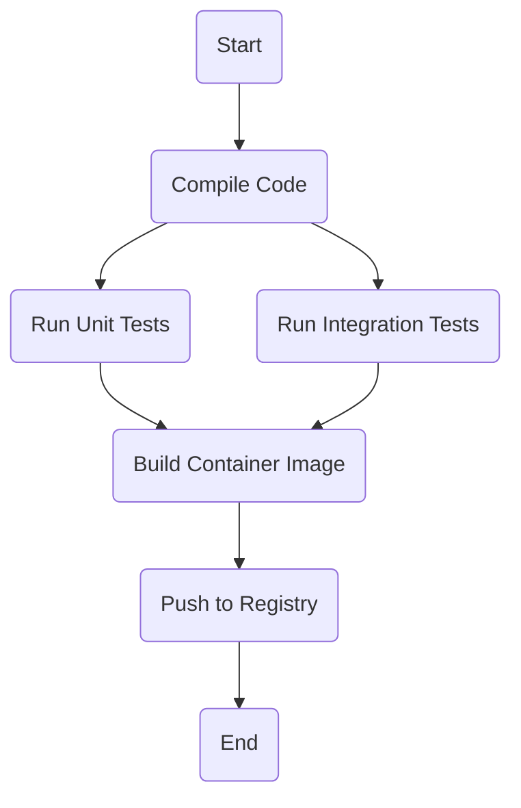

# Argo Workflows Exploration

[`Argo Workflows`](https://argoproj.github.io/argo-workflows/) is an open source container-native workflow engine for orchestrating parallel jobs on Kubernetes. Argo Workflows is implemented as a Kubernetes CRD (Custom Resource Definition).

## What is a Workflow Engine?

A workflow engine automates and manages a sequence of tasks. Argo Workflows is special because it's designed to run on Kubernetes, where each step in a workflow is its own container.

## How Argo Workflows Works

You define a `Workflow` as a series of steps in a YAML file. The Argo Workflows controller detects these resources and executes them, creating pods for each step.

*   **Workflow:** The definition of the entire process.
*   **Template:** A single step in the workflow.
*   **DAG (Directed Acyclic Graph):** You can define complex dependencies between steps.



### Core Components
*   **Argo Server (UI):** A web server that provides a user interface for managing and observing workflows.
*   **Workflow Controller:** The core component that orchestrates the execution of workflows.

## Verifiable Demo: A Simple CI Pipeline

This demo provides a verifiable example of a simple CI pipeline implemented as an Argo Workflow.

### Manual Walkthrough

**IMPORTANT:** Run all commands from the root of the `cncf-projects` repository.

#### Step 1: Start Minikube & Install Argo Workflows

```bash
# Start Minikube
minikube start --profile argo-workflows-demo --cpus 4 --memory 8192

# Install the base Argo Workflows components
kubectl create namespace argo
kubectl apply -n argo -f https://raw.githubusercontent.com/argoproj/argo-workflows/stable/manifests/install.yaml

# Wait for the deployments to be created
echo "--> Waiting for Argo Workflows components..."
kubectl wait --for=condition=available --timeout=600s deployment/argo-server -n argo
kubectl wait --for=condition=available --timeout=600s deployment/workflow-controller -n argo
echo "--> Argo Workflows is ready."
```

#### Step 2: Make the UI Accessible
By default, the Argo Server is not accessible from outside the cluster. We need to patch its deployment to change the authentication mode. This is a standard step for local demos.

```bash
kubectl patch deployment \
  argo-server \
  --namespace argo \
  --type='json' \
  -p='[{"op": "replace", "path": "/spec/template/spec/containers/0/args", "value": [
  "server",
  "--auth-mode=server"
]}]'
```

#### Step 3: Submit the Workflow

Create a file named `argo-workflows/demo/ci-workflow.yaml` with the following content:

```yaml
apiVersion: argoproj.io/v1alpha1
kind: Workflow
metadata:
  generateName: ci-pipeline-
  namespace: argo
spec:
  entrypoint: ci-pipeline
  templates:
  - name: ci-pipeline
    dag:
      tasks:
      - name: build
        template: build-step
      - name: test
        dependencies: [build]
        template: test-step

  - name: build-step
    container:
      image: alpine:latest
      command: [sh, -c]
      args: ["echo 'Simulating build process...'; sleep 5; echo 'Compiled!'"]

  - name: test-step
    container:
      image: alpine:latest
      command: [sh, -c]
      args: ["echo 'Simulating test process...'; sleep 5; echo 'Tested!'"]
```

Now, submit this workflow to your cluster:

```bash
kubectl apply -f argo-workflows/demo/ci-workflow.yaml
```

#### Step 4: Observe in the UI

1.  **Access the Argo Workflows UI:**
    *   **Open a new terminal** and run `kubectl -n argo port-forward svc/argo-server 2746:2746`. **Leave this running.**
    *   Open your browser to `http://localhost:2746`. (Note: it is HTTP, not HTTPS). The UI will load, and you can proceed without logging in.

2.  You will see your `ci-pipeline-` workflow in the list. Click on it to see the graph of the execution.

#### Step 5: Verify the Output

1.  In the Argo Workflows UI, click on the completed `test-step` pod in the graph.
2.  A side panel will open. Go to the **Logs** tab. You will see the output "Tested!".

#### Step 6: Cleanup

```bash
minikube delete --profile argo-workflows-demo
```
