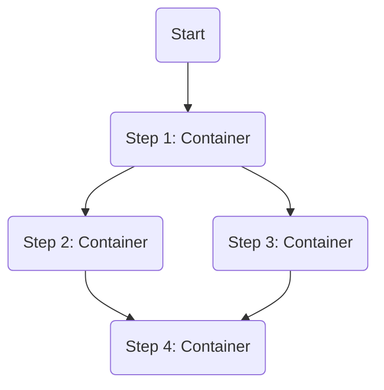
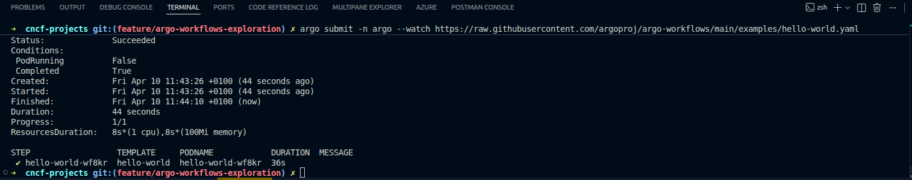
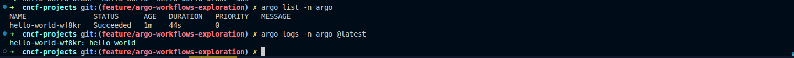
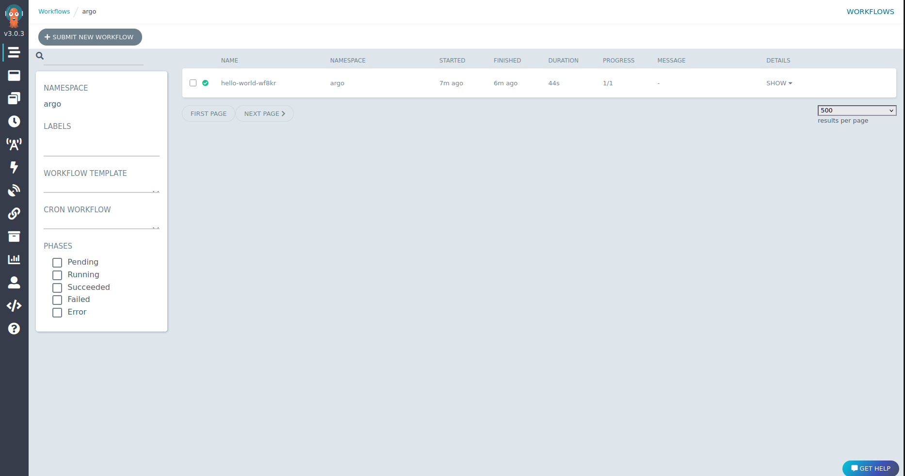
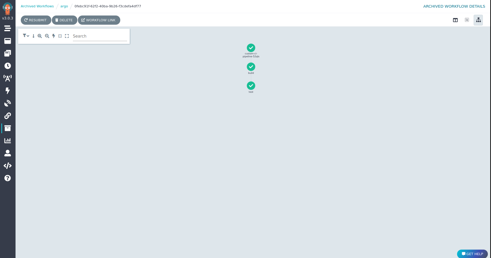

# Argo Workflows Exploration

[`Argo Workflows`](https://argoproj.github.io/argo-workflows/) is an open source container-native workflow engine for orchestrating parallel jobs on Kubernetes.

## What is a Workflow Engine?

A workflow engine automates and manages a sequence of tasks. Argo Workflows is special because it's designed to run on Kubernetes, where each step in a workflow is its own container.

## How Argo Workflows Works

You define a `Workflow` as a series of steps in a YAML file. The Argo Workflows controller detects these resources and executes them, creating pods for each step.



## Verifiable Demo: A CLI-Driven Walkthrough

This demo is based on the official [Argo Workflows Quick Start guide](https://argo-workflows.readthedocs.io/en/latest/quick-start/). It will provide a verifiable, CLI-driven example of submitting and inspecting workflows.

### Manual Walkthrough

#### Step 1: Start Minikube & Install Argo Workflows
This block will create a local cluster and install Argo Workflows in a way that makes it accessible for this demo.

```bash
# Start Minikube
minikube start --profile argo-workflows-demo --cpus 4 --memory 8192

# Install Argo Workflows using the "quick-start" manifest.
kubectl create namespace argo
kubectl apply -n argo -f https://raw.githubusercontent.com/argoproj/argo-workflows/stable/manifests/quick-start-postgres.yaml

# Wait for all services to be ready
echo "--> Waiting for Argo Workflows..."
kubectl wait --for=condition=available deployment/argo-server -n argo --timeout=600s
echo "--> Argo Workflows is ready."
```

#### Step 2: Install the Argo CLI
The `argo` command-line tool is the easiest way to interact with your workflows.

```bash
# On Mac: brew install argo

# On Linux:
VERSION=v3.5.7
curl -sLO https://github.com/argoproj/argo-workflows/releases/download/${VERSION}/argo-linux-amd64.gz
gunzip argo-linux-amd64.gz
chmod +x argo-linux-amd64
sudo mv ./argo-linux-amd64 /usr/local/bin/argo
```

#### Step 3: Submit the Official "Hello World" Example
We will use the CLI to submit a simple "hello world" workflow directly from the official Argo examples repository.

```bash
argo submit -n argo --watch https://raw.githubusercontent.com/argoproj/argo-workflows/main/examples/hello-world.yaml
```
Your terminal output will look like this, showing the workflow progress:


#### Step 4: Submit a Custom Workflow
Now, let's submit our own custom workflow from a local file. This example simulates a simple two-step CI/CD pipeline.

```bash
argo submit -n argo --watch argo-workflows/demo/ci-workflow.yaml
```

#### Step 5: Inspect the Workflows
Now that the workflows have run, let's inspect them.

```bash
# Get a list of all workflows.
argo list -n argo
```
You should see both the `hello-world` and `custom-ci-pipeline` workflows in the list.


```bash
# Get the logs from the most recent workflow (our custom one)
argo logs -n argo @latest
```
The logs command will show the output from both the "Custom Build Step" and the "Custom Test Step".

#### Step 6: (Optional) Access the UI
You can see both completed workflows in the web UI.

```bash
# Open a new terminal and run this command. Leave it running.
kubectl -n argo port-forward svc/argo-server 2746:2746
```
Open your browser to `http://localhost:2746`. You will see a list of the workflows you have run.



Clicking on the `custom-ci-pipeline` workflow will show you the graph of its execution.



#### Step 7: Cleanup
```bash
minikube delete --profile argo-workflows-demo
```
