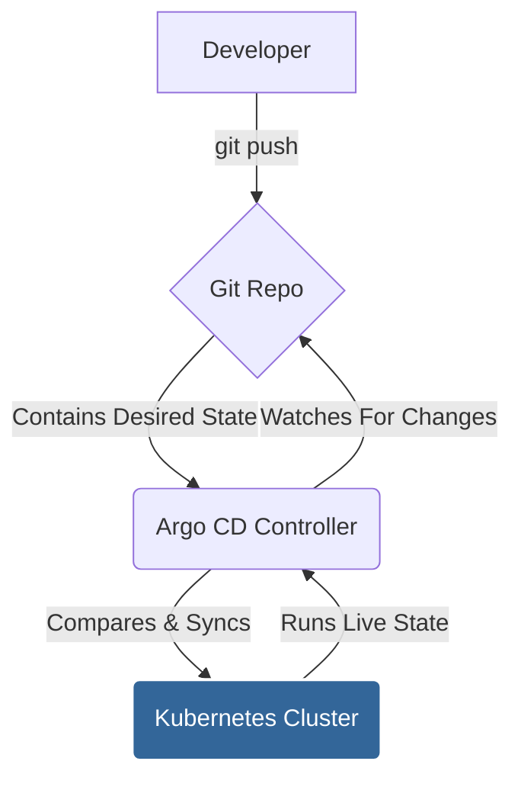

# Argo CD Exploration

[`Argo CD`](https://argo-cd.readthedocs.io/en/stable/) is a declarative, GitOps continuous delivery tool for Kubernetes.

## What is GitOps? (A Simple Explanation)

**GitOps** is a way of doing Continuous Delivery where Git is the "single source of truth." Instead of manually running `kubectl` commands to update your cluster, you make changes to your application's configuration in a Git repository.

Argo CD's job is to constantly watch that Git repository. When it sees a change, it automatically applies that change to your Kubernetes cluster, making sure the live state of your application matches the state defined in Git.

Why is this a game-changer?
*   **Declarative:** You define the desired state of your entire system in Git.
*   **Versioned & Auditable:** Every change is a `git commit`, so you have a full history of who changed what and when. Rolling back is as simple as reverting a commit (`git revert`).
*   **Automated & Secure:** No one needs direct `kubectl` access to the cluster for deployments. Argo CD handles it.

## How Argo CD Works

Argo CD runs as a controller inside your cluster. It continuously compares the state of your application as defined in a Git repository with the actual live state in the cluster.

1.  A developer pushes a change to a Kubernetes manifest in a Git repository.
2.  Argo CD detects that the live state of the application in the cluster no longer matches the desired state in Git (it's "OutOfSync").
3.  Argo CD automatically (or manually, if configured) "syncs" the application, pulling the new manifests from Git and applying them to the cluster.
4.  The application's live state now matches the desired state in Git (it's "Synced").



## Verifiable Demo: A GitOps Deployment

This demo will provide a working example of Argo CD's core GitOps feature. We will install Argo CD and use it to deploy a sample Guestbook application from a public Git repository.

### How the Demo Works
The `demo.sh` script will automate the following steps:
1.  **Create a Kubernetes Cluster**: It will start a `minikube` cluster.
2.  **Install Argo CD**: It will install the Argo CD components into the cluster.
3.  **Deploy the Application**: It applies an Argo CD `Application` manifest. This manifest tells Argo CD to fetch the Kubernetes configuration for a sample Guestbook app from a public Git repository and apply it.
4.  **Verify Synchronization**: It waits for Argo CD to report that the application is healthy and synced. This proves that Argo CD successfully pulled the configuration from Git and applied it to the cluster.
5.  **Clean Up**: It automatically deletes the `minikube` cluster.

### What to Look For (Expected Output)
A successful run will show the Argo CD installation followed by the successful synchronization of the guestbook application.
```text
--> Installing Argo CD...
...
--> Deploying sample application via Argo CD...
...
--> SUCCESS: Application is healthy and synced.
```
This final success message proves the GitOps workflow is functional.

### Prerequisites
*   Docker is required to run `minikube`.

## Manual Walkthrough

The automated demo script can be sensitive to the execution environment. The following steps allow you to run the entire demo manually in your own terminal to observe the GitOps workflow.

### Step 1: Start Minikube with Sufficient Resources
This command creates a local Kubernetes cluster with enough CPU and memory to run the demo reliably.

```bash
minikube start --profile argocd-demo --cpus 4 --memory 8192
```

### Step 2: Install Argo CD
This applies the standard Argo CD installation manifests to your cluster.

```bash
kubectl create namespace argocd
kubectl apply -n argocd -f https://raw.githubusercontent.com/argoproj/argo-cd/v2.4.0/manifests/install.yaml
```

### Step 3: Install Gitea (In-Cluster Git Server)
To make the demo self-contained and avoid network issues, we run a lightweight Gitea Git server inside the cluster.

```bash
kubectl create namespace gitea
kubectl apply -n gitea -f argocd/demo/gitea.yaml
```

### Step 4: Wait for All Services to Become Ready
These commands will pause until the Argo CD and Gitea pods are up and running. This may take several minutes.

```bash
echo "Waiting for Argo CD..."
kubectl wait --for=condition=available --timeout=600s deployment/argocd-server -n argocd
echo "Waiting for Gitea..."
kubectl wait --for=condition=available --timeout=600s deployment/gitea -n gitea
echo "All services are ready."
```

### Step 5: Create the In-Cluster Git Repository
This complex step uses a temporary `git-client` pod to push the application's configuration (`guestbook-gitops/`) into the Gitea server.

```bash
# Create the temporary git client pod
kubectl run git-client --image=alpine/git --restart=Never --command -- sleep 3600
kubectl wait --for=condition=ready pod/git-client

# Copy the application configuration into the pod
kubectl cp argocd/demo/guestbook-gitops git-client:/tmp/

# Exec into the pod to initialize the repo and push to Gitea
kubectl exec git-client -- /bin/sh -c "
  apk add curl
  
  echo 'Waiting for Gitea to be connectable...'
  until curl -s http://gitea.gitea.svc:3000; do sleep 2; done
  echo 'Gitea is ready.'

  git config --global user.email 'demo@example.com' && git config --global user.name 'Demo User'
  cd /tmp/guestbook-gitops && git init && git add .
  git commit -m 'Initial commit'
  git remote add origin http://gitea.gitea.svc:3000/gitea/guestbook.git
  git push -u origin master
"

# Clean up the temporary pod
kubectl delete pod git-client
```

### Step 6: Deploy the Application via Argo CD
First, update the `application.yaml` to point to our new in-cluster Gitea repo, then apply it to the cluster.

```bash
# Update the repoURL to point to the internal Gitea service
sed -i 's|https://github.com/bansikah22/cncf-projects.git|http://gitea.gitea.svc:3000/gitea/guestbook.git|' argocd/demo/application.yaml

# Apply the application manifest to tell Argo CD what to deploy
kubectl apply -f argocd/demo/application.yaml
```

### Step 7: Access Argo CD and Verify Sync
Now, we will log in to Argo CD and verify that it has successfully synced our application.

**First, open a new, separate terminal** and run this command. It will forward the Argo CD server UI and API to your local machine. **Leave this terminal running.**

```bash
kubectl -n argocd port-forward svc/argocd-server 8080:443
```

**Return to your original terminal** for the following commands.

```bash
# Get the auto-generated admin password
ARGOCD_PASSWORD=$(kubectl -n argocd get secret argocd-initial-admin-secret -o jsonpath="{.data.password}" | base64 -d)
echo "Argo CD Admin Password: $ARGOCD_PASSWORD"

# Login to Argo CD using the password
argocd login localhost:8080 --username admin --password "\$ARGOCD_PASSWORD" --insecure

# Wait for the application to sync and become healthy
argocd app wait guestbook --sync --health --timeout 300

# Verify the replica count is 2, as defined in our 'staging' overlay
kubectl get deployment -n guestbook guestbook-ui -o jsonpath='{.spec.replicas}'
```
The final command should output `2`. This confirms Argo CD has correctly deployed the initial state from the Gitea repository.

At this point, you can navigate to `https://localhost:8080` in your browser. You will get a certificate warning, which you can safely ignore for this demo. Log in with the username `admin` and the password you retrieved from the terminal. You will see the `guestbook` application card. Click on it to see the tree of all the Kubernetes resources that Argo CD has deployed and their status.

### Step 8: The GitOps Loop - Simulate a Change
Here we simulate a developer changing the desired state in Git. We will update the replica count from 2 to 3.

```bash
# Change the number of replicas in the patch file
sed -i 's/replicas: 2/replicas: 3/' argocd/demo/guestbook-gitops/overlays/staging/patch.yaml

# Create another temporary pod to push this change to Gitea
kubectl run git-client --image=alpine/git --restart=Never --command -- sleep 3600
kubectl wait --for=condition=ready pod/git-client
kubectl cp argocd/demo/guestbook-gitops git-client:/tmp/
kubectl exec git-client -- /bin/sh -c "
  git config --global user.email 'demo@example.com' && git config --global user.name 'Demo User'
  cd /tmp/guestbook-gitops && git add . && git commit -m 'Scale to 3 replicas' && git push
"
kubectl delete pod git-client

# Tell Argo CD to check the Git repo for the change we just pushed
argocd app refresh guestbook

# Wait for Argo CD to see the change and re-sync the application
argocd app wait guestbook --sync --health --timeout 300

# Verify that Argo CD automatically applied the change to the cluster
kubectl get deployment -n guestbook guestbook-ui -o jsonpath='{.spec.replicas}'
```
The final command should now output `3`. This proves the end-to-end GitOps workflow was successful!

### Step 9: Cleanup
When you are finished, stop the `kubectl port-forward` process (Ctrl+C) in the other terminal. Then, run these commands to delete the cluster and restore the local files you changed.

```bash
minikube delete --profile argocd-demo
git checkout -- argocd/demo/application.yaml argocd/demo/guestbook-gitops/overlays/staging/patch.yaml
```
Now, open your web browser and navigate to `http://localhost:3001`. You will see the Gitea UI. You can explore the `gitea/guestbook` repository to see the Kubernetes manifests that our script just pushed.

When you are finished, you can stop the port-forward process (Ctrl+C).


### Step 6: Deploy the Application via Argo CD
First, update the `application.yaml` to point to our new in-cluster Gitea repo, then apply it to the cluster.

```bash
# Update the repoURL to point to the internal Gitea service
sed -i 's|https://github.com/bansikah22/cncf-projects.git|http://gitea.gitea.svc:3000/gitea/guestbook.git|' argocd/demo/application.yaml

# Apply the application manifest to tell Argo CD what to deploy
kubectl apply -f argocd/demo/application.yaml
```

### Step 7: Access Argo CD and Verify Sync
Now, we will log in to Argo CD and verify that it has successfully synced our application.

**First, open a new, separate terminal** and run this command. It will forward the Argo CD server UI and API to your local machine. **Leave this terminal running.**

```bash
kubectl -n argocd port-forward svc/argocd-server 8080:443
```

**Return to your original terminal** for the following commands.

```bash
# Get the auto-generated admin password
ARGOCD_PASSWORD=$(kubectl -n argocd get secret argocd-initial-admin-secret -o jsonpath="{.data.password}" | base64 -d)
echo "Argo CD Admin Password: $ARGOCD_PASSWORD"

# Login to Argo CD using the password
argocd login localhost:8080 --username admin --password "\$ARGOCD_PASSWORD" --insecure

# Wait for the application to sync and become healthy
argocd app wait guestbook --sync --health --timeout 300

# Verify the replica count is 2, as defined in our 'staging' overlay
kubectl get deployment -n guestbook guestbook-ui -o jsonpath='{.spec.replicas}'
```
The final command should output `2`. This confirms Argo CD has correctly deployed the initial state from the Gitea repository.

At this point, you can navigate to `https://localhost:8080` in your browser. You will get a certificate warning, which you can safely ignore for this demo. Log in with the username `admin` and the password you retrieved from the terminal. You will see the `guestbook` application card. Click on it to see the tree of all the Kubernetes resources that Argo CD has deployed and their status.


### Step 8: The GitOps Loop - Simulate a Change
Here we simulate a developer changing the desired state in Git. We will update the replica count from 2 to 3.

```bash
# Change the number of replicas in the patch file
sed -i 's/replicas: 2/replicas: 3/' argocd/demo/guestbook-gitops/overlays/staging/patch.yaml

# Create another temporary pod to push this change to Gitea
kubectl run git-client --image=alpine/git --restart=Never --command -- sleep 3600
kubectl wait --for=condition=ready pod/git-client
kubectl cp argocd/demo/guestbook-gitops git-client:/tmp/
kubectl exec git-client -- /bin/sh -c "
  git config --global user.email 'demo@example.com' && git config --global user.name 'Demo User'
  cd /tmp/guestbook-gitops && git add . && git commit -m 'Scale to 3 replicas' && git push
"
kubectl delete pod git-client

# Tell Argo CD to check the Git repo for the change we just pushed
argocd app refresh guestbook

# Wait for Argo CD to see the change and re-sync the application
argocd app wait guestbook --sync --health --timeout 300

# Verify that Argo CD automatically applied the change to the cluster
kubectl get deployment -n guestbook guestbook-ui -o jsonpath='{.spec.replicas}'
```
The final command should now output `3`. This proves the end-to-end GitOps workflow was successful!

### Step 9: Cleanup
When you are finished, stop the `kubectl port-forward` process (Ctrl+C) in the other terminal. Then, run these commands to delete the cluster and restore the local files you changed.

```bash
minikube delete --profile argocd-demo
git checkout -- argocd/demo/application.yaml argocd/demo/guestbook-gitops/overlays/staging/patch.yaml
```

