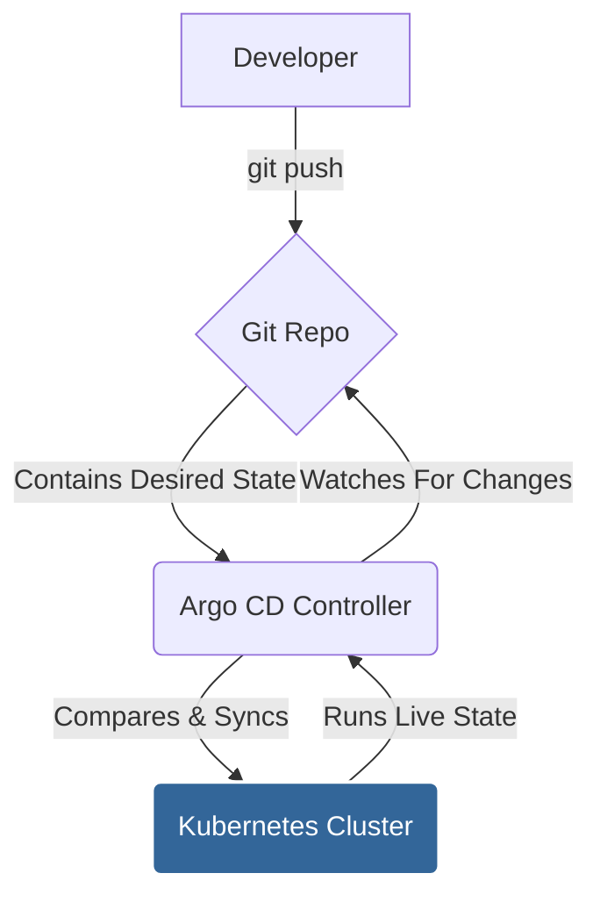
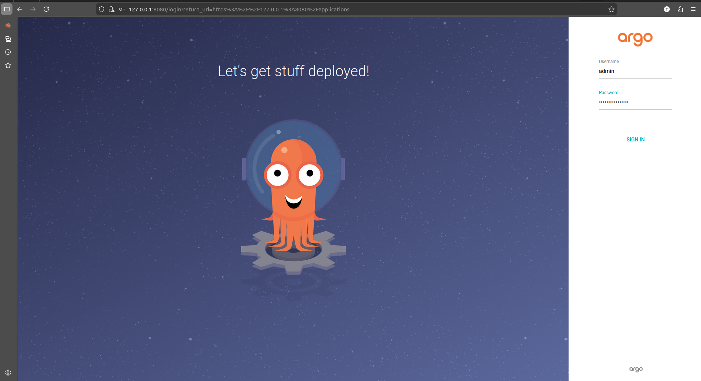
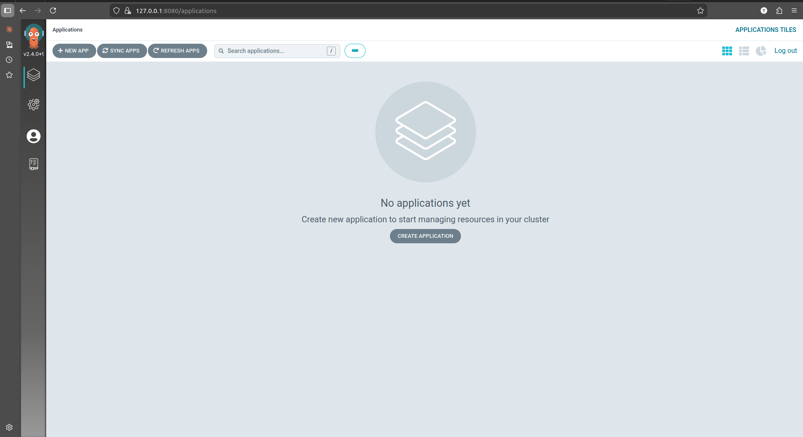
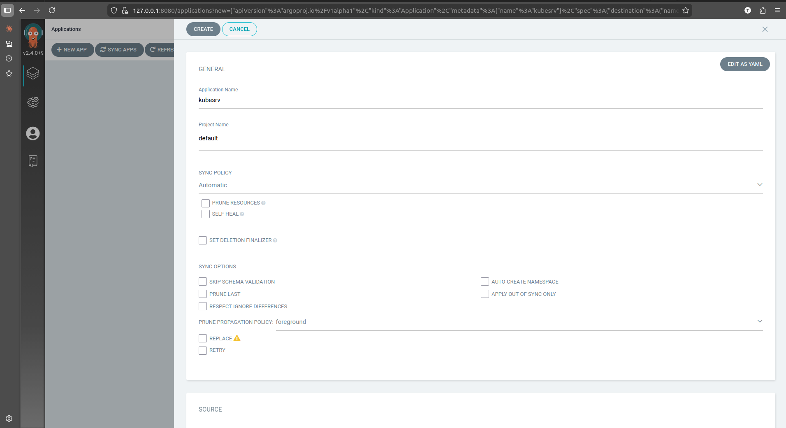
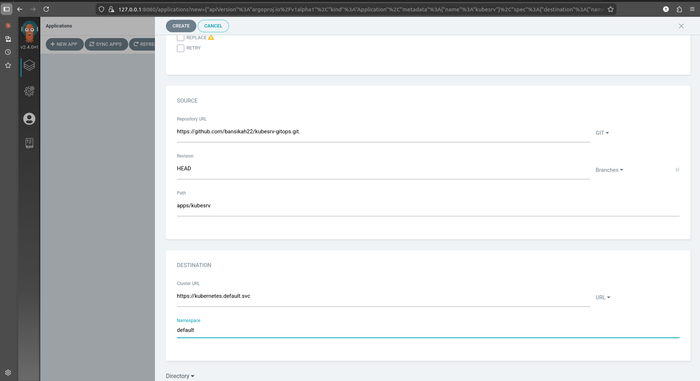
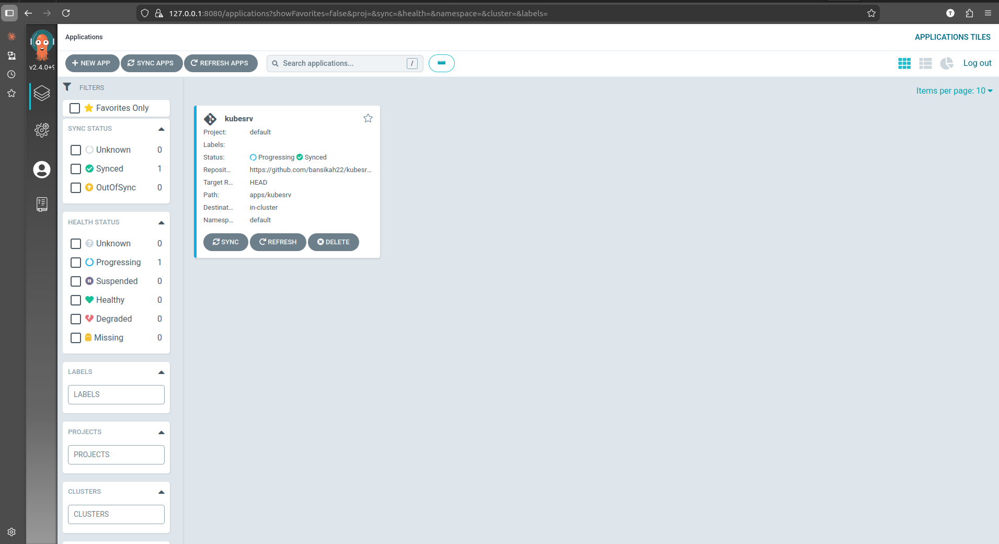
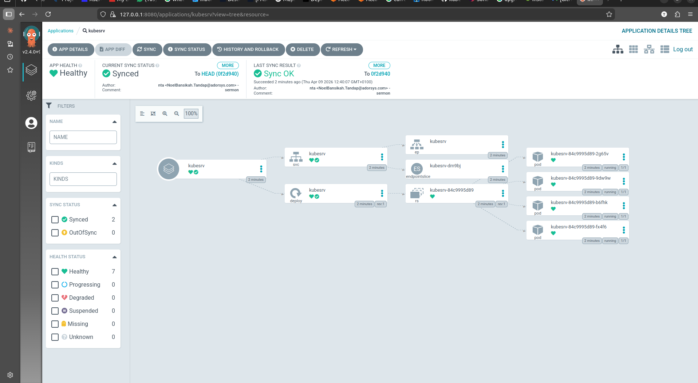
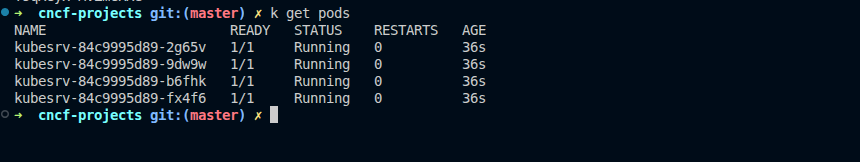
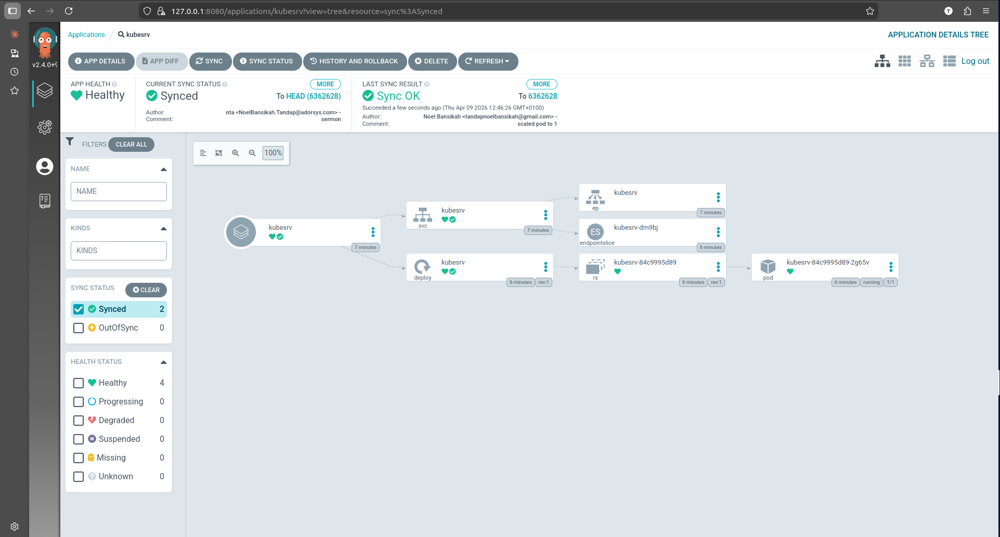
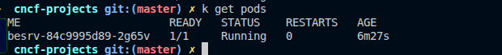

# Argo CD Exploration

[`Argo CD`](https://argo-cd.readthedocs.io/en/stable/) is a declarative, GitOps continuous delivery tool for Kubernetes.

## What is GitOps?

**GitOps** is a way of doing Continuous Delivery where Git is the "single source of truth." Instead of manually running `kubectl` commands, you declare the desired state of your system in a Git repository. Argo CD's job is to make your cluster's state match the state in Git.

## How Argo CD Works

Argo CD runs as a controller inside your cluster. It continuously compares the state of your application as defined in a Git repository with the actual live state in the cluster.

1.  A developer pushes a change to a Kubernetes manifest in a Git repository.
2.  Argo CD detects that the live state of the application in the cluster no longer matches the desired state in Git (it's "OutOfSync").
3.  Argo CD automatically (or manually, if configured) "syncs" the application, pulling the new manifests from Git and applying them to the cluster.
4.  The application's live state now matches the desired state in Git (it's "Synced").



### Core Components

Argo CD is composed of three main components that work together to achieve the GitOps workflow:

*   **API Server:** This is the gRPC/REST server that exposes the API consumed by the Web UI, the CLI (`argocd`), and CI/CD systems. It is responsible for managing applications, checking status, and invoking operations.

*   **Repository Server:** This internal service is responsible for cloning your Git repository and caching its manifests. It generates the Kubernetes manifests from different sources (like Kustomize, Helm, or plain YAML) and returns the result to the Application Controller.

*   **Application Controller:** This is the heart of Argo CD. It is a Kubernetes controller that continuously monitors running applications and compares their live state against the desired state defined in the Git repository. When it detects a difference (`OutOfSync` status), it takes corrective action to bring the application back into the desired state, either automatically or by user command.


## Verifiable Demo: A UI-Driven GitOps Workflow

This demo provides a robust, verifiable example of Argo CD's core functionality using a real-world workflow. You will use a public GitHub repository as the source of truth for your application's configuration. The entire process will be driven through the Argo CD web interface.

**IMPORTANT:** This guide uses the repository `https://github.com/bansikah22/kubesrv-gitops`.

### Step 1: Start Minikube & Install Argo CD

This will start your local cluster and deploy the Argo CD components.

```bash
# Start Minikube with sufficient resources
minikube start --profile argocd-demo --cpus 4 --memory 8192

# Install Argo CD
kubectl create namespace argocd
kubectl apply -n argocd -f https://raw.githubusercontent.com/argoproj/argo-cd/v2.4.0/manifests/install.yaml

# Wait for Argo CD to be ready (this may take several minutes)
echo "--> Waiting for Argo CD..."
kubectl wait --for=condition=available --timeout=600s deployment/argocd-server -n argocd
echo "--> Argo CD is ready."
```

### Step 2: Deploy the Application via the Argo CD UI

Now we will connect Argo CD to your `kubesrv-gitops` GitHub repository.

1.  **Access the Argo CD UI:**
    *   **Open a new terminal** and run `kubectl -n argocd port-forward svc/argocd-server 8080:443`. **Leave this running.**
    *   In your **original terminal**, get the admin password:
        ```bash
        kubectl -n argocd get secret argocd-initial-admin-secret -o jsonpath="{.data.password}" | base64 -d; echo
        ```
    *   Open your browser to `https://localhost:8080` and log in with the username `admin` and the password you just retrieved.
        

2.  **Create the Application:**
    *   After logging in, you will see an empty dashboard. Click **+ NEW APP**.
        
    *   Fill out the application creation form with the following details.
        *   **Application Name:** `kubesrv`
        *   **Project:** `default`
        *   **Sync Policy:** `Automatic`
        *   **Repository URL:** `https://github.com/bansikah22/kubesrv-gitops.git`
        *   **Path:** `apps/kubesrv`
        *   **Cluster URL:** `https://kubernetes.default.svc`
        *   **Namespace:** `default`
    *   The configuration should look like this:
        
        
    *   Click **CREATE** at the top of the page.

3.  **Verify Initial Sync:**
    *   Argo CD will automatically sync the state from your Git repository. Initially, the `deployment.yaml` in the repository is configured with **4 replicas**.
    *   Wait for the application status to become **Healthy** and **Synced**.
        
    *   You can see the 4 running pods in the Argo CD UI.
        
    *   You can also verify this in your terminal:
        ```bash
        kubectl get pods
        ```
        

### Step 3: The GitOps Loop - Scale Down

Now, let's simulate a developer scaling the application **down from 4 to 1** by pushing a change to the `kubesrv-gitops` repository.

1.  **Update the Manifest:**
    *   In your **local clone** of the `kubesrv-gitops` repository, open the file `apps/kubesrv/deployment.yaml`.
    *   Change the `replicas` field from `4` to `1`.
    *   Commit and push this change to the `master` branch on GitHub.

2.  **Observe the Change in Argo CD:**
    *   Go back to the Argo CD UI in your browser. Click the **Refresh** button on the `kubesrv` application.
    *   Argo CD will detect the change, show the application as `OutOfSync`, and then automatically start syncing.
    *   You will see 3 of the 4 pods begin to terminate.
        

3.  **Verify the Result:**
    *   Once the sync is complete, verify the change from your terminal:
        ```bash
        kubectl get pods
        ```
    *   You should now see only one `kubesrv` pod running.
        

### Step 4: Cleanup

When you are finished, stop the `port-forward` process (Ctrl+C). Then, run this command to delete the cluster.

```bash
minikube delete --profile argocd-demo
```
