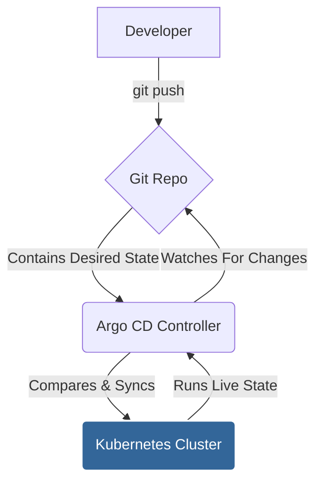

# Argo CD Exploration

[`Argo CD`](https://argo-cd.readthedocs.io/en/stable/) is a declarative, GitOps continuous delivery tool for Kubernetes.

## What is GitOps? (A Simple Explanation)

**GitOps** is a way of doing Continuous Delivery where Git is the "single source of truth." Instead of manually running `kubectl` commands to update your cluster, you make changes to your application's configuration in a Git repository.

Argo CD's job is to constantly watch that Git repository. When it sees a change, it automatically applies that change to your Kubernetes cluster, making sure the live state of your application matches the state defined in Git.

Why is this a game-changer?
*   **Declarative:** You define the desired state of your entire system in Git.
*   **Versioned & Auditable:** Every change is a `git commit`, so you have a full history of who changed what and when. Rolling back is as simple as reverting a commit (`git revert`).
*   **Automated & Secure:** No one needs direct `kubectl` access to the cluster for deployments. Argo CD handles it.

## How Argo CD Works

Argo CD runs as a controller inside your cluster. It continuously compares the state of your application as defined in a Git repository with the actual live state in the cluster.

1.  A developer pushes a change to a Kubernetes manifest in a Git repository.
2.  Argo CD detects that the live state of the application in the cluster no longer matches the desired state in Git (it's "OutOfSync").
3.  Argo CD automatically (or manually, if configured) "syncs" the application, pulling the new manifests from Git and applying them to the cluster.
4.  The application's live state now matches the desired state in Git (it's "Synced").



## Verifiable Demo: A GitOps Deployment

This demo will provide a working example of Argo CD's core GitOps feature. We will install Argo CD and use it to deploy a sample Guestbook application from a public Git repository.

### How the Demo Works
The `demo.sh` script will automate the following steps:
1.  **Create a Kubernetes Cluster**: It will start a `minikube` cluster.
2.  **Install Argo CD**: It will install the Argo CD components into the cluster.
3.  **Deploy the Application**: It applies an Argo CD `Application` manifest. This manifest tells Argo CD to fetch the Kubernetes configuration for a sample Guestbook app from a public Git repository and apply it.
4.  **Verify Synchronization**: It waits for Argo CD to report that the application is healthy and synced. This proves that Argo CD successfully pulled the configuration from Git and applied it to the cluster.
5.  **Clean Up**: It automatically deletes the `minikube` cluster.

### What to Look For (Expected Output)
A successful run will show the Argo CD installation followed by the successful synchronization of the guestbook application.
```text
--> Installing Argo CD...
...
--> Deploying sample application via Argo CD...
...
--> SUCCESS: Application is healthy and synced.
```
This final success message proves the GitOps workflow is functional.

### Prerequisites
*   Docker is required to run `minikube`.
