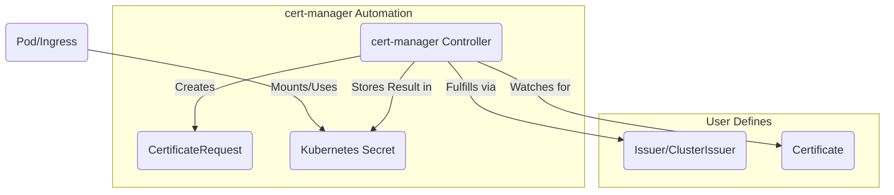

# cert-manager Exploration

[`cert-manager`](https://cert-manager.io/) is a native Kubernetes certificate management controller. It can help with issuing certificates from a variety of sources, such as Let's Encrypt, HashiCorp Vault, Venafi, a simple signing key pair, or self-signed. It will ensure certificates are valid and up to date, and attempt to renew certificates at a configured time before expiry.

## What Problem Does cert-manager Solve?

In modern infrastructure, Transport Layer Security (TLS) is essential for securing communication between services. This requires issuing, managing, and renewing digital certificates. Manually managing this lifecycle—generating private keys, creating certificate signing requests (CSRs), sending them to a Certificate Authority (CA), and configuring your services to use the resulting certificates—is complex, error-prone, and does not scale.

`cert-manager` automates this entire process within a Kubernetes cluster. You simply declare the certificate you need as a Kubernetes resource, and `cert-manager` handles the rest.

### Use Cases
*   **Securing Ingress:** Automatically provision TLS certificates for web applications exposed via a Kubernetes Ingress.
*   **Mutual TLS (mTLS):** Issue certificates for individual pods or services to secure service-to-service communication within the cluster.
*   **Securing Webhooks:** Provide TLS certificates for admission controller webhooks and other internal Kubernetes components.

## Architecture & Components

`cert-manager` operates as a set of controllers running in your cluster that watch for its custom resources.

1.  **Issuer/ClusterIssuer:** An `Issuer` (namespaced) or `ClusterIssuer` (cluster-wide) represents a Certificate Authority (CA) that can sign certificates. You configure an `Issuer` to specify *how* certificates should be issued (e.g., using Let's Encrypt with an ACME challenge, or by signing with an internal CA).
2.  **Certificate:** This resource represents your *request* for a certificate. You specify which `Issuer` to use and what domain names (DNS names) the certificate should be valid for.
3.  **CertificateRequest:** `cert-manager` creates this resource in the background to represent the actual request to the `Issuer`.
4.  **Secret:** Once the `Issuer` successfully signs the certificate, `cert-manager` creates a Kubernetes `Secret` containing the TLS key and certificate (`tls.key`, `tls.crt`). This secret can then be mounted into pods or referenced by an Ingress controller.



## Verifiable Demo: A Self-Signed Issuer and Certificate

This demo provides a simple, verifiable example of `cert-manager`'s core functionality. We will create a self-signed `ClusterIssuer` and then request a `Certificate` from it. This is a common pattern for securing internal cluster services where a publicly trusted certificate is not needed.

### Manual Walkthrough

#### Step 1: Start Minikube & Install cert-manager
This will start a new cluster and install `cert-manager` using its official Helm chart.

```bash
# Start Minikube
minikube start --profile cert-manager-demo --cpus 4 --memory 8192

# Install cert-manager using Helm
helm repo add jetstack https://charts.jetstack.io
helm repo update
helm install \
  cert-manager jetstack/cert-manager \
  --namespace cert-manager \
  --create-namespace \
  --version v1.14.0 \
  --set installCRDs=true
```

#### Step 2: Verify the Installation
Before proceeding, ensure all the `cert-manager` pods are running correctly.

```bash
# Wait for the cert-manager pods to be ready
kubectl wait --for=condition=ready pod -l app.kubernetes.io/instance=cert-manager -n cert-manager --timeout=120s
echo "--> cert-manager is ready."
```

#### Step 3: Create a Self-Signed Issuer
Now, we will create a `ClusterIssuer` that will sign our certificates. Create a file named `cert-manager/demo/self-signed-issuer.yaml` with the following content:

```yaml
apiVersion: cert-manager.io/v1
kind: ClusterIssuer
metadata:
  name: self-signed-issuer
spec:
  selfSigned: {}
```
Apply it to the cluster:
```bash
kubectl apply -f cert-manager/demo/self-signed-issuer.yaml
```

#### Step 4: Request a Certificate
Next, we will request a certificate for the example domain `my-app.com`. Create a file named `cert-manager/demo/my-app-certificate.yaml` with this content:

```yaml
apiVersion: cert-manager.io/v1
kind: Certificate
metadata:
  name: my-app-certificate
  namespace: default
spec:
  secretName: my-app-tls
  dnsNames:
  - my-app.com
  issuerRef:
    name: self-signed-issuer
    kind: ClusterIssuer
```
Apply this resource. `cert-manager` will see it and create a secret named `my-app-tls` to store the resulting certificate.
```bash
kubectl apply -f cert-manager/demo/my-app-certificate.yaml
```

#### Step 5: Verify the Certificate Was Issued
1.  **Check the Certificate Status:** Check the `Certificate` resource. After a few moments, its `Ready` status should become `True`.
    ```bash
    kubectl get certificate my-app-certificate
    ```
    The output should show `READY=True`.

2.  **Inspect the Secret:** Verify that `cert-manager` created the `my-app-tls` secret containing the certificate and private key.
    ```bash
    kubectl get secret my-app-tls
    ```
    The output should show a secret of type `kubernetes.io/tls`.

3.  **Inspect the Certificate Contents (Optional):** You can decode the certificate from the secret to see its details, such as the issuer and the subject.
    ```bash
    kubectl get secret my-app-tls -o jsonpath='{.data.tls\.crt}' | base64 -d | openssl x509 -text -noout
    ```
    In the output, you will see that the **Issuer** and **Subject** are both `my-app.com`, confirming it's a self-signed certificate. This proves the entire flow worked correctly.

#### Step 6: Cleanup
```bash
minikube delete --profile cert-manager-demo
```
