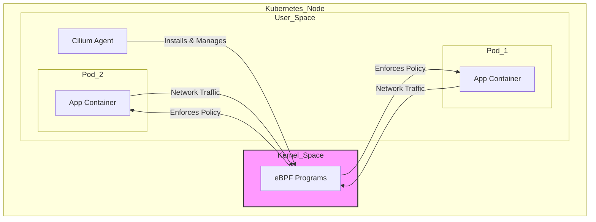

# Cilium Exploration

[`Cilium`](https://cilium.io/) is an open-source project that provides networking, observability, and security for cloud-native environments like Kubernetes. Its superpower is that it is built on top of a revolutionary Linux kernel technology called **eBPF**.

## What is eBPF? (A Simple Explanation)

Think of the Linux kernel (the core of the operating system) as a very busy, secure building that manages everything on your server. Normally, you can't just run your own code inside this building because it could be dangerous.

**eBPF** (Extended Berkeley Packet Filter) is a new technology that lets you run small, safe, sandboxed programs *directly inside the kernel* without changing the kernel's code.

Why is this a game-changer for networking?
Instead of using older, slower networking rules (like iptables), Cilium uses eBPF programs to process network traffic at a much lower level. This makes it incredibly fast and powerful.

## How Cilium Works

Cilium runs an "agent" on every server (or node) in your cluster. This agent installs eBPF programs into the Linux kernel on that node. These eBPF programs can then see and control all the network traffic going in and out of your application containers.

This allows Cilium to provide features like:
*   **High-Performance Networking:** By replacing older networking components, Cilium can speed up the communication between your services.
*   **Identity-Based Security:** Cilium understands what a "service" or "application" is based on its Kubernetes labels, not just its IP address. This allows you to create powerful security rules like "Only the `frontend` app can talk to the `api` app."
*   **Deep Observability:** Because it sees all the traffic, Cilium can provide deep insights into how your services are communicating, what APIs they are calling, and where errors are happening.



## Verifiable Demo: A Network Policy

This demo will provide a working example of Cilium's core security feature: a `CiliumNetworkPolicy`. We will deploy two applications and show how a policy can block traffic between them.

This demo uses **`kind`** (Kubernetes in Docker) to create a local cluster, as it's lightweight and works well with Cilium's eBPF requirements.

### How the Demo Works
The `demo.sh` script will automate the following steps:
1.  **Create a Kubernetes Cluster**: It will start a `kind` cluster.
2.  **Install Cilium**: It will install the Cilium CLI and use it to add Cilium to the `kind` cluster.
3.  **Deploy Test Apps**: It deploys two simple services, `leia` and `luke`, each with a specific label.
4.  **Verify Initial Connectivity**: It proves that `luke` can successfully "ping" `leia` *before* any policy is applied.
5.  **Apply a Network Policy**: It applies a `CiliumNetworkPolicy` that says "Only pods with the label `app=leia` can talk to other pods with the label `app=leia`." This should block traffic from `luke`.
6.  **Verify Blocked Connectivity**: It tries to "ping" `leia` from `luke` again. This time, the test is expected to **fail (time out)**, proving the policy is working.
7.  **Clean Up**: It automatically deletes the `kind` cluster.

### What to Look For (Expected Output)
A successful run will first show a successful connection, and then a failed connection after the policy is applied.
```text
--> SUCCESS: leia is reachable from luke before policy is applied.
...
--> Applying network policy...
...
--> FAILURE: leia is NOT reachable from luke after policy is applied. This is the expected behavior.
```
The final failure is what proves the demo was a success.

### Prerequisites
*   Docker is required to run `kind`.
