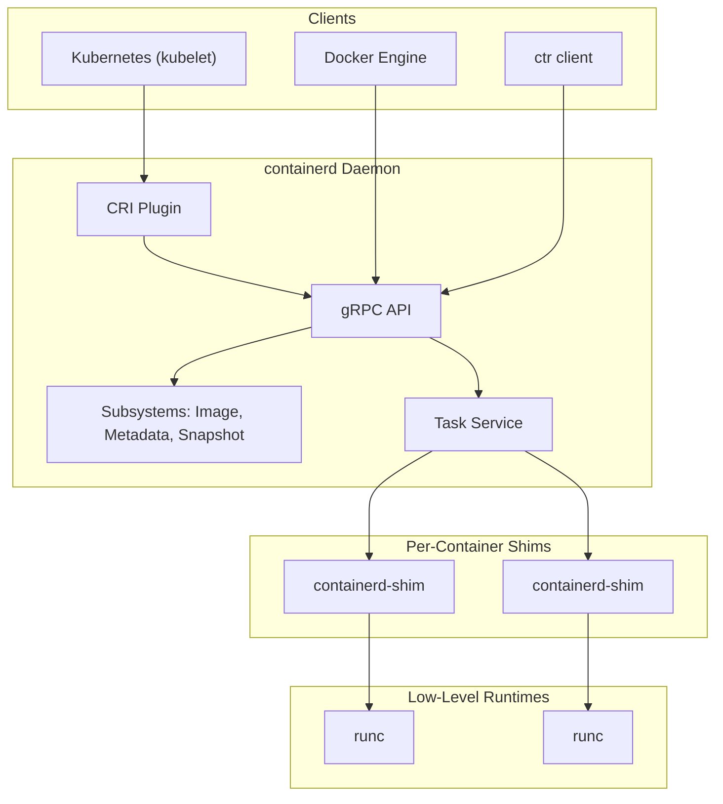

# containerd Exploration

## Architecture

`containerd` is a high-level container runtime that acts as a robust, daemon-based abstraction layer between container orchestration systems (like Kubernetes) and low-level runtimes (like `runc`). It manages the complete container lifecycle, from image transfer and storage to container execution, supervision, and networking.

Its architecture is built on a few key components:

-   **gRPC API**: `containerd` exposes a full-featured gRPC API over a UNIX socket. Clients like the Kubernetes `kubelet` (via the CRI plugin) or Docker's `dockerd` interact with this API to manage images and containers.
-   **Subsystems**: It is composed of various subsystems, including:
    -   **Image Store**: Manages pulling, pushing, and storing container images.
    -   **Metadata Store**: Handles metadata for all container resources (images, containers, namespaces, etc.) using `boltdb`.
    -   **Snapshotter**: Manages container filesystems using drivers like `overlayfs` or `btrfs`. This is crucial for creating the copy-on-write layers for containers.
    -   **Task Service**: Manages running containers (tasks).
-   **Shim API (`containerd-shim`)**: For each container, `containerd` forks a `containerd-shim` process. This shim acts as the direct parent of the container's `runc` process, allowing `containerd` itself to be restarted without terminating the running containers. This "daemonless container" model is a critical feature for stability in production.



## Use Cases

*   **Standard Runtime for Kubernetes**: As the reference implementation of the Container Runtime Interface (CRI), `containerd` is the dominant and most battle-tested runtime for Kubernetes clusters.
*   **Backbone of Docker**: It powers Docker Engine, managing all container lifecycle operations behind the `dockerd` API.
*   **Building Container-Based Platforms**: Its simple API and modular architecture make it a great foundation for building custom container platforms, cloud-native CI/CD systems, and other tools that need to manage container lifecycles without the overhead of the full Docker daemon.

## Production Considerations

*   **Namespaces**: `containerd` uses namespaces (e.g., `k8s.io`, `moby`) to provide multi-tenancy. This is how Kubernetes and Docker can run on the same node without conflicting with each other's containers or images. When using `ctr`, you should specify a namespace (`--namespace k8s.io`) to see resources managed by Kubernetes.
*   **Snapshotters / Storage Drivers**: The choice of snapshotter (e.g., `overlayfs`, `btrfs`, `zfs`) is a critical performance decision. `overlayfs` is the most common and generally recommended for Linux. The performance of your container's I/O is directly tied to the efficiency of this driver.
*   **CRI Plugin Configuration**: When used with Kubernetes, the `containerd` CRI plugin (`/etc/containerd/config.toml` in the `[plugins."io.containerd.grpc.v1.cri"]` section) is the central point of configuration. This is where you configure sandboxed runtimes (e.g., gVisor, Kata), registry mirrors, and other cluster-level runtime settings.
*   **Monitoring**: `containerd` exposes a Prometheus metrics endpoint. In a production environment, you must scrape these metrics to monitor the health of the runtime, including snapshot usage, task counts, and API latency. This is essential for debugging node-level issues.

## Demo Project

For this demo, we will use the command-line tool `ctr`, which is the official, developer-focused client for `containerd`. This provides raw access to the containerd API and is excellent for understanding its object model.

We will perform the following steps:

1.  Pull a container image (`redis:alpine`) from Docker Hub.
2.  Run the image as a container.
3.  List the running container and its associated task.
4.  Stop and delete the container.

---
**Note**: This demo assumes `containerd` and `ctr` are installed and the user has permission to access the `containerd.sock` (often requires `sudo`). The commands below may not run in all sandboxed CI/CD environments that restrict `sudo` access.

### Expected Demo Output

Running the `demo.sh` script will perform the following actions and produce output similar to this:

```text
--> Pulling image: docker.io/library/redis:alpine
docker.io/library/redis:alpine:                                                   resolved       |++++++++++++++++++++++++++++++++++++++| 
index-sha256:2344795085b3a373919e8550c0c598a28742b6a48f0e0c90d81016928271e84f:    done           |++++++++++++++++++++++++++++++++++++++| 
manifest-sha256:55a29f8d6995b285b03c8b49591463e2621c1f510a74797178c5208942b10287:   done           |++++++++++++++++++++++++++++++++++++++| 
layer-sha256:5b75b22b1c4c11b157548b594b9f27301c2384c56e269d038f4d95c73a20d7d9:      done           |++++++++++++++++++++++++++++++++++++++| 
config-sha256:d158f3885d935403487ad620021c13d80327f3113192087265c0d5b4044f5cf3:     done           |++++++++++++++++++++++++++++++++++++++| 
elapsed: 2.2 s                                                                    total:   0.0 B (0.0 B/s)                                       
unpacking linux/amd64 sha256:2344795085b3a373919e8550c0c598a28742b6a48f0e0c90d81016928271e84f...
done: 3.425121111s
--> Running container with ID: redis-demo-ctr
--> Listing running containers:
CONTAINER         IMAGE                               RUNTIME                  
redis-demo-ctr    docker.io/library/redis:alpine      io.containerd.runc.v2    
--> Stopping and deleting the container...
--> Demo finished.
```
