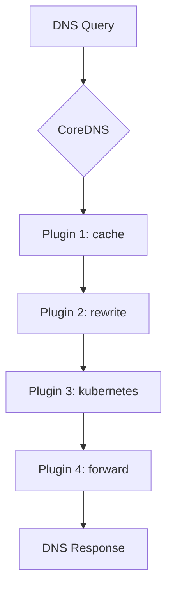

# CoreDNS Exploration

## Architecture

CoreDNS is a flexible and extensible DNS server written in Go. Its power comes from its plugin-based architecture. Each plugin performs a specific DNS function, and they are chained together to process DNS queries. This allows for a highly customizable DNS server that can be tailored to specific needs.

Here is a diagram illustrating the plugin chain concept:



## Use Cases

*   **Kubernetes Cluster DNS**: CoreDNS is the default DNS server for Kubernetes, responsible for service discovery within the cluster.
*   **Cloud DNS Integration**: It can integrate with cloud provider DNS services like AWS Route53, Google Cloud DNS, and Azure DNS.
*   **Custom DNS Solutions**: Its flexibility allows it to be used as a simple DNS forwarder, a DNS-based ad-blocker, or a component in a complex service discovery system.
*   **Service Discovery with etcd**: It can use etcd as a backend for service discovery, similar to how it works with Kubernetes.

### Running the demo

1.  Start the CoreDNS container:
    ```bash
    docker run -d --name coredns-demo -p 1053:53/udp -v $(pwd)/coredns/demo/Corefile:/Corefile coredns/coredns:latest -conf /Corefile
    ```
2.  Run the demo script:
    ```bash
    ./coredns/demo/demo.sh
    ```
3.  The script will automatically stop and remove the container. If you need to do it manually, run:
    ```bash
    docker stop coredns-demo && docker rm coredns-demo
    ```
