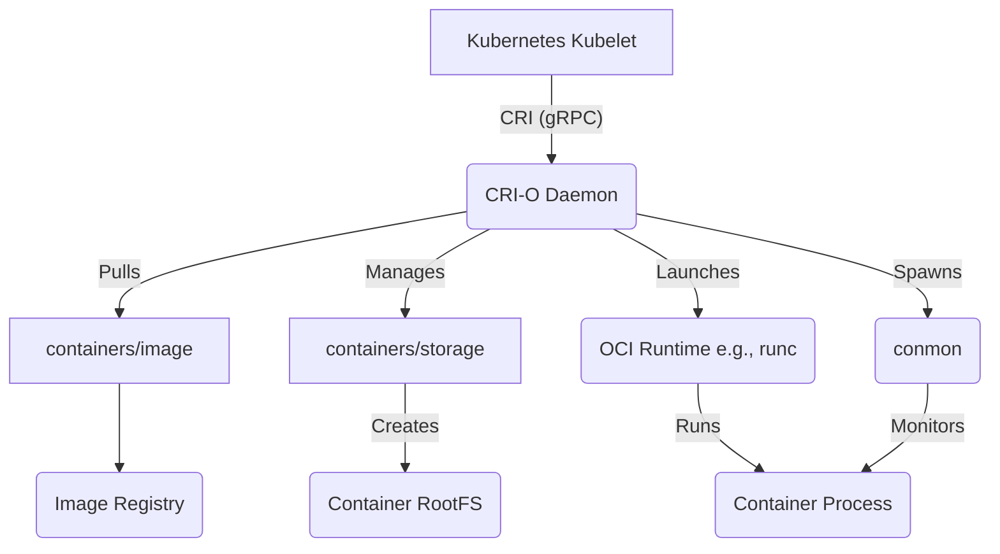

# CRI-O Exploration

[`CRI-O`](https://cri-o.io/) is a lightweight, community-driven implementation of the Kubernetes Container Runtime Interface (CRI). Its sole purpose is to be a stable, performant, and secure runtime specifically for Kubernetes.

## Architecture

CRI-O's architecture is a minimal bridge between the Kubernetes `kubelet` and OCI-compliant runtimes (`runc`). It uses the robust `containers/image` and `containers/storage` libraries for image and storage management and spawns a `conmon` process to monitor each container, ensuring stability.



## Production Considerations

*   **Designed for Kubernetes**: CRI-O's primary and only focus is Kubernetes. Its minimal nature reduces the attack surface compared to general-purpose runtimes.
*   **Configuration**: All settings are managed in `/etc/crio/crio.conf`. Key settings include the `cgroup_manager` (which should be set to `systemd` to match the `kubelet`), storage options, and default runtimes.
*   **Tooling (`crictl`)**: The standard CLI for any CRI runtime is `crictl`. It's essential for node-level debugging.
*   **Version Alignment**: Always use a CRI-O version that is validated for your specific Kubernetes version.

## Verifiable Demo with Minikube

The most effective way to see CRI-O in action is to run a local Kubernetes cluster configured to use it as the container runtime. The `demo.sh` script automates the following steps, with the success of the demo being determined by verifying that the Kubernetes node is in fact using CRI-O.

### 1. Start a Minikube Cluster with CRI-O
This command starts a new Kubernetes cluster, instructing `minikube` to use CRI-O as the container runtime instead of the default.
```bash
minikube start --driver=docker --container-runtime=cri-o
```

### 2. Verify the Container Runtime
This is the key verification step. We use `kubectl` to inspect the node's properties and confirm the runtime is `cri-o`.
```bash
kubectl get nodes -o jsonpath='{.items[0].status.nodeInfo.containerRuntimeVersion}'
```
Expected output will contain `cri-o://...`.

### 3. Deploy a Simple NGINX Pod
To show the runtime in action, we deploy a standard NGINX container.
```bash
kubectl create deployment nginx --image=nginx
```
**Note**: In some environments, this pod may fail to pull its image with an `ImageInspectError`. This is a known issue with `minikube`'s CRI-O provisioning in some contexts. However, the main goal—proving CRI-O is the active runtime—is still achieved in step 2.

### 4. Clean Up the Cluster
This command deletes the cluster and frees up the resources.
```bash
minikube delete
```

### Prerequisites
*   [minikube](https://minikube.sigs.k8s.io/docs/start/)
*   [kubectl](https://kubernetes.io/docs/tasks/tools/install-kubectl/)
*   A container driver like Docker.

---
*The `crictl`-specific config files (`pod-sandbox.yaml`, `container-config.json`) are included in the demo directory for conceptual reference.*
