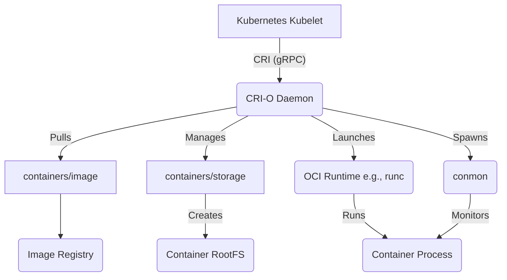

# CRI-O Exploration

[`CRI-O`](https://cri-o.io/) is a lightweight, community-driven implementation of the Kubernetes Container Runtime Interface (CRI). Its sole purpose is to be a stable, performant, and secure runtime specifically for Kubernetes, nothing more.

## Architecture

CRI-O's architecture is designed to be a minimal and compliant bridge between the Kubernetes `kubelet` and OCI-compliant container runtimes like `runc`.

-   **Kubelet Interaction**: The `kubelet` communicates with the CRI-O daemon via the gRPC-based CRI protocol.
-   **Image and Storage Management**: CRI-O uses the battle-tested `containers/image` and `containers/storage` libraries (also used by Podman and Skopeo) to handle pulling images and managing container storage layers.
-   **OCI Runtime Generation**: It generates an OCI runtime specification (a `config.json` file) that describes how the container should be run.
-   **Runtime Execution**: It launches an OCI-compliant runtime, like `runc`, to create and run the container process according to the specification.
-   **Monitoring (`conmon`)**: For each container, CRI-O spawns a `conmon` (Container Monitor) process. This lightweight utility is responsible for monitoring the container, handling its logging, and managing the container's lifecycle, which allows CRI-O itself to be upgraded without restarting the containers.
-   **Networking (CNI)**: CRI-O uses the Container Network Interface (CNI) framework to delegate all pod networking setup to CNI plugins.



## Use Cases

*   **Primary Use Case: Kubernetes Runtime**: CRI-O is specifically designed for and tailored to Kubernetes. It's an excellent choice for production Kubernetes clusters where a minimal, stable, and secure runtime is the top priority. It avoids the overhead and larger feature set of a general-purpose runtime like Docker Engine.
*   **Security-Conscious Environments**: Because its scope is limited to the CRI, its attack surface is smaller than multi-purpose runtimes. This makes it a preferred choice in environments with stringent security requirements.

## Production Considerations

*   **Configuration**: CRI-O is configured via `/etc/crio/crio.conf`. This is where you set the storage driver, logging level, default runtimes (e.g., configuring Kata Containers for sandboxed workloads), and registry configurations.
*   **Tooling (`crictl`)**: The primary tool for debugging and interacting with CRI-O is `crictl`. This is a standard CLI for any CRI-compliant runtime. You **must** configure it to point to the CRI-O socket by creating `/etc/crictl.yaml`.
*   **CGroup Manager**: CRI-O can be configured to use either `cgroupfs` or `systemd` as the cgroup driver. For modern systems using `systemd`, it is strongly recommended to configure both CRI-O and the `kubelet` to use the `systemd` cgroup driver for stability and consistency.
*   **Updates and Versions**: CRI-O versions are closely aligned with Kubernetes versions. It's crucial to use a CRI-O version that is validated for the version of Kubernetes you are running in your cluster.

## Demo Project

For this demo, we will use `crictl`, the standard command-line interface for CRI-compliant runtimes. This will allow us to interact with CRI-O in the same way the `kubelet` does.

**Note**: This demo requires a functioning CRI-O installation and `crictl`. Like the `containerd` demo, it requires root privileges and may not run in restricted environments. The expected output will be documented.

### Demo Files

To create a pod and container with `crictl`, you need to provide configuration files that describe them.

**`pod-sandbox.yaml`**
```yaml
metadata:
  name: nginx-sandbox
  namespace: default
  attempt: 1
  uid: hdishd83d-dshsd-3232-uid
log_directory: "/tmp"
linux:
  security_context:
    namespace_options:
      network: 2 # POD
      pid: 1 # CONTAINER
      ipc: 1 # CONTAINER
```

**`container-config.json`**
```json
{
  "metadata": {
    "name": "nginx"
  },
  "image": {
    "image": "nginx:alpine"
  },
  "log_path": "nginx.log",
  "linux": {
  }
}
```

### Expected Demo Output

```text
--> Pulling NGINX image...
Image is up to date for docker.io/library/nginx:alpine
--> Creating Pod Sandbox...
a1b2c3d4e5f6...
--> Creating Container...
f1e2d3c4b5a6...
--> Listing Pods:
POD ID              CREATED             STATE               NAME                NAMESPACE           ATTEMPT
a1b2c3d4e5f6        About a minute ago  SANDBOX_READY       nginx-sandbox       default             1
--> Listing Containers:
CONTAINER ID        IMAGE               CREATED             STATE               NAME                ATTEMPT
f1e2d3c4b5a6        nginx:alpine        About a minute ago  CONTAINER_CREATED   nginx               0
--> Stopping and removing...
(Stop and remove commands would execute here)
--> Demo finished.
```
