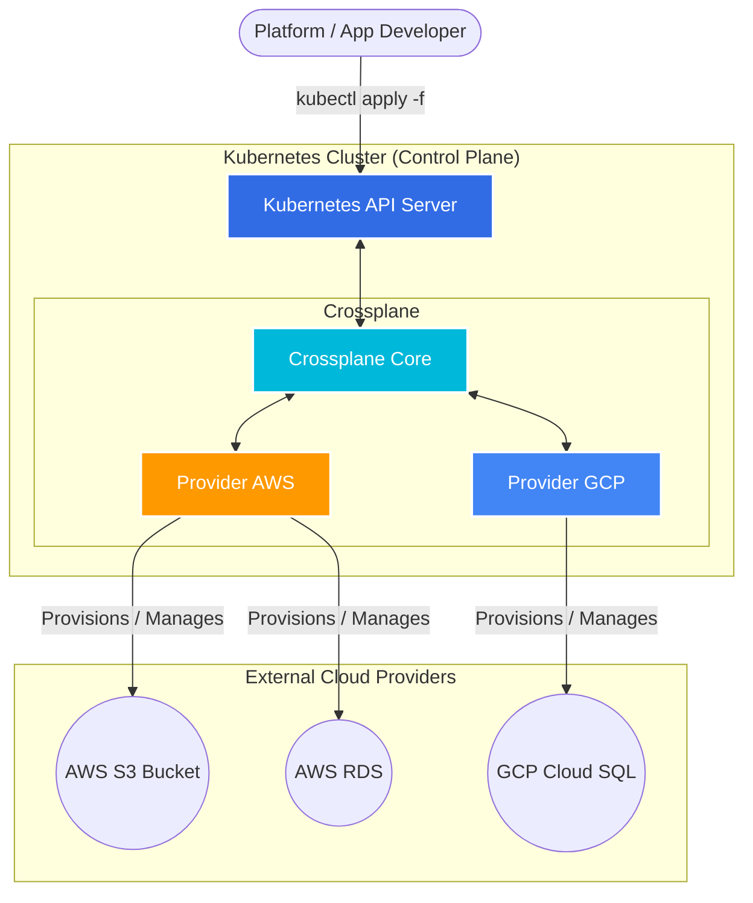

# Crossplane Exploration

[Crossplane](https://crossplane.io/) is an open-source Kubernetes add-on that enables you to build cloud-native control planes without writing code. It transforms your Kubernetes cluster into a universal control plane, allowing you to manage external infrastructure (like AWS, GCP, Azure resources) using Kubernetes APIs.

## What is Crossplane?

Traditionally, Kubernetes is used to manage containers. Crossplane extends this capability so Kubernetes can manage anything—databases, message queues, buckets, and even other Kubernetes clusters—across different cloud providers. 

It does this through:
1. **Providers**: Packages that bundle controllers and Custom Resource Definitions (CRDs) for a specific cloud or service (e.g., `provider-aws`, `provider-gcp`).
2. **Managed Resources**: High-fidelity Kubernetes representations of external infrastructure resources.
3. **Composite Resources (XRs)**: Custom abstractions you define that bundle together multiple managed resources into a single concept (e.g., a "PostgresDatabase" that provisions an RDS instance, a Subnet Group, and IAM roles).



## Why is Crossplane Useful?

* **Unified API**: You manage your applications and infrastructure using the exact same Kubernetes YAML files and tools (`kubectl`, ArgoCD, Flux).
* **Self-Service**: Platform teams can define custom Composite Resources, hiding complex infrastructure details and allowing developers to provision what they need safely.
* **Continuous Reconciliation**: Like standard Kubernetes resources, Crossplane continuously watches the state of your external infrastructure and reconciles it to match your desired state, preventing configuration drift.

## Verifiable Demo: Managing Resources with provider-helm

This demo showcases using Crossplane to install a Helm release (as a managed resource) within a local `minikube` cluster using `provider-helm`.

### Prerequisites
* A local Kubernetes cluster environment like `minikube`.
* `kubectl` installed.
* `helm` installed.

### How the Demo Works
The `demo.sh` script automates the process:

1. **Start Minikube**: Starts a `minikube` cluster.
2. **Install Crossplane**: Uses Helm to install the core Crossplane components into the `crossplane-system` namespace.
3. **Install Provider**: Installs `provider-helm`, which allows Crossplane to manage Helm charts as Kubernetes resources.
4. **Configure Provider**: Applies necessary RBAC permissions (`ProviderConfig`) so the provider can create resources in the cluster.
5. **Provision Infrastructure**: Creates a Crossplane `Release` resource (a managed resource) that tells the provider to deploy a simple Nginx Helm chart.
6. **Verify Result**: Checks if the Crossplane `Release` becomes `READY` and `SYNCED`, and ensures the Nginx pods are running.
7. **Clean Up**: Deletes the `minikube` cluster.

### Running the Demo

To run the demo, navigate to the `demo` directory, make the script executable, and run it:

```bash
cd crossplane/demo
chmod +x demo.sh
./demo.sh
```
