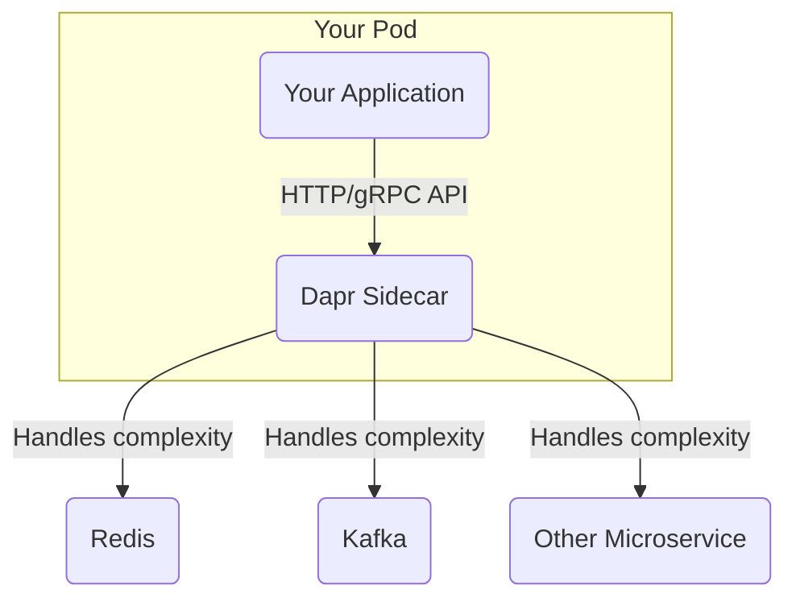

# Dapr Exploration

[`Dapr`](https://dapr.io/) stands for **D**istributed **Ap**plication **R**untime. It is a portable, event-driven runtime that makes it easy for developers to build resilient, microservice-based applications that run on the cloud and edge. Dapr is a CNCF Graduated project.

## What Problem Does Dapr Solve?

Building distributed applications (microservices) is hard. Developers need to solve many common challenges, such as:
*   How do services call each other reliably?
*   How do I manage state for a stateless service?
*   How do I implement pub/sub messaging between services?
*   How do I handle retries and transient failures?
*   How can I do all of this without locking my code into a specific cloud provider's SDK?

Dapr solves these problems by providing a set of "building blocks" that offer these common capabilities as standard, language-agnostic APIs.

## Architecture & Components: The Sidecar Model

Dapr's core architecture is based on the **sidecar pattern**. It runs a separate process or container (the `daprd` sidecar) alongside your application. Your application communicates with the Dapr sidecar over standard HTTP or gRPC APIs. The sidecar then handles the complex work of interacting with databases, message queues, and other services.

This has a huge advantage: your application code remains completely independent of the underlying components. For example, to save state, your code simply makes an HTTP POST request to the local Dapr state API. The Dapr sidecar, guided by a configuration file, takes care of persisting that state to a component like Redis, PostgreSQL, or an Azure CosmosDB. You can switch the backend store from Redis to CosmosDB just by changing a YAML file, with **no changes to your application code**.

### Dapr Building Blocks
*   **Service-to-Service Invocation:** Reliable, secure service calls with automatic mTLS.
*   **State Management:** Pluggable state persistence with support for Redis, Cassandra, MongoDB, and more.
*   **Publish & Subscribe:** A standard API for pub/sub messaging.
*   **Bindings:** Trigger your application from external systems or invoke external systems.
*   **Actors:** A programming model for building stateful, concurrent applications.



## Verifiable Demo: A Stateful Counter API

This demo will provide a realistic example of using Dapr's state management building block. We will deploy a simple Python application that maintains a counter. The application itself will be stateless; it will use the Dapr sidecar to persist the counter's value in a Redis cache.

### Manual Walkthrough

#### Step 1: Start Minikube & Install the Dapr CLI

```bash
# Start Minikube
minikube start --profile dapr-demo --cpus 4 --memory 8192

# Install the Dapr CLI (if you don't have it)
# On Mac/Linux:
wget https://raw.githubusercontent.com/dapr/cli/master/install/install.sh
# Review the script for security, then run it:
# bash install.sh
```

#### Step 2: Initialize Dapr on Kubernetes
This command will deploy the core Dapr control plane components (`dapr-operator`, `dapr-sentry`, etc.) into your cluster.

```bash
dapr init --kubernetes
```

#### Step 3: Deploy Redis (Our State Store)
We will use Helm to deploy a simple Redis instance, which will act as our state store.

```bash
helm repo add bitnami https://charts.bitnami.com/bitnami
helm repo update
# We are setting a password and will store it in a Kubernetes secret.
helm install redis bitnami/redis --set auth.enabled=true --set auth.password=dapr-secret

# Create a Kubernetes secret to hold the Redis password for Dapr to use
kubectl create secret generic redis --from-literal=redis-password=dapr-secret
```
Now, create a Dapr `Component` manifest that tells Dapr how to connect to this Redis instance, including how to fetch the password from our new secret.
 Create a file named `dapr/demo/redis.yaml`:

```yaml
apiVersion: dapr.io/v1alpha1
kind: Component
metadata:
  name: statestore
spec:
  type: state.redis
  version: v1
  metadata:
  - name: redisHost
    value: redis-master.default.svc.cluster.local:6379
```
Apply it to the cluster:
```bash
kubectl apply -f dapr/demo/redis.yaml
```

#### Step 4: Deploy the Python Application
Create a file named `dapr/demo/app.yaml` with the following content. Note the `dapr.io/enabled: "true"` annotation, which tells the Dapr control plane to inject the `daprd` sidecar into this pod.

```yaml
apiVersion: apps/v1
kind: Deployment
metadata:
  name: python-app
  labels:
    app: python
spec:
  replicas: 1
  selector:
    matchLabels:
      app: python
  template:
    metadata:
      labels:
        app: python
      annotations:
        dapr.io/enabled: "true"
        dapr.io/app-id: "python-app"
        dapr.io/app-port: "5001"
    spec:
      containers:
      - name: python
        image: dapriosamples/hello-k8s-python:edge
```
Apply it to the cluster:
```bash
kubectl apply -f dapr/demo/app.yaml
```
Wait for the deployment to be ready. You should see `2/2` in the `READY` column, indicating both the application container and the Dapr sidecar are running.
```bash
kubectl get pods -w
```

#### Step 5: Test the State Management
We will use `port-forward` to access the application and test the counter.

```bash
# Open a new terminal for this and leave it running
kubectl port-forward svc/python-app 5001:5001

# In your original terminal, send a POST request to increment the counter
curl -X POST http://localhost:5001/increment

# Now, send a GET request to retrieve the current value
curl http://localhost:5001/
```
The first time you run the GET request, it should return `"1"`. If you run the POST command again and then the GET command, it will return `"2"`. This proves that the state is being persisted in Redis, managed entirely by the Dapr sidecar.

#### Step 6: Cleanup
```bash
minikube delete --profile dapr-demo
```
