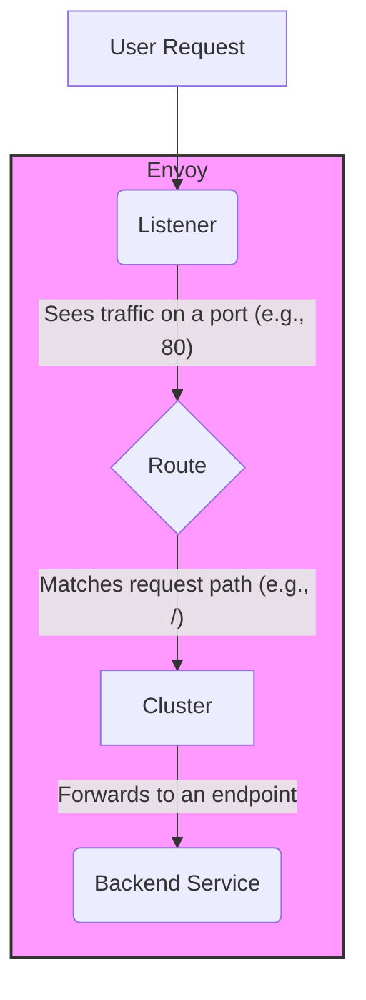

# Envoy Exploration

[`Envoy`](https://www.envoyproxy.io/) is an open-source **proxy** designed for modern, cloud-native applications. It was originally built at Lyft and is now a graduated CNCF project.

## What is Envoy? (A Simple Explanation)

Imagine you have a web application. Instead of letting users connect directly to your application, you can put Envoy in front of it. Envoy acts like a smart, programmable middle-man that sits at the "edge" of your system.

All incoming traffic goes to Envoy first. Envoy can then do useful things with that traffic before passing it along to your application. This makes it much more than a simple proxy; it's a powerful tool for controlling, securing, and observing your network traffic.

## How Envoy Works: Listeners, Routes, and Clusters

Envoy's configuration is based on three core concepts that form a request pipeline:



1.  **Listeners:** A listener is the "front door." It's configured to listen on a specific port (like port 80 for web traffic). When a request comes in, the listener accepts it and passes it to the next stage.

2.  **Routes:** The listener sends the request to a route. The route's job is to figure out *what to do* with the request based on its properties, like the URL path. For example, a route can say "if the path is `/api`, send it to the API service."

3.  **Clusters:** A cluster is a group of one or more backend servers (called "endpoints") that can handle the request. After a route matches, it forwards the traffic to a specific cluster. Envoy then intelligently sends the request to one of the healthy endpoints in that cluster.

This model allows Envoy to perform advanced tasks like load balancing, securing traffic with TLS, and gathering detailed metrics, all configured in a single YAML file.

## Verifiable Demo

This demo will showcase Envoy in its most basic role: a **front proxy**.

1.  We will run two Docker containers:
    *   A simple **backend service** (a Node.js web server) that will respond with a "Hello World" message.
    *   An **Envoy** container.
2.  We will provide an `envoy.yaml` configuration file that tells Envoy to:
    *   Listen for traffic on port `8080`.
    *   Route all incoming requests to our backend service.
3.  The demo script will start both containers, then send a `curl` request **to Envoy's port**. It will then verify that the response it receives is the "Hello World" message from the backend service.

### What to Look For (Expected Output)
A successful run will show the output from the `curl` command. The important thing is that we sent our request to Envoy (`localhost:8080`), but we received the response from our backend service.

```text
--> Verifying the response from Envoy...
--> SUCCESS: Received the expected 'Hello from backend service!' response.
--- Response ---
Hello from backend service!
---
```
This proves that Envoy successfully received our request and proxied (forwarded) it to the correct destination.

### Challenges Faced & Best Practices
*   **YAML Configuration**: Envoy's configuration is famously verbose and complex. For our simple demo, it's manageable, but for production systems, the configuration is almost always generated dynamically by a "control plane" (like Istio), not written by hand.
*   **Docker Networking**: To allow the Envoy container to find the backend container, they must be on the same Docker network. The demo script creates a dedicated network for this purpose.

### Prerequisites & Security Notes
*   **Docker** is required.
*   **Security Note**: This demo uses an unencrypted HTTP connection. In a real-world scenario, you would configure Envoy's listener to terminate TLS (HTTPS), providing a secure connection to the outside world.

## Example in Kubernetes (Sidecar Pattern)
While the Docker demo is great for learning, in a real-world cloud-native environment, Envoy is most often used as a **sidecar** proxy inside a Kubernetes Pod.

**The Concept (in simple terms):**
You place an Envoy container right next to your application container inside the same Pod. They live and die together. All network traffic going into or out of your application is forced to go through the Envoy sidecar first.

This pattern is the foundation of a **Service Mesh**, where every application gets its own personal, intelligent proxy.

### Kubernetes Manifest Examples
Here is how you would configure our simple demo in Kubernetes. We don't need a runnable script for this; the YAML files themselves are the example.

First, we would place the `envoy.yaml` configuration into a `ConfigMap` so Kubernetes can manage it. Notice the `address` for the cluster now points to `127.0.0.1` (localhost), because the sidecar and the application are in the same Pod and can talk to each other directly.

**1. `envoy-config.yaml` (The ConfigMap)**
```yaml
apiVersion: v1
kind: ConfigMap
metadata:
  name: envoy-sidecar-config
data:
  envoy.yaml: |
    admin:
      address:
        socket_address: { address: 0.0.0.0, port_value: 9901 }
    static_resources:
      listeners:
      - name: listener_0
        address:
          socket_address: { address: 0.0.0.0, port_value: 10000 }
        filter_chains:
        - filters:
          - name: envoy.filters.network.http_connection_manager
            typed_config:
              "@type": type.googleapis.com/envoy.extensions.filters.network.http_connection_manager.v3.HttpConnectionManager
              stat_prefix: ingress_http
              route_config:
                name: local_route
                virtual_hosts:
                - name: local_service
                  domains: ["*"]
                  routes:
                  - match: { prefix: "/" }
                    route: { cluster: backend_service }
              http_filters:
              - name: envoy.filters.http.router
      clusters:
      - name: backend_service
        connect_timeout: 0.25s
        type: STRICT_DNS
        lb_policy: ROUND_ROBIN
        load_assignment:
          cluster_name: backend_service
          endpoints:
          - lb_endpoints:
            - endpoint:
                address:
                  socket_address:
                    address: 127.0.0.1
                    port_value: 8000
```

Next, we define our `Deployment`, which creates the Pods. This is the most important part. Notice it has **two containers** defined: our `backend-service` app and the `envoy` sidecar. The Envoy container mounts the `ConfigMap` we just created.

**2. `backend-deployment.yaml` (The Deployment)**
```yaml
apiVersion: apps/v1
kind: Deployment
metadata:
  name: backend-deployment
spec:
  replicas: 1
  selector:
    matchLabels:
      app: backend-service
  template:
    metadata:
      labels:
        app: backend-service
    spec:
      containers:
      # Our Node.js application container
      - name: backend-service
        image: backend-service-image # Assumes you've built and pushed this image
        ports:
        - containerPort: 8000

      # The Envoy sidecar container
      - name: envoy-sidecar
        image: envoyproxy/envoy:v1.28-latest
        ports:
        - containerPort: 10000
        volumeMounts:
        - name: envoy-config-volume
          mountPath: /etc/envoy
      volumes:
      - name: envoy-config-volume
        configMap:
          name: envoy-sidecar-config
```

Finally, to expose our service to the outside world, we create a `Service` that targets **Envoy's port (`10000`)**, not our application's port. This ensures all traffic goes through the proxy.

**3. `backend-service.yaml` (The Service)**
```yaml
apiVersion: v1
kind: Service
metadata:
  name: backend-service
spec:
  selector:
    app: backend-service
  ports:
    - protocol: TCP
      port: 80
      targetPort: 10000
  type: LoadBalancer
```
