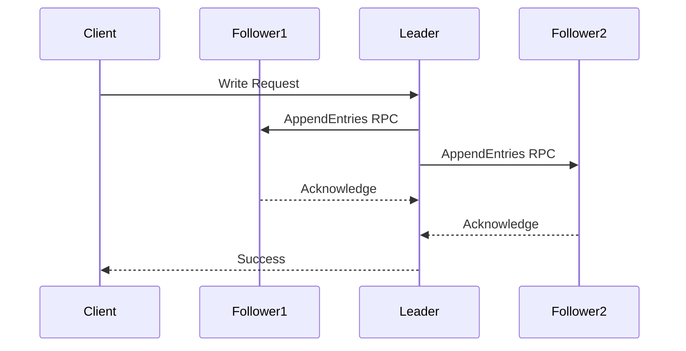

# etcd Exploration

## Architecture

[`etcd`](https://etcd.io/) is a distributed key-value store that uses the [Raft consensus algorithm](https://raft.github.io/) to manage a highly-available replicated log. This ensures strong consistency across all nodes in a cluster.

When a client sends a write request to the leader, the leader forwards the request to its followers. The write is committed only after a majority of the nodes in the cluster have acknowledged it. This process ensures that the data is safely replicated and the system can tolerate failures of a minority of nodes.

Here is a simplified diagram of the Raft consensus process:



## Use Cases

*   **Kubernetes**: Kubernetes uses etcd as its primary datastore for all cluster state, including node status, pod scheduling, secrets, and configmaps.
*   **Service Discovery**: Services can register themselves with etcd, and other services can query etcd to find them.
*   **Distributed Configuration**: Centralized and dynamic configuration management for distributed applications.
*   **Distributed Locking**: Implementing distributed mutexes for coordinating access to shared resources.

## Demo Project

This demo uses Docker to run a single-node etcd cluster.

### Prerequisites

*   Docker

### Running the demo

1.  Start the etcd container:
    ```bash
    docker run -d -p 2379:2379 --name etcd-demo gcr.io/etcd-development/etcd:v3.5.0 /usr/local/bin/etcd --name my-etcd-1 --listen-client-urls http://0.0.0.0:2379 --advertise-client-urls http://0.0.0.0:2379
    ```
2.  Run the demo script:
    ```bash
    ./demo.sh
    ```
3.  Stop and remove the etcd container:
    ```bash
    docker stop etcd-demo && docker rm etcd-demo
    ```
