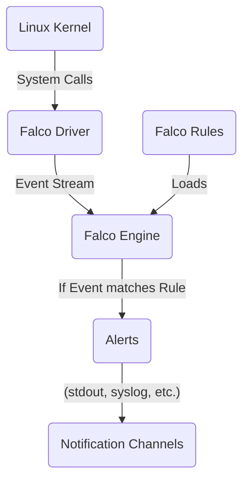

# Falco Exploration

[`Falco`](https://falco.org/), the cloud-native runtime security project, is the de-facto Kubernetes threat detection engine. Falco is a CNCF Graduated project.

## What Problem Does Falco Solve?

While other tools provide security at creation time (admission control), Falco provides **runtime security**. It observes what is actually happening inside your running containers and alerts you when suspicious activity occurs.

### Use Cases
*   **Privilege Escalation:** A process tries to gain root access.
*   **Unexpected Network Connections:** An application connects to an unknown IP address.
*   **Sensitive File Access:** A shell tries to read a file in `/etc/`.
*   **Container Drifts:** A package is installed in a running container.

## Architecture & Components

Falco gets deep visibility into your system by processing kernel-level events using a driver (like eBPF). Its engine filters these events through a ruleset, and if an event matches a rule, Falco generates an alert.



## Verifiable Demo: Detecting a Shell in a Container

This demo provides a simple, verifiable example of Falco's core functionality. We will install Falco and then deliberately perform a suspicious action (spawning a shell in a pod) to trigger a security alert.

### Manual Walkthrough

#### Step 1: Start Minikube & Install Falco
This will start a new cluster and install Falco using the official Helm chart.

```bash
# Start Minikube
minikube start --profile falco-demo --cpus 4 --memory 8192

# Install Falco using Helm
helm repo add falcosecurity https://falcosecurity.github.io/charts
helm repo update
helm install falco falcosecurity/falco \
  --namespace falco \
  --create-namespace \
  --set driver.kind=modern_ebpf
```

#### Step 2: Observe Falco's Logs
To see the alerts, we need to stream the logs from the Falco pod.

**Open a new terminal for this and leave it running.** This terminal will act as our security monitoring console.

```bash
# Wait for the Falco pod to be running
kubectl wait --for=condition=ready pod -l app.kubernetes.io/name=falco -n falco --timeout=300s

# Find the name of the Falco pod
FALCO_POD=$(kubectl get pods -n falco -l app.kubernetes.io/name=falco -o jsonpath='{.items[0].metadata.name}')

# Stream the logs from the Falco pod
kubectl logs -n falco -f $FALCO_POD
```
You will see some initial startup messages. **IMPORTANT:** It can take several minutes for the Falco driver to initialize. Be patient and wait for the log messages to stop before proceeding to the next step.

#### Step 3: Trigger a Security Event
Now, we will simulate spawning a shell inside a running pod.

1.  **Create a test pod:** In your **original terminal**, create a simple NGINX pod.
    ```bash
    kubectl run nginx --image=nginx
    # Wait for it to be ready
    kubectl wait --for=condition=ready pod/nginx
    ```

2.  **Spawn a shell:** Use `kubectl exec` to open an interactive shell inside the NGINX pod.
    ```bash
    kubectl exec -it nginx -- /bin/sh
    ```
    Your terminal prompt will change, indicating you are now inside the container.

#### Step 4: Verify the Alert
Go back to the terminal where you are streaming the Falco logs. You should now see an alert for the shell activity.

```json
{
  "hostname": "falco-...",
  "output": "15:51:58.647284816: Notice A shell was spawned in a container with an attached terminal...",
  "priority": "Notice",
  "rule": "Terminal shell in container",
  ...
}
```
The message `Notice A shell was spawned in a container` proves that Falco detected the suspicious activity.

#### Step 5: Cleanup
```bash
minikube delete --profile falco-demo
```
