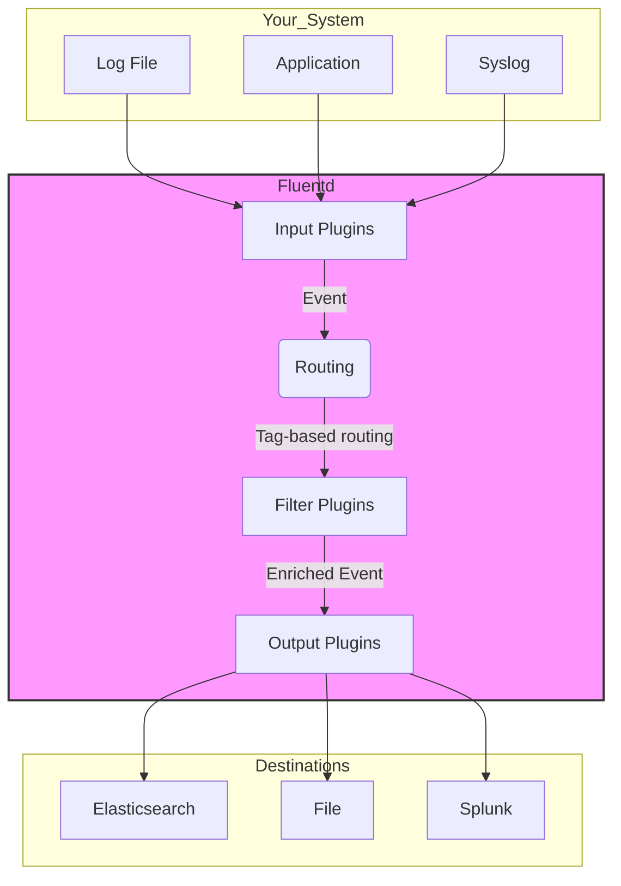

# Fluentd Exploration

[`Fluentd`](https://www.fluentd.org/) is an open-source data collector for building a **Unified Logging Layer**.

## What is Fluentd? (A Simple Explanation)

Imagine you have many different applications and servers. Each one produces its own logs in its own format.
*   Your web server creates access logs.
*   Your database creates query logs.
*   Your application creates custom error logs.

Trying to look at all these logs in different places is messy and difficult. Fluentd solves this problem by acting as a universal log collector and forwarder.

It sits in the middle, collects logs from all your different sources, cleans them up into a consistent format (JSON is the standard), and then sends them to one or more destinations for storage and analysis.

This creates a **Unified Logging Layer**—a single, reliable pipeline for all of your log data.

## How Fluentd Works: The Pipeline

Fluentd works like an assembly line for your logs. A log event enters one end and moves through a series of stages defined in a configuration file.



1.  **Input Plugins (`source`):** These are the "front door." They are configured to get logs *from* a source. Fluentd has plugins to read from a file (`tail`), listen for HTTP requests (`http`), or receive messages from the system log (`syslog`). Every log that comes in is given a **tag** (e.g., `app.error`).

2.  **Filter Plugins (`filter`):** This is an optional but powerful step. Filters can modify the log data as it passes through. You can add new information (like the server's hostname), remove sensitive data (like a password), or parse a messy log line into a clean, structured format.

3.  **Output Plugins (`match`):** These are the "back door." They send the final, processed log data *to* a destination. The "match" part is important: you configure outputs to only send logs that have a specific tag. For example, logs tagged `app.error` might go to Elasticsearch, while logs tagged `app.access` might go to a different file.

## Verifiable Demo

This demo will show a simple but complete Fluentd pipeline in action.

1.  We will run two Docker containers:
    *   A simple application that continuously writes logs to a file (`app.log`).
    *   A **Fluentd** container.
2.  We will configure Fluentd to:
    *   Use the `tail` input plugin to "watch" the `app.log` file for new lines.
    *   Use the `stdout` output plugin, which simply prints every log it receives to its own console logs.
3.  The demo script will start both containers, wait a few seconds for logs to be generated, and then check the Fluentd container's logs to verify that it has successfully collected and processed the logs from the application.

### What to Look For (Expected Output)
A successful run will show the logs from the Fluentd container. You should see JSON-formatted output that matches the logs written by the application. The tag (`app.log`) and the log message itself will be visible.

```text
--> Verifying Fluentd logs...
--> SUCCESS: Found application logs in the Fluentd output.
--- Log Snippet ---
2026-04-08T13:50:00.000000000+00:00 app.log: {"message":"Log entry 1"}
2026-04-08T13:50:01.000000000+00:00 app.log: {"message":"Log entry 2"}
---
```
This proves that Fluentd was able to read from the file source and process the events.

### Challenges Faced (A Learning Opportunity)
*   **File Permissions**: The demo initially failed with a "Permission denied" error. This was because the Fluentd container runs as a non-root `fluent` user by default, but the log files in the shared volume were owned by `root` (from the other container). The `fluent` user did not have permission to read the files or write its own "position" file. We solved this for the demo by running the Fluentd container as `root` using the `--user root` flag. This is a common challenge when sharing volumes between containers.
*   **Configuration Filename**: The demo also failed because Fluentd was using its default configuration. We discovered that the official Docker image looks for a specific configuration file named `/fluentd/etc/fluent.conf`. Our custom file was originally named `fluentd.conf`, so it was being ignored. Renaming our file to `fluent.conf` and mounting it to the correct path solved the issue.

### Prerequisites & Security Notes
*   **Docker** is required.
*   **Best Practice - Shared Volume**: This demo works by mounting the same directory (a Docker volume) into both containers. The app writes a file to this shared space, and Fluentd reads it. This is a common pattern for log collection from containerized applications running on the same host.
*   **Best Practice - Non-Root**: For simplicity, this demo runs the Fluentd container as root to avoid file permission issues on the shared volume. In production, you would need to carefully manage user and group permissions to allow a non-root Fluentd user to read the log files.
