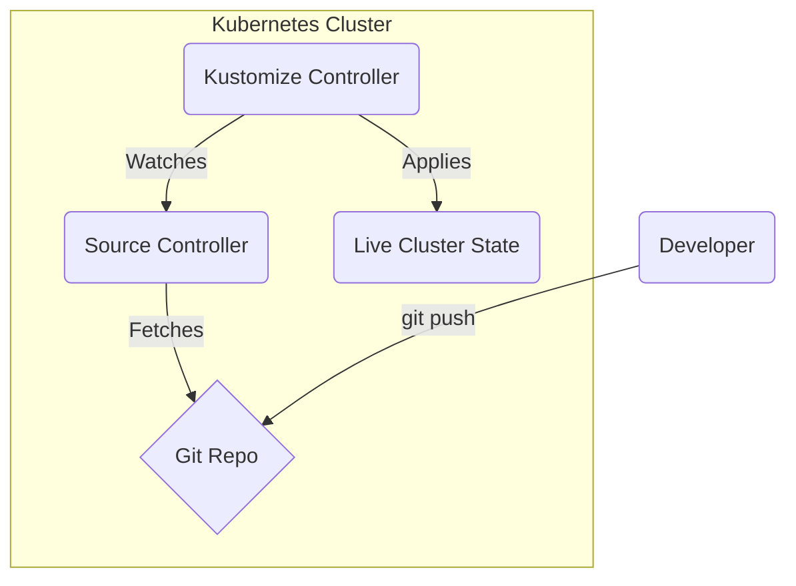

# Flux Exploration

[`Flux`](https://fluxcd.io/) is a tool for keeping Kubernetes clusters in sync with sources of configuration (like Git repositories) and automating updates to configuration when there is new code to deploy. Flux is a CNCF Graduated project.

## How is Flux different from Argo CD?

Flux and Argo CD are both very popular GitOps tools that solve the same fundamental problem. They have different origins and architectures, but their high-level goals are similar.

*   **Architectural Style:** Flux is a collection of "micro-controllers." It breaks down the GitOps process into specialized controllers for different tasks (e.g., a `SourceController` for fetching from Git, a `KustomizeController` for applying Kustomize overlays, a `HelmController` for Helm charts). Argo CD is more of a monolithic tool with a central Application Controller.
*   **User Interface:** Argo CD is widely known for its polished and powerful web UI. Flux is more controller-centric and is often managed via `kubectl` and command-line tools, though it does have UI options.

## How Flux Works

Flux operates as a set of controllers running in your cluster. You create custom resources to tell Flux what to do.

1.  A `GitRepository` resource tells Flux's `SourceController` to fetch manifests from a specific Git repository at a regular interval.
2.  A `Kustomization` resource tells Flux's `KustomizeController` to take the manifests from the source and apply them to the cluster.
3.  When a developer pushes a change to the Git repository, the `SourceController` detects the new commit.
4.  The `KustomizeController` sees that the live state of the cluster no longer matches the desired state from the source and automatically applies the changes.



## Verifiable Demo: A Real-World GitOps Workflow

This demo will provide a robust, verifiable example of Flux's core functionality using your existing public GitHub repository as the source of truth.

**IMPORTANT:** This guide uses the repository `https://github.com/bansikah22/kubesrv-gitops`.

### Manual Walkthrough

#### Step 1: Start Minikube & Install Flux
This will start your local cluster and install the Flux CLI and the in-cluster components.

```bash
# Start Minikube
minikube start --profile flux-demo --cpus 4 --memory 8192

# Install the Flux CLI (if you don't have it)
# On Mac: brew install fluxcd/tap/flux
# On Linux: curl -s https://fluxcd.io/install.sh | sudo bash

# Install the Flux components into your cluster
flux install
```

#### Step 2: Connect Flux to Your Git Repository
This is the core GitOps step. We will create a `GitRepository` source and a `Kustomization` to deploy the `kubesrv` app.

```bash
# Create the GitRepository source
flux create source git kubesrv-source \
  --url=https://github.com/bansikah22/kubesrv-gitops \
  --branch=master \
  --interval=1m

# Create the Kustomization to apply the manifests from the source
flux create kustomization kubesrv \
  --source=kubesrv-source \
  --path="./apps/kubesrv" \
  --prune=true \
  --interval=1m
```

#### Step 3: Verify the Initial Deployment
Flux will now automatically sync and deploy the application.

```bash
# Watch the Kustomization until it is ready
flux get kustomizations --watch

# Verify that 4 replicas are running (as defined in the repo)
kubectl get pods
```

#### Step 4: The GitOps Loop - Scale Down
Let's simulate a developer scaling the application down from 4 to 1.

1.  **Update the Manifest:**
    *   In your **local clone** of the `kubesrv-gitops` repository, open `apps/kubesrv/deployment.yaml`.
    *   Change the `replicas` field from `4` to `1`.
    *   Commit and push this change to the `master` branch on GitHub.

2.  **Observe the Change:**
    *   Flux will automatically detect the change within the 1-minute interval. To speed it up, you can force a reconciliation:
        ```bash
        flux reconcile kustomization kubesrv
        ```
    *   Watch the pods in your terminal. You will see 3 of the 4 pods terminate.
        ```bash
        kubectl get pods -w
        ```

3.  **Verify the Result:**
    *   Once the change is applied, verify the final state:
        ```bash
        kubectl get deployment kubesrv -o jsonpath='{.spec.replicas}'
        ```
    *   This command should now output `1`.

#### Step 5: Cleanup

```bash
minikube delete --profile flux-demo
```
