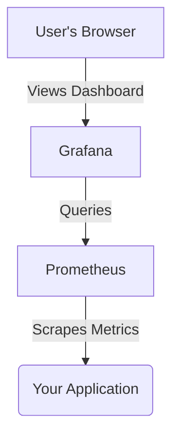
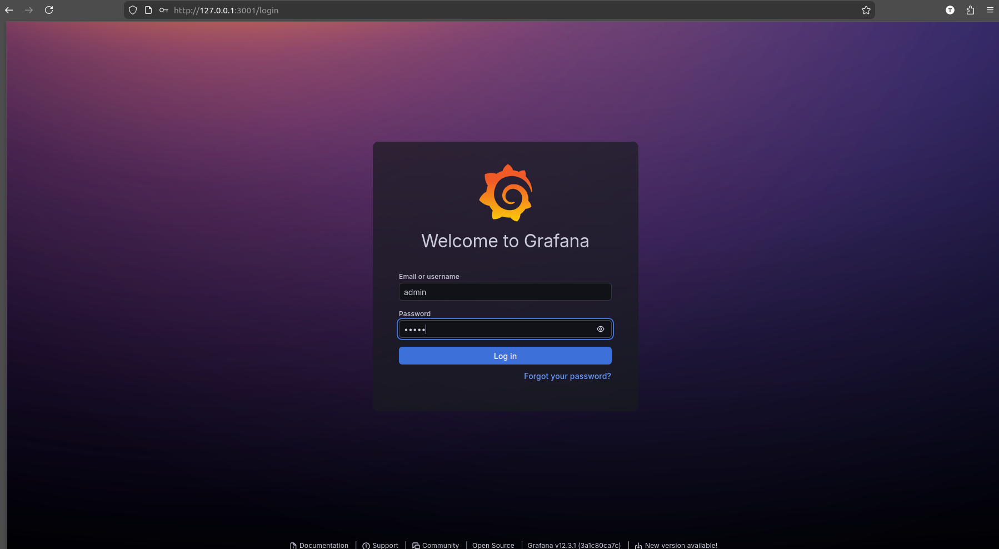
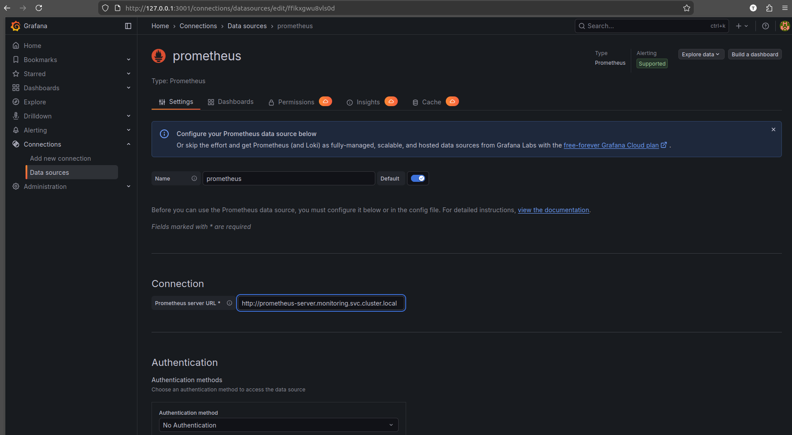
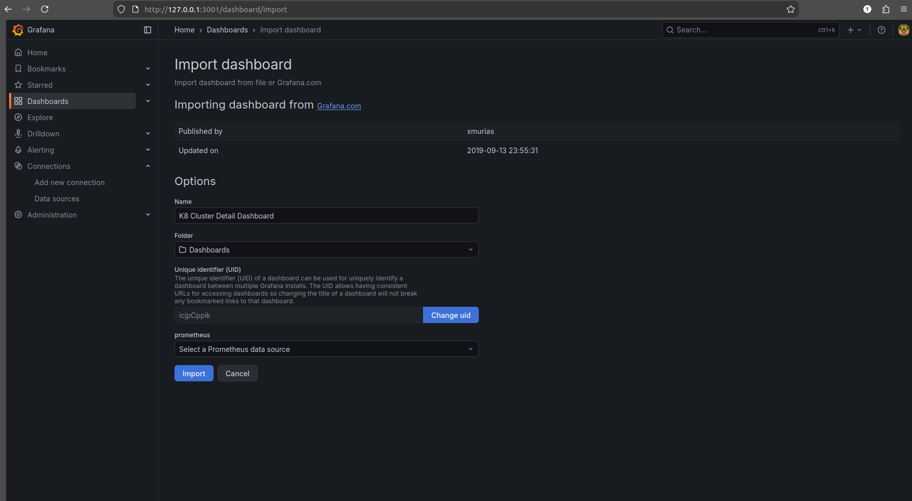
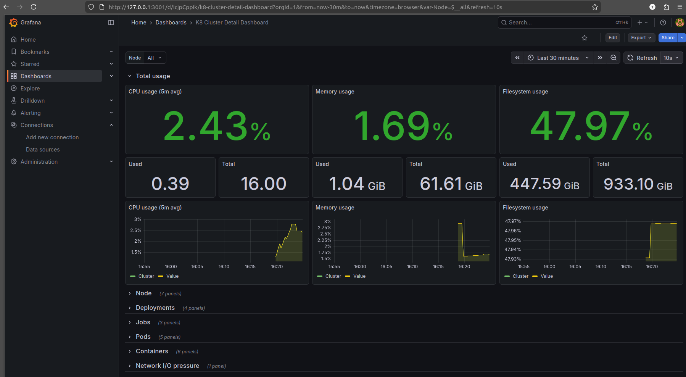

# Grafana Exploration

[`Grafana`](https://grafana.com/) is an open-source platform for monitoring and observability. It allows you to query, visualize, alert on, and explore your metrics no matter where they are stored.

## What is Grafana?

While tools like Prometheus are excellent for collecting and storing metrics, Grafana is the de-facto standard for creating beautiful, complex, and highly useful dashboards from a wide variety of data sources.

## How Grafana Works

Grafana runs as a server that you can access through a web browser. Inside Grafana, you configure:

1.  **Data Sources:** Connections to your databases (like Prometheus).
2.  **Dashboards:** Collections of panels.
3.  **Panels:** Specific visualizations (like a graph or a table) configured with a query.



## Verifiable Demo: Visualizing Prometheus Metrics

This demo will show how to install Prometheus and Grafana into a single cluster and then use Grafana to visualize metrics collected by Prometheus using a real-world community dashboard.

### Manual Walkthrough

#### Step 1: Cluster Setup (Minikube, Prometheus & Grafana)
This single block of commands will create your local cluster and install all necessary components.

```bash
# Start Minikube with its own profile
minikube start --profile grafana-demo --cpus 4 --memory 8192

# Create a namespace for our monitoring tools
kubectl create namespace monitoring

# Add the Helm repositories
helm repo add prometheus-community https://prometheus-community.github.io/helm-charts
helm repo add grafana https://grafana.github.io/helm-charts
helm repo update

# Install Prometheus
helm install prometheus prometheus-community/prometheus --namespace monitoring

# Install Grafana
helm install grafana grafana/grafana \
  --namespace monitoring \
  --set persistence.enabled=true \
  --set adminPassword='admin'
```

#### Step 2: Access the Grafana UI

1.  **Port-forward the Grafana service.** We use local port `3001` to avoid conflicts.
    *   **Open a new terminal for this and leave it running.**
    ```bash
    kubectl -n monitoring port-forward svc/grafana 3001:80
    ```

2.  **Log in:**
    *   Open your browser to `http://localhost:3001`.
    *   Log in with **Username:** `admin` and **Password:** `admin`.
    


#### Step 3: Add Prometheus as a Data Source

1.  In the Grafana UI, go to the **Connections** section (the chain link icon on the left).
2.  Click **Add new connection**.
3.  Search for **Prometheus** and select it.
4.  For the **Prometheus server URL**, enter the in-cluster address of the Prometheus server: `http://prometheus-server.monitoring.svc.cluster.local`.
    
5.  Click **Save & test**. You should see a green checkmark indicating the data source is working.

#### Step 4: Import a Real-World Dashboard
A common real-world scenario is to import pre-built dashboards from the Grafana community.

1.  In the Grafana UI, navigate to the **Dashboards** section (the four squares icon on the left).
2.  Click the **New** button in the top-right and select **Import**.
3.  In the "Import via grafana.com" box, enter the ID `10856` and click **Load**.
    
4.  On the next page, at the bottom, select your **Prometheus** data source from the dropdown.
5.  Click **Import**.

You will now be taken to a complete, pre-built dashboard showing detailed metrics about your entire Minikube cluster.



#### Step 5: Cleanup

```bash
minikube delete --profile grafana-demo
```
