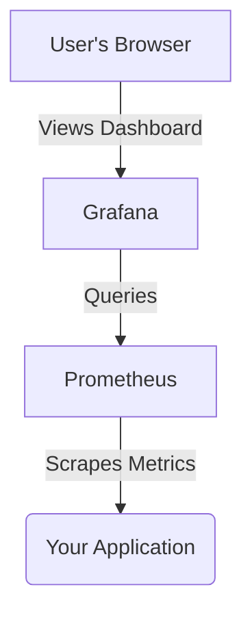

# Grafana Exploration

[`Grafana`](https://grafana.com/) is an open-source platform for monitoring and observability. It allows you to query, visualize, alert on, and explore your metrics no matter where they are stored.

## What is Grafana?

While tools like Prometheus are excellent for collecting and storing metrics, they are not primarily designed for visualization. Grafana is the de-facto standard for creating beautiful, complex, and highly useful dashboards from a wide variety of data sources, including Prometheus, Loki, InfluxDB, and many others.

You can think of Grafana as the user interface for your observability data.

## How Grafana Works

Grafana runs as a server that you can access through a web browser. Inside Grafana, you configure:

1.  **Data Sources:** You tell Grafana how to connect to your databases (like Prometheus). You provide the address and any necessary authentication.
2.  **Dashboards:** A dashboard is a collection of one or more panels arranged in a grid.
3.  **Panels:** Each panel represents a specific visualization (like a graph, a single stat, a table, or a heatmap). You configure a panel by writing a **query** in the language of your data source (e.g., PromQL for Prometheus) and then choosing how to display the results.



## Verifiable Demo: Visualizing Prometheus Metrics

This demo will show how to use Grafana to visualize metrics that are being collected by the Prometheus instance we have already explored. We will:

1.  Install Grafana into our Kubernetes cluster.
2.  Configure Prometheus as a data source.
3.  Create a simple dashboard to display CPU usage metrics from the cluster.

### Manual Walkthrough

**Prerequisite:** This demo assumes you have already run the `prometheus` demo and have a Minikube cluster named `prometheus-demo` running with Prometheus installed.

#### Step 1: Install Grafana

We will install Grafana using a standard Helm chart.

```bash
# Add the Grafana Helm repository
helm repo add grafana https://grafana.github.io/helm-charts
helm repo update

# Install Grafana
helm install grafana grafana/grafana \
  --namespace prometheus \
  --set persistence.enabled=true \
  --set adminPassword='admin'
```

#### Step 2: Access the Grafana UI

```bash
# Get the Grafana admin password (it's 'admin' as we set it above)
# Port-forward the Grafana service. Open a new terminal for this and leave it running.
kubectl -n prometheus port-forward svc/grafana 3000:3000

# Open your browser to http://localhost:3000
# Log in with username 'admin' and password 'admin'.
```

#### Step 3: Add Prometheus as a Data Source

1.  In the Grafana UI, go to the **Connections** section (the four squares icon on the left).
2.  Click **Add new connection**.
3.  Search for **Prometheus** and select it.
4.  For the **Prometheus server URL**, enter the in-cluster address of the Prometheus server: `http://prometheus-server.prometheus.svc.cluster.local`.
5.  Click **Save & test**. You should see a green checkmark indicating the data source is working.

#### Step 4: Create a Dashboard

1.  Click the **+** icon in the top-right corner and select **New Dashboard**.
2.  Click **Add visualization**.
3.  In the query editor at the bottom, make sure your **Prometheus** data source is selected.
4.  In the query field, enter the following PromQL query to get the container CPU usage:
    ```promql
    sum(rate(container_cpu_usage_seconds_total{namespace="prometheus"}[5m])) by (pod)
    ```
5.  On the right side of the screen, under "Panel options," set the **Title** to "CPU Usage by Pod".
6.  Click **Apply** in the top-right corner.

You will now see a panel on your dashboard showing the CPU usage of the pods in the `prometheus` namespace.

#### Step 5: Cleanup

```bash
# Uninstall Grafana
helm uninstall grafana -n prometheus

# Stop the Minikube cluster (optional)
# minikube stop -p prometheus-demo
```
