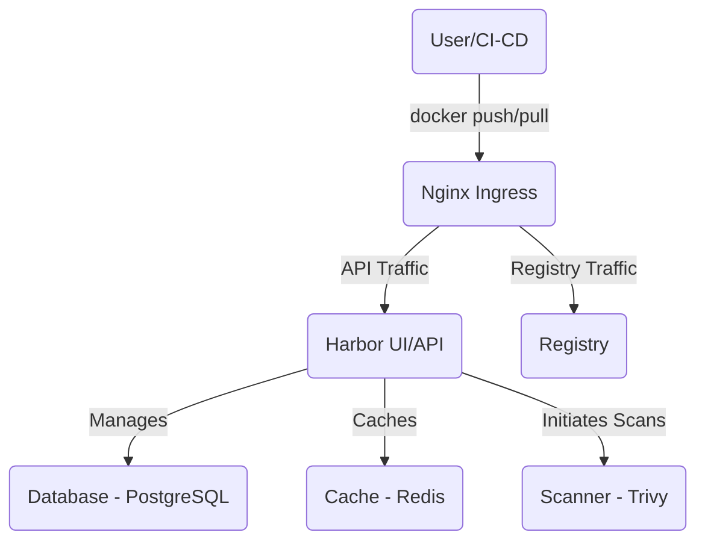

# Harbor Exploration

[`Harbor`](https://goharbor.io/) is an open-source registry for storing, signing, and scanning container images and Helm charts. It provides a secure, private registry that you can run in your own environment. Harbor is a CNCF Graduated project.

## What Problem Does Harbor Solve?

While public registries like Docker Hub are great for public images, organizations often need a private, secure, and compliant place to store their own container images. Harbor solves this by providing a production-grade private registry with a rich set of enterprise features that go far beyond simple image storage.

### Use Cases & Key Features
*   **Private Image Registry:** The core functionality. Store and manage your container images in a private, authenticated environment.
*   **Security & Vulnerability Scanning:** Harbor integrates with vulnerability scanners (like Trivy) to automatically scan your images for known CVEs (Common Vulnerabilities and Exposures). You can create policies to prevent vulnerable images from being pulled and run.
*   **Content Signing & Provenance:** Harbor uses Notary and Sigstore Cosign to sign your images. This allows you to ensure that the images you run in production are the exact, untampered images that your CI/CD system built.
*   **Replication:** Automatically replicate images between different Harbor instances (e.g., for disaster recovery or to move images closer to your edge clusters).
*   **Helm Chart Registry:** Store and manage your Helm charts alongside your container images.
*   **Role-Based Access Control (RBAC):** Fine-grained control over who can push, pull, and manage images and charts.

## Architecture & Components

Harbor is deployed as a set of microservices, typically within a Kubernetes cluster.

1.  **Harbor UI & API:** The main entrypoint for users and automation. Provides the web interface and the REST API for managing the registry.
2.  **Registry:** The core component responsible for storing the image layers. This is a Docker-compatible V2 registry.
3.  **Core Services:** A set of services that manage projects, users, replication, and other business logic.
4.  **Database:** A PostgreSQL database that stores all the metadata about projects, users, images, and scan results.
5.  **Redis:** An in-memory cache used for storing session data and job queues.
6.  **Trivy:** The default vulnerability scanner that inspects images.



## Verifiable Demo: A Secure Private Registry

This demo will provide a realistic example of using Harbor. We will install Harbor, push an image to it, scan it for vulnerabilities, and then successfully pull and run the image from our Kubernetes cluster.

### Manual Walkthrough

#### Step 1: Start Minikube & Install Harbor
Harbor is a complex application. We will use the official Helm chart and a specific values file to configure it for a local Minikube environment.

```bash
# Start Minikube with sufficient resources
minikube start --profile harbor-demo --cpus 4 --memory 8192

# Add the Harbor Helm repository
helm repo add harbor https://helm.goharbor.io
helm repo update

# Create a values file for the Minikube installation
# This disables components that are not needed for the demo and exposes the service
cat <<EOF > harbor/demo/values.yaml
expose:
  type: nodePort
  tls:
    enabled: false
externalURL: http://$(minikube ip -p harbor-demo):30002

persistence:
  enabled: true

trivy:
  enabled: true
EOF

# Install Harbor using Helm
helm install harbor harbor/harbor -f harbor/demo/values.yaml \
  --namespace harbor --create-namespace
```

#### Step 2: Access the Harbor UI and Configure
1.  **Wait for Harbor to be ready.** This can take **5-10 minutes**.
    ```bash
    kubectl get pods -n harbor -w
    ```
    Wait until all pods are `Running` or `Completed`.

2.  **Access the UI:**
    *   Find your Minikube IP: `minikube ip -p harbor-demo`
    *   Open your browser to `http://<YOUR_MINIKUBE_IP>:30002`.
    *   The default **Username** is `admin`.
    *   Get the default **Password** by running:
        ```bash
        kubectl get secret -n harbor harbor-core -o jsonpath='{.data.HARBOR_ADMIN_PASSWORD}' | base64 -d
        ```

3.  **Create a Project:**
    *   Log in and go to **Projects**.
    *   Click **+ NEW PROJECT**.
    *   Enter `my-project` as the Project Name and click **OK**.

#### Step 3: Push an Image to Harbor
1.  **Configure Docker to trust the insecure registry:**
    *   On Docker Desktop, go to Settings -> Docker Engine and add:
        `"insecure-registries": ["$(minikube ip -p harbor-demo):30002"]`
    *   On Linux, edit `/etc/docker/daemon.json` and add the same line, then restart Docker.

2.  **Log in to Harbor from Docker:**
    ```bash
    # Use the password you retrieved in the previous step
    docker login $(minikube ip -p harbor-demo):30002 --username admin
    ```

3.  **Pull, Tag, and Push an Image:**
    ```bash
    docker pull alpine:3.18
    docker tag alpine:3.18 $(minikube ip -p harbor-demo):30002/my-project/alpine:v1
    docker push $(minikube ip -p harbor-demo):30002/my-project/alpine:v1
    ```

#### Step 4: Scan the Image for Vulnerabilities
1.  Go back to the Harbor UI and navigate into `my-project`.
2.  Click on the `alpine` repository.
3.  You will see the `v1` tag. Harbor will automatically start a vulnerability scan.
4.  After a minute, the "Vulnerabilities" column will be updated with a summary.
5.  Click on the digest to see a detailed report of all CVEs found in the image.

#### Step 5: Pull and Run the Image from Kubernetes
Now we will simulate a Kubernetes node pulling and running the image from the private registry.

```bash
# First, create a secret so your Kubernetes cluster can authenticate with Harbor
kubectl create secret docker-registry regcred \
  --docker-server=$(minikube ip -p harbor-demo):30002 \
  --docker-username=admin \
  --docker-password=<YOUR_ADMIN_PASSWORD>

# Now, create a pod that uses this secret to pull the image
cat <<EOF | kubectl apply -f -
apiVersion: v1
kind: Pod
metadata:
  name: my-app
spec:
  containers:
  - name: my-app
    image: $(minikube ip -p harbor-demo):30002/my-project/alpine:v1
    command: ["sleep", "3600"]
  imagePullSecrets:
  - name: regcred
EOF

# Verify the pod starts successfully
kubectl get pods my-app
```
The pod starting successfully proves that Kubernetes was able to authenticate with your private Harbor registry and pull the image.

#### Step 6: Cleanup
```bash
minikube delete --profile harbor-demo
```
