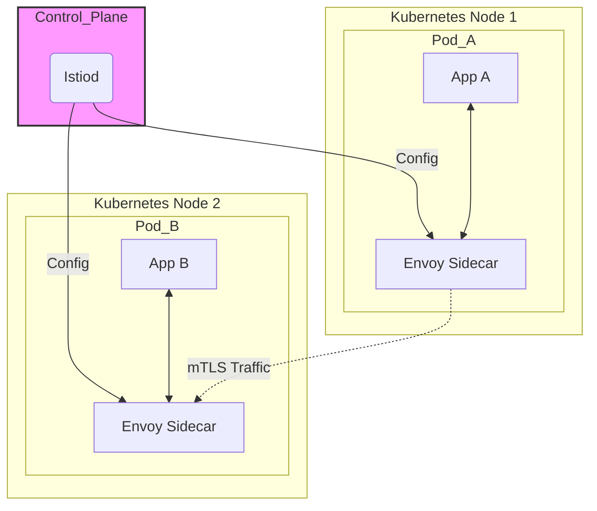

# Istio Exploration

[`Istio`](https://istio.io/) is an open-source **service mesh**. It layers on top of a platform like Kubernetes to give you powerful control over how your microservices communicate with each other.

## What is a Service Mesh? (A Simple Explanation)

In our Envoy exploration, we learned about placing an Envoy proxy next to our application as a "sidecar." Now, imagine you do this for *every single application* in your system. A **service mesh** is what you get when you have this network of interconnected proxies, along with a "brain" to control them all.

Istio is a complete service mesh solution that consists of two main parts:

1.  **The Data Plane:** This is made up of all the **Envoy proxies** running as sidecars next to your applications. They handle all the network traffic entering and leaving your services.
2.  **The Control Plane (Istiod):** This is the "brain" of the mesh. `Istiod` is a central component that you run in your cluster. It watches your configuration and tells all the Envoy proxies how to behave. You never have to configure each Envoy proxy by hand.



## Why is Istio Useful?

By controlling all the proxies from a central place, Istio can provide powerful features to your entire system **without you having to change a single line of your application code**:
*   **Security:** Istio can automatically encrypt all traffic between your services using mutual TLS (mTLS), creating a "zero-trust" network.
*   **Observability:** It automatically generates detailed metrics, logs, and traces for all traffic, giving you a complete picture of how your services are communicating.
*   **Traffic Management:** You can easily implement advanced routing rules, like canary deployments (sending 10% of traffic to a new version), A/B testing, or automatic retries and circuit breakers.

## Verifiable Demo: A Canary Deployment
This demo is a runnable script that uses `minikube` to showcase a real-world Istio use case: a **canary deployment**.

**The Goal:** We will deploy two versions of a "hello world" application. Then, using an Istio configuration, we will direct 90% of traffic to version 1 and 10% of traffic to version 2 (the "canary").

### Prerequisites
*   A local Kubernetes cluster environment like [minikube](https://minikube.sigs.k8s.io/docs/start/). The script is designed to work with `minikube`.
*   `kubectl` installed.

### Challenges Faced (A Learning Opportunity)
*   **Environment Constraints**: This demo requires starting a full Kubernetes cluster and installing Istio, which is resource-intensive and requires reliable network access from within the cluster to pull images. In some restricted CI/CD or sandboxed environments, network policies or resource limits may prevent the Istio Ingress Gateway from starting correctly, causing the final readiness check to time out.
*   **Accessing the Service**: Getting traffic into a local Kubernetes cluster can be tricky for scripts. Our first attempt using `minikube tunnel` failed because it requires an interactive `sudo` password. We solved this by changing the service type to `NodePort`, which is a much more reliable pattern for automated testing.
*   **PATH Issues**: The `istioctl` tool is downloaded as part of the script. We had to be careful to find the location of the downloaded tool and add it to the script's `PATH` variable before trying to use it.

### How the Demo Works
The `demo.sh` script automates the entire process:

1.  **Start Minikube**: It begins by starting a `minikube` cluster with sufficient resources to run Istio.
2.  **Install Istio**: It downloads the `istioctl` utility and installs Istio's "demo" profile into the cluster.
3.  **Deploy Applications**: It deploys two versions (`v1` and `v2`) of a sample application from the `helloworld-app.yaml` file.
4.  **Apply Routing Rules**: It applies the Istio `Gateway` and `VirtualService` from the `routing-rules.yaml` file. This is the step that tells Istio how to split the traffic.
5.  **Test the Traffic Split**: The script starts `minikube tunnel` to get an external IP address for the gateway. It then sends 100 requests to the service and counts how many responses come from `v1` and how many from `v2`.
6.  **Verify the Result**: It checks if the counts are approximately 90/10. A successful run will look like this:
    ```text
    --> Verification complete.
        Responses from v1: 91
        Responses from v2: 9
    --> SUCCESS: Traffic split is approximately 90/10.
    ```
7.  **Clean Up**: Finally, it automatically deletes the `minikube` cluster to clean up all resources.

