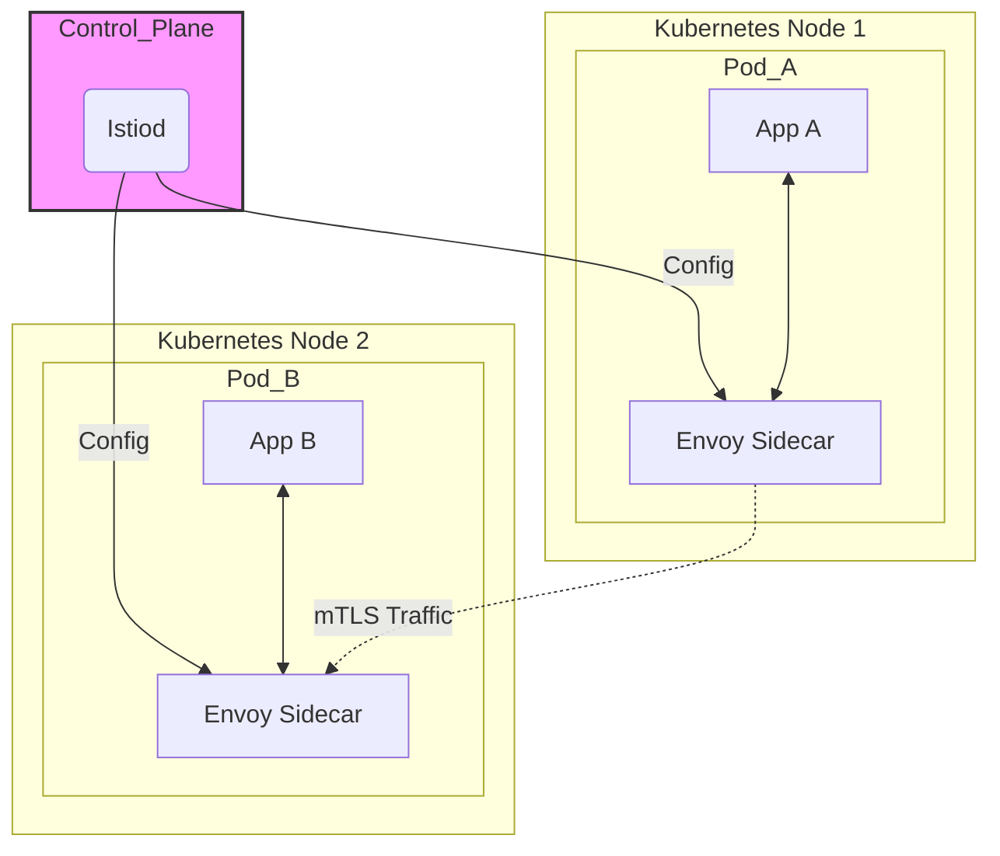

# Istio Exploration

[`Istio`](https://istio.io/) is an open-source **service mesh**. It layers on top of a platform like Kubernetes to give you powerful control over how your microservices communicate with each other.

## What is a Service Mesh? (A Simple Explanation)

In our Envoy exploration, we learned about placing an Envoy proxy next to our application as a "sidecar." Now, imagine you do this for *every single application* in your system. A **service mesh** is what you get when you have this network of interconnected proxies, along with a "brain" to control them all.

Istio is a complete service mesh solution that consists of two main parts:

1.  **The Data Plane:** This is made up of all the **Envoy proxies** running as sidecars next to your applications. They handle all the network traffic entering and leaving your services.
2.  **The Control Plane (Istiod):** This is the "brain" of the mesh. `Istiod` is a central component that you run in your cluster. It watches your configuration and tells all the Envoy proxies how to behave. You never have to configure each Envoy proxy by hand.



## Why is Istio Useful?

By controlling all the proxies from a central place, Istio can provide powerful features to your entire system **without you having to change a single line of your application code**:
*   **Security:** Istio can automatically encrypt all traffic between your services using mutual TLS (mTLS), creating a "zero-trust" network.
*   **Observability:** It automatically generates detailed metrics, logs, and traces for all traffic, giving you a complete picture of how your services are communicating.
*   **Traffic Management:** You can easily implement advanced routing rules, like canary deployments (sending 10% of traffic to a new version), A/B testing, or automatic retries and circuit breakers.

## Conceptual Demo: A Canary Deployment

Since installing Istio is too resource-intensive for a simple script, this demo will walk through the exact steps and manifest files you would use to perform a common Istio task: a **canary deployment**.

**The Goal:** We will deploy two versions of a simple "hello world" application. Then, using an Istio configuration, we will direct 90% of traffic to version 1 and 10% of traffic to version 2.

### Prerequisites (for running this on your own)
*   A local Kubernetes cluster like [minikube](https://minikube.sigs.k8s.io/docs/start/) or [kind](https://kind.sigs.k8s.io/docs/user/quick-start/).
*   `kubectl` installed.
*   The `istioctl` command-line tool, which is Istio's helper utility.

### Step 1: Install Istio
First, you would install Istio onto your cluster using `istioctl`. The `demo` profile includes the core components.
```bash
# To be run in your own terminal
istioctl install --set profile=demo -y
```

### Step 2: Enable Automatic Sidecar Injection
Next, you tell Istio to watch a specific namespace. Any new application deployed in this namespace will automatically get an Envoy sidecar proxy added to its Pod.
```bash
# To be run in your own terminal
kubectl label namespace default istio-injection=enabled
```

### Step 3: Deploy the Application (Both Versions)
This manifest deploys two versions of our application (`v1` and `v2`) and a standard Kubernetes Service to point to them.
```yaml
# To be saved as helloworld-app.yaml
apiVersion: apps/v1
kind: Deployment
metadata:
  name: helloworld-v1
spec:
  replicas: 1
  selector:
    matchLabels:
      app: helloworld
      version: v1
  template:
    metadata:
      labels:
        app: helloworld
        version: v1
    spec:
      containers:
      - name: helloworld
        image: docker.io/istio/examples-helloworld-v1
        ports:
        - containerPort: 5000
---
apiVersion: apps/v1
kind: Deployment
metadata:
  name: helloworld-v2
spec:
  replicas: 1
  selector:
    matchLabels:
      app: helloworld
      version: v2
  template:
    metadata:
      labels:
        app: helloworld
        version: v2
    spec:
      containers:
      - name: helloworld
        image: docker.io/istio/examples-helloworld-v2 # This is the only difference
        ports:
        - containerPort: 5000
---
apiVersion: v1
kind: Service
metadata:
  name: helloworld
spec:
  ports:
  - port: 5000
    name: http
  selector:
    app: helloworld
```
```bash
# To be run in your own terminal
kubectl apply -f helloworld-app.yaml
```

### Step 4: Apply Istio Routing Rules
This is where the magic happens. We create two Istio configuration objects: a `DestinationRule` and a `VirtualService`.
*   **DestinationRule:** This tells Istio about the different versions of our service (`v1` and `v2`).
*   **VirtualService:** This contains the routing logic. It tells Istio's proxies to send 90% of traffic to `v1` and 10% to `v2` (the "canary").
```yaml
# To be saved as routing-rules.yaml
apiVersion: networking.istio.io/v1alpha3
kind: DestinationRule
metadata:
  name: helloworld
spec:
  host: helloworld
  subsets:
  - name: v1
    labels:
      version: v1
  - name: v2
    labels:
      version: v2
---
apiVersion: networking.istio.io/v1alpha3
kind: VirtualService
metadata:
  name: helloworld
spec:
  hosts:
  - "*"
  gateways:
  - helloworld-gateway # We also need to create this Gateway
  http:
  - route:
    - destination:
        host: helloworld
        subset: v1
      weight: 90
    - destination:
        host: helloworld
        subset: v2
      weight: 10
```
(Note: A `Gateway` manifest would also be needed to expose this service outside the cluster). After applying this, Istio would automatically reconfigure all the Envoy proxies to split the traffic as desired.
