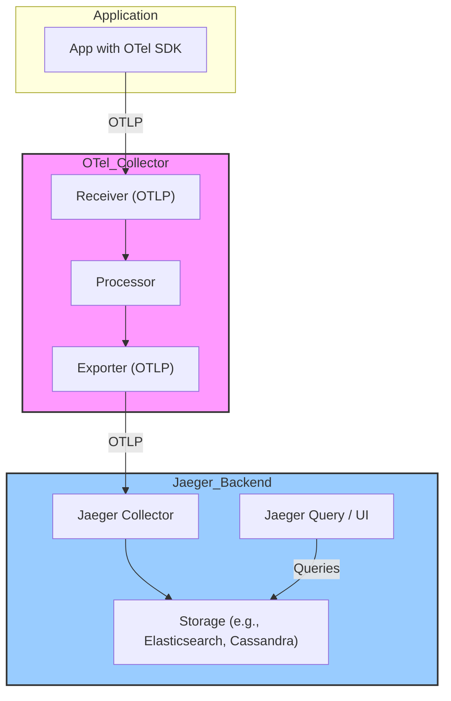

# Jaeger Exploration

[`Jaeger`](https://www.jaegertracing.io/) is an open-source, end-to-end distributed tracing system that helps you monitor and troubleshoot transactions in complex distributed systems. It was originally created by Uber and is now a graduated CNCF project.

## Architecture & The Shift to OpenTelemetry

Historically, Jaeger had its own data format and client libraries. However, the industry has standardized on **OpenTelemetry (OTel)** as the vendor-neutral standard for producing and collecting telemetry data (traces, metrics, logs). Jaeger has fully embraced this shift.

The modern Jaeger architecture relies on the OpenTelemetry ecosystem:
*   **Applications** are instrumented with OpenTelemetry SDKs.
*   The **OTel SDKs** send trace data to an **OpenTelemetry Collector**.
*   The **OTel Collector** can process, batch, and filter this data before exporting it to a backend.
*   **Jaeger** acts as a powerful, scalable backend for storing, analyzing, and visualizing this trace data. It receives data from the OTel Collector via the OpenTelemetry Protocol (OTLP).

## Production Considerations

*   **OpenTelemetry is the Way Forward**: For any new application, you should use the OpenTelemetry SDKs for instrumentation, not the deprecated Jaeger-specific clients. This gives you the flexibility to switch backends without re-instrumenting your code.
*   **Sampling**: In high-traffic systems, tracing every single request can be prohibitively expensive. Jaeger and OpenTelemetry provide several sampling strategies (e.g., probabilistic, rate-limiting) that can be configured in the OTel Collector to manage the volume of trace data.
*   **Storage Backend**: The default all-in-one Jaeger binary uses in-memory storage, which is **not suitable for production**. For production, you must configure a scalable, persistent storage backend like Elasticsearch, Cassandra, or ClickHouse.
*   **Deployment Model**: The recommended production deployment uses the OpenTelemetry Collector as an agent or gateway that receives data from applications and forwards it to the Jaeger backend components.

## Verifiable Demo

This demo will show a complete, modern tracing pipeline using OpenTelemetry and Jaeger. We will:
1.  Run three services using Docker:
    *   A simple Python **"frontend"** service.
    -   A simple Python **"backend"** service.
    -   The **Jaeger all-in-one** container, which includes the collector, query service, and UI.
2.  Both services will be instrumented with the OpenTelemetry SDK.
3.  When a request hits the "frontend," it will make a subsequent request to the "backend," creating a distributed trace.
4.  The services will be configured to export their traces directly to the Jaeger container.
5.  We will then use `curl` to query the Jaeger API to verify that the complete, two-span trace was received and stored.

### Prerequisites
*   Docker.
