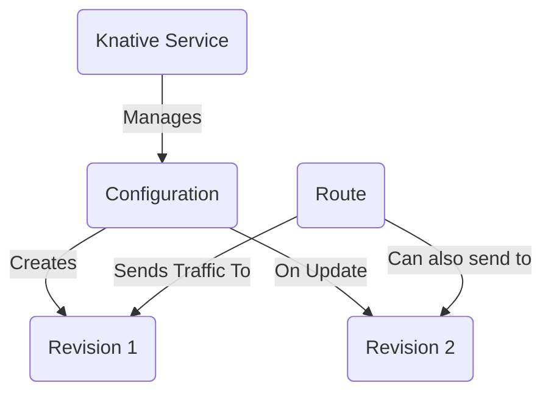
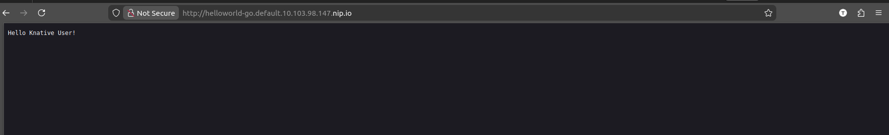
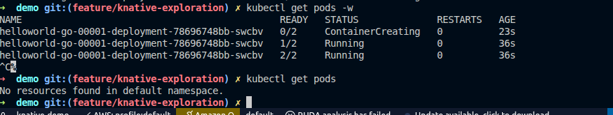

# Knative Exploration

[`Knative`](https://knative.dev/) is a Kubernetes-based platform to build, deploy, and manage modern serverless workloads. Knative is a CNCF Graduated project.

## What Problem Does Knative Solve?

Knative simplifies the deployment of "serverless" applications on Kubernetes. It provides a set of higher-level abstractions that handle building containers, routing traffic, and scaling applications up and down (often to and from zero) in response to requests.

## Architecture & Components

*   **Knative Serving:** Manages the deployment and serving of serverless applications via a `Service` CRD.
*   **Knative Eventing:** Provides building blocks for creating event-driven systems.



## Verifiable Demo: A Scale-to-Zero Web Service

This demo will provide a verifiable example of Knative Serving's core "scale-to-zero" feature.

### Manual Walkthrough

#### Step 1: Start Minikube
```bash
# Start Minikube with sufficient resources
minikube start --profile knative-demo --cpus 4 --memory 8192
```

#### Step 2: Install Istio (Knative's Network Layer)
```bash
# Install the Istio CRDs and then Istio itself
kubectl apply -f https://github.com/knative/net-istio/releases/download/knative-v1.13.1/istio.yaml

# Wait for all Istio pods to be ready
echo "--> Waiting for Istio pods..."
kubectl wait --for=condition=ready pod --all -n istio-system --timeout=300s
echo "--> Istio is ready."
```

#### Step 3: Install and Configure Knative
With the networking layer in place, we can now install Knative and configure it for a Minikube environment.

```bash
# Install the Knative Serving components
kubectl apply -f https://github.com/knative/serving/releases/download/knative-v1.13.1/serving-crds.yaml
kubectl apply -f https://github.com/knative/serving/releases/download/knative-v1.13.1/serving-core.yaml

# Wait for the core Knative pods to be ready
echo "--> Waiting for Knative core components..."
kubectl wait --for=condition=ready pod --all -n knative-serving --timeout=300s
echo "--> Knative core is ready."

# Install the Knative Istio controller
kubectl apply -f https://github.com/knative/net-istio/releases/download/knative-v1.13.1/net-istio.yaml

# Wait for all Knative components to be ready
echo "--> Waiting for all Knative components..."
kubectl wait --for=condition=ready pod --all -n knative-serving --timeout=300s
echo "--> All components are ready."
```

#### Step 4: Configure Networking and DNS
This final setup step configures the networking to be accessible from your local machine.

```bash
# Get the external IP address of the Istio ingress gateway
INGRESS_IP=$(kubectl -n istio-system get service istio-ingressgateway -o jsonpath='{.spec.clusterIP}')

# Configure Knative to use this IP with a magic DNS
kubectl patch configmap/config-domain \
  --namespace knative-serving \
  --type merge \
  --patch "{\"data\":{\"$INGRESS_IP.nip.io\":\"\"}}"
```

#### Step 5: Deploy a Knative Service
Now that the platform is ready, we can deploy our application.

```bash
kubectl apply -f knative/demo/hello-service.yaml
```

#### Step 6: Access the Service and See it Scale
1.  **Get the URL:** Find the URL for your new service.
    ```bash
    kubectl get kservice helloworld-go
    ```
    Copy the URL from the output (e.g., `http://helloworld-go.default.10.102.217.13.nip.io`).

2.  **Access the URL in your browser.** The first request will cause Knative to create a pod to serve the traffic.
    

3.  Once the pod is running, the page will load, displaying "Hello Knative User!".
    

#### Step 7: Verify Scale to Zero
1.  **Wait:** Do nothing for about 2 minutes.
2.  **Check the pods:** After the idle period, Knative will scale the deployment down to zero pods.
    ```bash
    kubectl get pods
    ```
    

This proves the entire scale-up-on-demand and scale-down-when-idle workflow is functional.

#### Step 8: Cleanup
```bash
minikube delete --profile knative-demo
```
