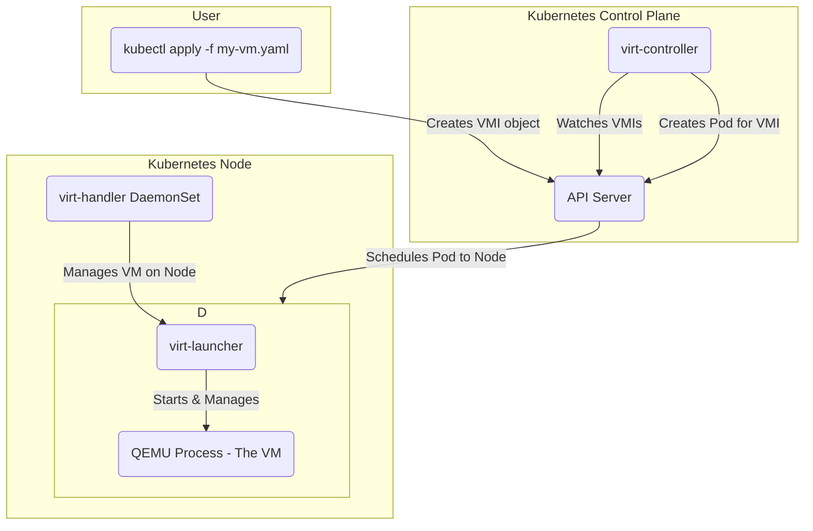

# KubeVirt Exploration

[`KubeVirt`](https://kubevirt.io/) is a Kubernetes addon that provides the ability to run and manage virtual machines (VMs) alongside containers. It extends the Kubernetes API to add new resource types, like `VirtualMachineInstance` (VMI), allowing you to manage VMs using familiar `kubectl` commands. KubeVirt is a CNCF Incubating project.

## Architecture & Components

KubeVirt integrates with Kubernetes by adding several custom resource definitions (CRDs) and controllers. The main components are:

*   **virt-operator:** Manages the lifecycle of other KubeVirt components.
*   **virt-controller:** Watches for `VirtualMachineInstance` (VMI) objects and creates a corresponding Pod for each VM.
*   **virt-handler:** A DaemonSet that runs on each node. It is responsible for managing the VM lifecycle on the node, including starting and stopping the VM process.
*   **virt-launcher:** The primary process inside the VM's Pod. It starts and monitors the QEMU process that runs the actual VM.
*   **virt-api:** The central API server for KubeVirt.



## Verifiable Demo: Running a VM on Kubernetes

This demo will walk through installing KubeVirt on Minikube and deploying a simple Fedora-based Virtual Machine Instance (VMI).

### Manual Walkthrough

#### Step 1: Start Minikube

KubeVirt requires a CNI that works with its networking model. We will use `flannel` as recommended in the official documentation.

```bash
# Start Minikube with sufficient resources and the flannel CNI
minikube start --profile kubevirt-demo --cpus 4 --memory 8192 --cni=flannel
```

> **Troubleshooting: `CrashLoopBackOff` on `virt-handler`**
> If the `virt-handler` pod fails to start and goes into a `CrashLoopBackOff` state, check its logs (`kubectl logs -n kubevirt <virt-handler-pod-name>`). If you see the error `Failed to create an inotify watcher: too many open files`, it means the user-watch limit on your host machine is too low.
> **To Fix:** You must increase this limit on your host machine (not inside Minikube).
> ```bash
> # Temporarily increase the limit
> sudo sysctl fs.inotify.max_user_watches=524288
> # Make the change permanent
> echo fs.inotify.max_user_watches=524288 | sudo tee -a /etc/sysctl.conf && sudo sysctl -p
> ```
> After increasing the limit, you will need to restart your Minikube cluster for the change to take effect: `minikube stop -p kubevirt-demo && minikube start -p kubevirt-demo`. You will then need to re-install KubeVirt.
> If the `virt-handler` still fails after this, you can try enabling software emulation as a last resort. This is less performant but may bypass the host incompatibility.
> ```bash
> kubectl -n kubevirt patch kubevirt kubevirt --type=merge --patch '{"spec":{"configuration":{"developerConfiguration":{"useEmulation":true}}}}'
> ```
> If the pod still does not stabilize, the host environment is likely incompatible with running KubeVirt via Minikube at this time.

Wait until all pods are in the `Running` state. You can also check the status of the KubeVirt deployment itself:
```bash
kubectl get kubevirt.kubevirt.io/kubevirt -n kubevirt -o=jsonpath="{.status.phase}"
# This should return "Deployed"
```

#### Step 4: Install virtctl

`virtctl` is a command-line utility for managing KubeVirt VMs.

```bash
# Get the installed KubeVirt version
VERSION=$(kubectl get kubevirt.kubevirt.io/kubevirt -n kubevirt -o=jsonpath="{.status.observedKubeVirtVersion}")
# Determine the architecture
ARCH=$(uname -s | tr A-Z a-z)-$(uname -m | sed 's/x86_64/amd64/')
# Download virtctl
curl -L -o virtctl https://github.com/kubevirt/kubevirt/releases/download/${VERSION}/virtctl-${VERSION}-${ARCH}
# Make it executable and move it to your path
sudo install -m 0755 virtctl /usr/local/bin
```

#### Step 5: Deploy a Virtual Machine

Now, we will deploy a test Virtual Machine. This manifest uses a `containerDisk`, which is an ephemeral disk image stored in a container registry. It's a quick way to get a VM running without setting up persistent storage.

Create a file named `kubevirt/demo/vm.yaml` with the following content:

```yaml
apiVersion: kubevirt.io/v1
kind: VirtualMachine
metadata:
  name: testvm
spec:
  runStrategy: Always
  template:
    spec:
      domain:
        devices:
          disks:
            - name: containerdisk
              disk:
                bus: virtio
            - name: cloudinitdisk
              disk:
                bus: virtio
        resources:
          requests:
            memory: 64M
      volumes:
        - name: containerdisk
          containerDisk:
            image: quay.io/kubevirt/cirros-container-disk-demo:latest
        - name: cloudinitdisk
          cloudInitNoCloud:
            userData: |
              #!/bin/sh
              echo 'printed from cloud-init'
```

Apply the manifest to your cluster:

```bash
kubectl apply -f kubevirt/demo/vm.yaml
```

#### Step 6: Connect to the VM

After a minute, the VM should be running. You can check its status with `kubectl get vms`. Once it is running, you can connect to its serial console.

```bash
# Connect to the console
virtctl console testvm

# To exit the console, use the key combination Ctrl+]
```

#### Step 7: Cleanup

To remove all the resources created in this demo, delete the Minikube profile.

```bash
minikube delete --profile kubevirt-demo
```
