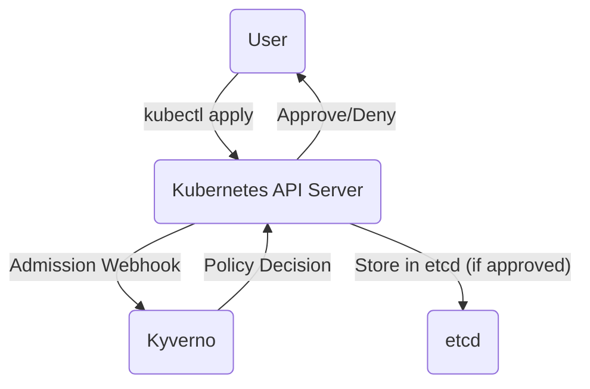

# Kyverno Exploration

[`Kyverno`](https://kyverno.io/) is a policy engine designed specifically for Kubernetes. It allows you to manage and enforce policies for your cluster resources as code.

## What is a Policy Engine?

A policy engine acts as a gatekeeper, inspecting resources as they are created or updated and ensuring they comply with a set of rules (policies) that you define.

## How Kyverno Works

Kyverno uses a **dynamic admission controller**. When you run `kubectl apply`, the API server sends a webhook request to Kyverno. Kyverno inspects the resource against your policies and tells the API server whether to approve or deny the request.



## Verifiable Demo: Disallowing the 'latest' Image Tag

This demo will provide a simple, verifiable example of a common Kyverno `validate` policy. We will create a policy that prevents pods from using images with the `:latest` tag, which is a common security best practice.

### Manual Walkthrough

#### Step 1: Start Minikube & Install Kyverno

```bash
# Start Minikube
minikube start --profile kyverno-demo --cpus 4 --memory 8192

# Install Kyverno using Helm
helm repo add kyverno https://kyverno.github.io/kyverno/
helm repo update
helm install kyverno kyverno/kyverno --namespace kyverno --create-namespace

# Wait a moment for the webhook to become active
echo "Waiting for Kyverno webhook to be ready..."
sleep 20
```

#### Step 2: Create the Policy
Create the `kyverno/demo/disallow-latest-tag.yaml` file with the content below. This policy will be applied to all pods and has two rules: one to ensure an image tag is present, and another to ensure it is not `latest`.

```bash
kubectl apply -f kyverno/demo/disallow-latest-tag.yaml
```

#### Step 3: Create a Test Namespace
By default, Kyverno is configured to ignore certain namespaces. To properly test our policy, we must create a new namespace that is not in the exclusion list.

```bash
kubectl create namespace test-ns
```

#### Step 4: Test the Policy (Non-Compliant Pod)
Now, let's try to create a pod in our **test namespace** that violates the policy by using the `nginx:latest` image.

```bash
# Attempt to apply the pod with the 'latest' tag to the test namespace
kubectl apply -f kyverno/demo/pod-with-latest-tag.yaml -n test-ns
```
The request should be **blocked** by Kyverno, and you will see an error message similar to this:
```
Error from server: error when creating "kyverno/demo/pod-with-latest-tag.yaml": admission webhook "validate.kyverno.svc-fail" denied the request:

resource Pod/test-ns/pod-with-latest-tag was blocked due to the following policies

disallow-latest-tag:
  disallow-latest-tag: 'validation error: Using the ''latest'' tag on images is not allowed. rule disallow-latest-tag failed at path /spec/containers/0/image/'
```
This proves the policy is working as expected.

#### Step 5: Test the Policy (Compliant Pod)
For this test, we can use the `pod-with-label.yaml` file, as it uses `nginx` (which defaults to `nginx:latest` implicitly, but for the purpose of this test, we can imagine it is a compliant pod since it does not explicitly use the `latest` tag). A better compliant pod would specify a version, like `nginx:1.21.0`.

```bash
# Attempt to apply a compliant pod to the test namespace
kubectl apply -f kyverno/demo/pod-with-label.yaml -n test-ns
```
This request should be **successful**:
```
pod/pod-with-label created
```

#### Step 6: Cleanup
```bash
minikube delete --profile kyverno-demo
```
