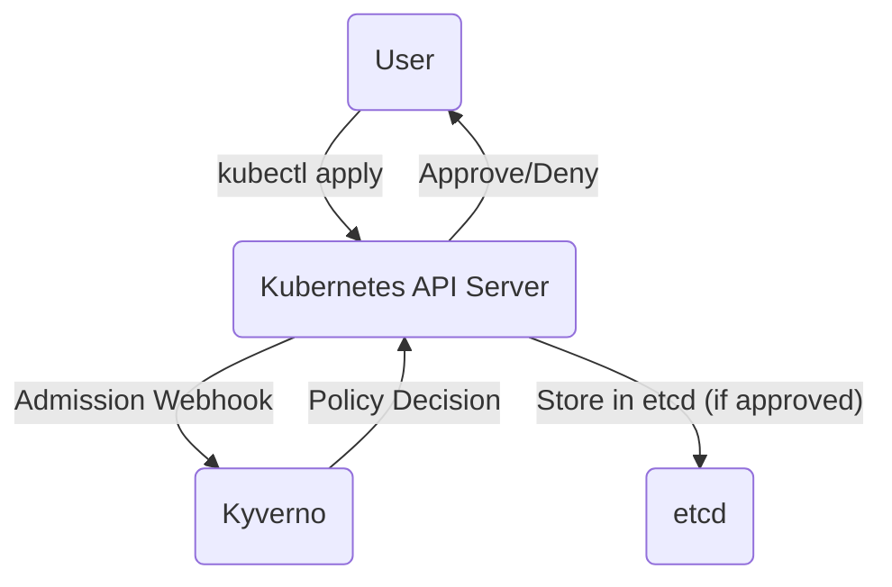
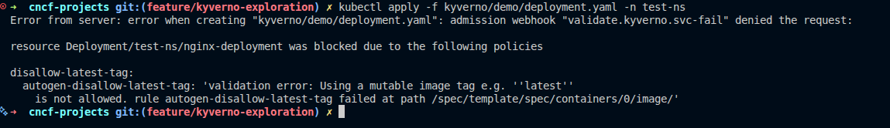

# Kyverno Exploration

[`Kyverno`](https://kyverno.io/) is a policy engine designed specifically for Kubernetes. It allows you to manage and enforce policies for your cluster resources as code.

## What is a Policy Engine?

A policy engine acts as a gatekeeper, inspecting resources as they are created or updated and ensuring they comply with a set of rules (policies) that you define.

## How Kyverno Works

Kyverno uses a **dynamic admission controller**. When you run `kubectl apply`, the API server sends a webhook request to Kyverno. Kyverno inspects the resource against your policies and tells the API server whether to approve or deny the request.



## Verifiable Demo: Disallowing the 'latest' Image Tag

This demo will provide a simple, verifiable example of a common Kyverno `validate` policy. We will create a policy that prevents pods from using images with the `:latest` tag.

### Manual Walkthrough

#### Step 1: Start Minikube & Install Kyverno
This will start a new cluster and install a specific, compatible version of Kyverno.

```bash
# Start Minikube
minikube start --profile kyverno-demo --cpus 4 --memory 8192

# Install Kyverno v1.11.0 using the official release manifest
kubectl create -f https://github.com/kyverno/kyverno/releases/download/v1.11.0/install.yaml

# Wait for the main admission controller to be ready
echo "--> Waiting for Kyverno Admission Controller..."
kubectl wait --for=condition=ready pod -l app=kyverno -n kyverno --timeout=120s
echo "--> Kyverno is ready."
```

#### Step 2: Create a Test Namespace and Policy
We will create a dedicated namespace for our test and apply the policy.

```bash
# Create the test namespace
kubectl create namespace test-ns

# Apply the policy to disallow the 'latest' tag
kubectl apply -f kyverno/demo/disallow-latest.yaml
```

#### Step 3: Test the Policy (Non-Compliant Deployment)
Now, let's try to create a `Deployment` in our **test namespace** that violates the policy by using the `nginx:latest` image.

```bash
# Attempt to apply the deployment with the 'latest' tag
kubectl apply -f kyverno/demo/deployment.yaml -n test-ns
```
The request should be **blocked** by Kyverno, and you will see an error.


#### Step 4: Test the Policy (Compliant Deployment)
Now we will fix the deployment by changing the image tag from `latest` to a specific version (`1.21.0`) and apply it again.

1.  **Update the Manifest:**
    *   Open the file `kyverno/demo/deployment.yaml`.
    *   Change the line `image: nginx:latest` to `image: nginx:1.21.0`.

2.  **Apply the Compliant Deployment:**
    ```bash
    kubectl apply -f kyverno/demo/deployment.yaml -n test-ns
    ```
This request should now be **successful**.

#### Step 5: Cleanup
```bash
minikube delete --profile kyverno-demo
```
