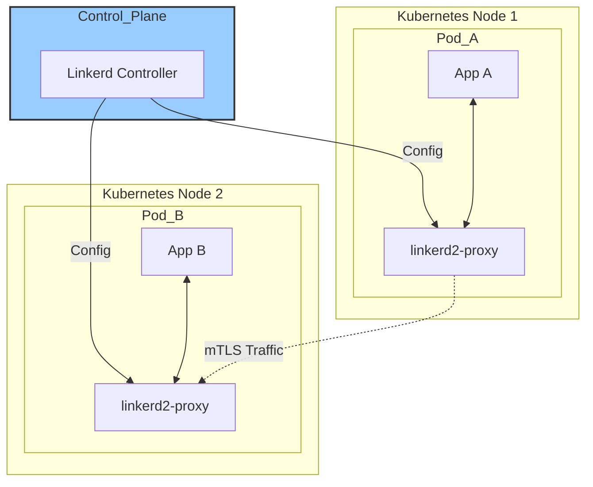

# Linkerd Exploration

[`Linkerd`](https://linkerd.io/) is an open-source **service mesh** for Kubernetes. It is known for its simplicity, performance, and strong focus on security.

## What is Linkerd? (A Simple Explanation)

Like Istio, Linkerd is a service mesh. It adds a layer of control and visibility to your applications by managing the traffic between them. However, Linkerd's core philosophy is to be as simple and lightweight as possible. It aims to give you the most critical features of a service mesh—security, observability, and reliability—with the smallest possible operational burden.

## How Linkerd Works: Micro-proxies and Simplicity

Linkerd's architecture is also composed of a **control plane** and a **data plane**, but with some key differences from other meshes.

1.  **The Data Plane (Linkerd2-proxy):** Instead of using the general-purpose Envoy proxy, Linkerd uses its own custom-built, ultralight "micro-proxy" called `linkerd2-proxy`. This proxy is written in Rust, a language known for memory safety and performance. It is designed to do only what the service mesh needs, making it extremely small and fast. These proxies are injected as sidecars next to your application containers.

2.  **The Control Plane:** This is a set of services that run in their own `linkerd` namespace in your cluster. They provide the "brain" for the mesh, including a component that serves configuration to the data plane proxies.



## Linkerd vs. Istio: A Quick Comparison
*   **Proxy:** Linkerd uses its own Rust-based micro-proxy. Istio uses the more feature-rich (and complex) Envoy proxy.
*   **Philosophy:** Linkerd prioritizes simplicity and "just works" functionality. Istio prioritizes feature-richness and extensibility.
*   **Complexity:** Linkerd is generally considered easier to install and operate, with less configuration required out of the box.

## Conceptual Demo: Traffic Splitting

As with Istio, a full Linkerd installation is best done on your own local cluster. This demo will walk through the conceptual steps and manifest files for achieving a **canary deployment** using Linkerd's traffic splitting feature.

**The Goal:** We will have two versions of a service and use Linkerd to split traffic between them.

### Prerequisites (for running this on your own)
*   A local Kubernetes cluster like [minikube](https://minikube.sigs.k8s.io/docs/start/) or [kind](https://kind.sigs.k8s.io/docs/user/quick-start/).
*   `kubectl` installed.
*   The `linkerd` command-line tool.

### Step 1: Install the Linkerd CLI
First, you would install the Linkerd command-line tool, which helps you manage the installation.
```bash
# To be run in your own terminal
curl --proto '=https' --tlsv1.2 -sSfL https://run.linkerd.io/install | sh
export PATH=$PATH:$HOME/.linkerd2/bin
```

### Step 2: Install the Linkerd Control Plane
Next, you would use the CLI to install the Linkerd control plane onto your cluster.
```bash
# To be run in your own terminal
linkerd install | kubectl apply -f -
linkerd check # This command verifies the installation
```

### Step 3: Deploy Your Application
You would deploy your application (e.g., from a YAML file). Then, you use a special Linkerd command to "inject" it into the mesh. This command automatically adds the necessary annotation to your deployment manifest that tells Linkerd to add the `linkerd2-proxy` sidecar.
```bash
# To be run in your own terminal
kubectl get deploy my-app -o yaml | linkerd inject - | kubectl apply -f -
```

### Step 4: Configure Traffic Splitting with `TrafficSplit`
To split traffic, Linkerd uses a custom resource called `TrafficSplit`.

Imagine you have two services, `my-service-v1` and `my-service-v2`. You would first create a "parent" service that acts as the main entry point. Then, you create a `TrafficSplit` object that directs traffic coming to the parent service to the different versions, assigning a weight to each.

Here is what the manifest would look like:
```yaml
# To be saved as traffic-split.yaml
apiVersion: split.smi-spec.io/v1alpha2
kind: TrafficSplit
metadata:
  name: my-app-split
spec:
  # The "root" or parent service that receives all traffic
  service: my-app-parent-service
  backends:
    # First destination: send 90% of traffic here
  - service: my-service-v1
    weight: 90
    # Second destination: send 10% of traffic here
  - service: my-service-v2
    weight: 10
```
After applying this manifest (`kubectl apply -f traffic-split.yaml`), Linkerd reconfigures the micro-proxies to split the traffic exactly as specified. You didn't need to touch your application code at all.
