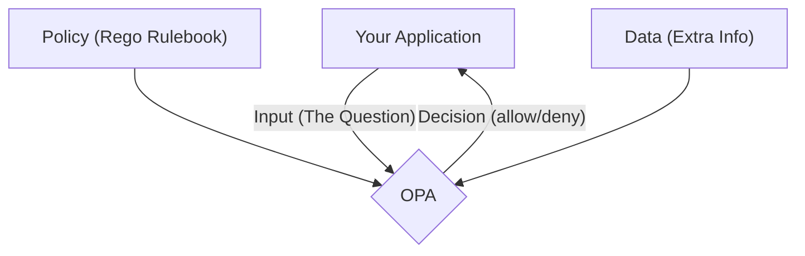

# Open Policy Agent (OPA) Exploration

[`Open Policy Agent`](https://www.openpolicyagent.org/) (OPA) is an open-source, general-purpose **policy engine**.

## What is OPA? (A Simple Explanation)

Imagine you are a security guard for a very large company with many different doors (applications, servers, databases, etc.). Instead of hiring a different guard with a different set of rules for each door, you hire one expert guard, OPA, who has a single, unified rulebook.

OPA is that expert guard. Its job is to make decisions based on a set of rules you give it. You can ask OPA questions like:
*   "Is this user allowed to access this data?"
*   "Does this new server configuration follow our company's security standards?"
*   "Is this Kubernetes object configured correctly?"

Your application (the "door") sends a question to OPA (the "guard"). OPA checks its rulebook and gives back a simple "allow" or "deny" answer. This decouples your application code from your policy logic, making your rules much easier to manage.

## How OPA Works: Rego, Input, and Data

OPA makes decisions based on three things:

1.  **The Policy (written in Rego):** This is the "rulebook." Policies are written in a special-purpose language called **[Rego](https://www.openpolicyagent.org/docs/latest/policy-language/)**. Rego is designed to be very good at asking complex questions about data.

2.  **The Input JSON:** This is the question you are asking. It's a JSON document that describes what you want to do. For example, if you want to create a Kubernetes resource, the "input" would be the YAML/JSON manifest for that resource.

3.  **The Data JSON:** This is optional extra information that OPA might need to make a decision. For example, you could provide a list of approved container registries as "data."



## Verifiable Demo: Validating a Kubernetes Manifest

This demo will provide a simple, verifiable example of using OPA on the command line to validate a piece of configuration. This is a very common use case for developers and DevOps engineers.

**The Goal:** We will create a policy that says "all Kubernetes Deployments must have a `app` label." We will then test this policy against two manifest files: one that is compliant and one that is not.

### How the Demo Works
The `demo.sh` script will automate the following:
1.  **Download OPA**: It will ensure the `opa` command-line tool is available.
2.  **Test the Compliant File**: It will run `opa eval` using our policy against `compliant-deployment.yaml`. This test is expected to **pass**.
3.  **Test the Non-Compliant File**: It will run `opa eval` using the same policy against `non-compliant-deployment.yaml`. This test is expected to **fail** (return an "undefined" result).

### What to Look For (Expected Output)
A successful run will show two different results:
```text
--> Verifying compliant deployment...
--> SUCCESS: OPA evaluation returned 'true', as expected.
--- Result ---
true
---
--> Verifying NON-compliant deployment...
--> SUCCESS: OPA evaluation returned 'undefined' (false), as expected.
--- Result ---
undefined
---
```
The "undefined" result for the non-compliant file is OPA's way of saying "the `allow` rule did not evaluate to true," which is exactly what we want. This proves our policy is working correctly.

### Prerequisites
*   The `opa` CLI is not required; the script will download it if needed.
