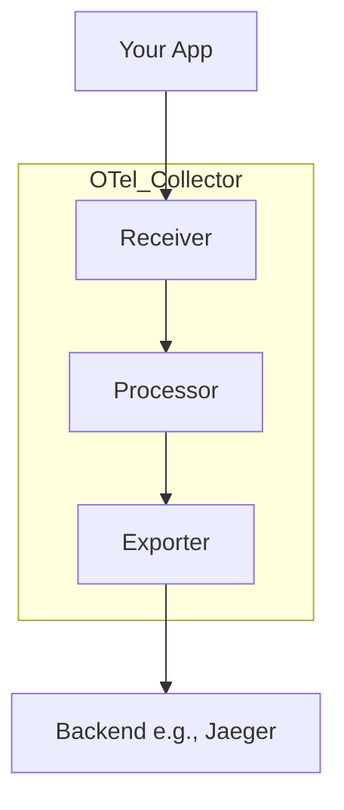

# OpenTelemetry Exploration

[`OpenTelemetry`](https://opentelemetry.io/) (also called OTel) is a set of tools and standards for creating and managing telemetry data—information like traces, metrics, and logs that help us understand what our applications are doing.

## What is OpenTelemetry? (A Simple Explanation)

Think of OpenTelemetry like a universal adapter for your application's data.

1.  **A Standard Language:** Before OTel, every monitoring tool (like Jaeger or Prometheus) had its own way of receiving data. This meant if you wanted to switch tools, you had to rewrite your application's code. OTel creates one single, open-standard "language" for this data.
2.  **Code Libraries (SDKs):** OTel gives you code libraries (SDKs) for many programming languages. You add these to your application to "instrument" it. This code automatically records important events, creating traces (stories of a request) and metrics (measurements).
3.  **Freedom of Choice:** Because your application now "speaks" the standard OpenTelemetry language, you can send its data to *any* tool that also understands this language. You can switch from Jaeger to another tool without changing your application's code at all.

## The OpenTelemetry Collector: A Deeper Look

The **OTel Collector** is a separate application that acts as a powerful "data pipeline" for your telemetry information. Instead of having your applications send data directly to a backend like Jaeger, it is a **best practice** to send it to a Collector first.

The Collector is configured using a single YAML file and is made of three main parts: **Receivers**, **Processors**, and **Exporters**. Data flows through this pipeline.



### 1. Receivers
**What they are:** Receivers are the "front door" of the Collector. Their job is to get data *into* the Collector. You can configure multiple receivers for different formats.
**Example:** In our demo, we configure the `otlp` receiver. This tells the Collector to listen for data coming in using the standard OpenTelemetry Protocol (OTLP). Other receivers exist for Jaeger's old format, Prometheus, and many others.
```yaml
receivers:
  otlp: # Can be any name
    protocols: # We tell the OTLP receiver to listen for...
      grpc: # ...gRPC traffic (on port 4317 by default)
      http: # ...and HTTP traffic (on port 4318 by default)
```

### 2. Processors
**What they are:** Processors are optional steps that can modify, filter, or group data after it's received.
**Example:** We use the `batch` processor. This processor is highly recommended as it takes lots of small data packages and groups them into bigger, more efficient batches before sending them to the backend. This reduces network traffic and is better for performance. Other processors can do things like add extra information to all traces or drop traces that you don't want to keep.
```yaml
processors:
  batch:
```

### 3. Exporters
**What they are:** Exporters are the "back door" of the Collector. Their job is to send the processed data *out* to one or more backends.
**Example:** We configure two exporters:
*   The `debug` exporter simply prints the data to the Collector's logs. This is fantastic for debugging to make sure data is flowing correctly.
*   The `otlp_grpc` exporter forwards the data to our Jaeger backend using the OTLP gRPC format.
```yaml
exporters:
  debug:
    verbosity: detailed
  otlp_grpc:
    endpoint: "jaeger:4317" # The address of the backend
    tls:
      insecure: true # Use encrypted connection in production!
```
### Putting it all together: The `service` Pipeline
The `service` section defines the pipeline by connecting the other components. You can have separate pipelines for traces, metrics, and logs. Here, we define a trace pipeline that uses our `otlp` receiver, `batch` processor, and both of our exporters.
```yaml
service:
  pipelines:
    traces:
      receivers: [otlp]
      processors: [batch]
      exporters: [debug, otlp_grpc]
```

## Verifiable Demo
This demo will show the OTel Collector in action. We will run three containers: a **Go App**, the **OTel Collector**, and **Jaeger**. The app will send its "story" (trace) to the Collector. The Collector will then log the story *and* forward it to Jaeger. We will verify both steps.

### What to Look For (Expected Output)
When you run the `demo.sh` script, it will perform several checks. Here is what a successful run looks like and what it means:

1.  **OTel Collector Logs:** The first verification checks the logs of the OTel Collector. You are looking for a log entry that shows the trace data being received and processed. A successful log will contain a `Trace ID` and the `service.name` we configured (`go-app-service`), like this snippet:
    ```text
    ...
    Resource SchemaURL: https://opentelemetry.io/schemas/1.21.0
    Resource attributes:
         -> service.name: Str(go-app-service)
    ...
    ```
    This proves that the Go App successfully sent its trace data to the Collector.

2.  **Jaeger API Query:** The second verification queries Jaeger's API to confirm it received the trace from the Collector. The script looks for a JSON response containing a `traceID`. A successful output looks like this:
    ```json
    {"data":[{"traceID":"...","spans":[...],"processes":{...}}],"total":1,"limit":1,"offset":0,"errors":null}
    ```
    This proves the Collector successfully forwarded the trace data to Jaeger, completing the pipeline.

### Challenges Faced (A Learning Opportunity)
During the creation of this demo, we faced several real-world issues:
*   **Container DNS:** Initially, we tried to have containers communicate using their names (e.g., `jaeger:4317`). This failed because the container DNS was not reliable in the test environment. We fixed this by using `docker inspect` to get the specific IP address of each container and using that for communication, which is a more robust pattern for scripting.
*   **Service Startup Timing:** The Go App would sometimes fail to start because it tried to connect to the OTel Collector before the Collector was ready. We fixed this by adding a health check loop to the script, which waits until the Collector reports it is "healthy" before starting the app. This is a crucial best practice for multi-service applications.
*   **Configuration Drift:** The `latest` tags on container images can introduce breaking changes. We saw this when the OTel Collector deprecated the `logging` exporter in favor of `debug`. We adapted by updating our configuration, but for production it's best to pin to specific image versions.

### Prerequisites & Security Notes
*   **Docker** is required.
*   **Best Practice - Non-Root Containers**: The Go app runs as a non-root user for better security.
*   **Security Note - Insecure Connections**: For simplicity, this demo sends data over unencrypted connections. In a real-world scenario, you **must** configure TLS to protect your data.
*   **Best Practice - Pinned Versions**: For production, all Docker image versions (e.g., `alpine:latest`) should be pinned to a specific digest (`alpine:3.19@sha256...`) for security and predictable builds.
