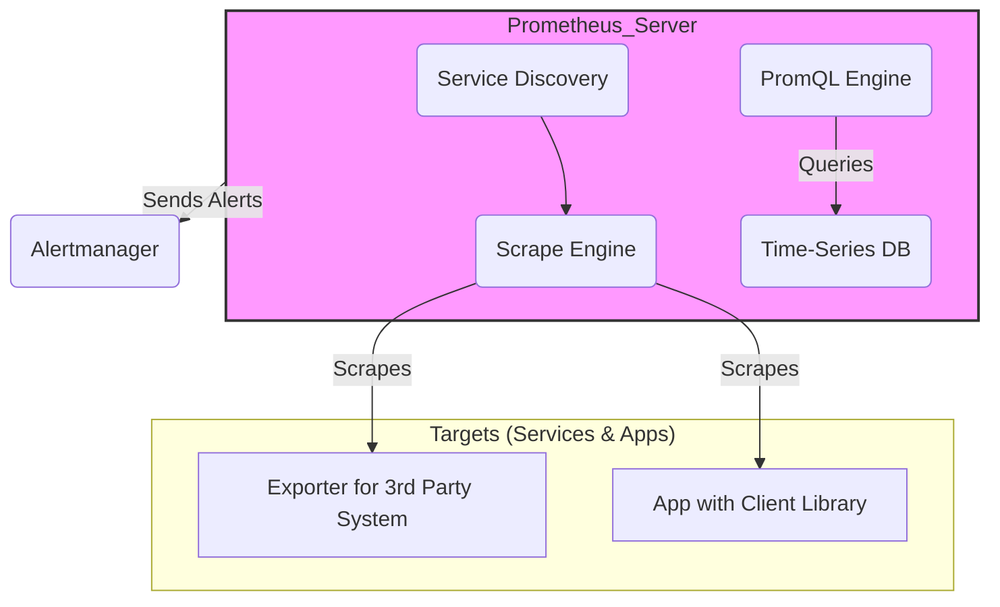

# Prometheus Exploration

[`Prometheus`](https://prometheus.io/) is a leading open-source monitoring and alerting toolkit originally built at SoundCloud. It has become the de-facto standard for metrics-based monitoring in the cloud-native ecosystem.

## Architecture

Prometheus's architecture is based on a pull model. The central Prometheus server scrapes (fetches) metrics from configured targets over HTTP at regular intervals, stores the data in its time-series database, and supports a powerful query language (PromQL) to analyze it.

Key components include:

*   **Prometheus Server**: The core of the system. It handles service discovery, metrics scraping, data storage, and processing queries with PromQL.
*   **Time-Series Database (TSDB)**: A highly efficient, custom-built database stored on the local disk of the server, optimized for time-stamped data.
*   **Exporters**: Services that expose metrics from third-party systems (like databases, hardware, or messaging queues) in the Prometheus format. They act as a translator for systems that don't natively expose Prometheus metrics.
*   **Service Discovery**: Prometheus can dynamically discover targets to scrape from various sources, including Kubernetes, cloud provider APIs, or static configuration files.
*   **Alertmanager**: A separate component that handles alerts sent by the Prometheus server. It takes care of deduplicating, grouping, and routing alerts to the correct notification channels (like email, Slack, or PagerDuty) and manages silencing.
*   **Pushgateway**: A component for short-lived jobs that cannot be scraped. These jobs can push their metrics to the Pushgateway, which Prometheus then scrapes.

## Production Considerations

*   **High Availability (HA)**: For high availability, you run two or more identical Prometheus servers that scrape the same targets. The Alertmanager can then be configured to deduplicate alerts coming from both instances.
*   **Long-Term Storage**: Prometheus's local TSDB is designed for short-to-medium term storage. For long-term storage and a global query view, you need to integrate it with a remote storage solution like Thanos, Cortex, or VictoriaMetrics.
*   **Federation**: Prometheus supports a hierarchical federation model, which allows a global Prometheus server to scrape aggregated time-series data from other, lower-level Prometheus servers. This is useful for scaling to large environments.
*   **Service Discovery is Key**: In dynamic environments like Kubernetes, relying on static scrape configurations is not feasible. Production setups **must** use service discovery (e.g., `kubernetes_sd_configs`) to automatically discover and monitor new pods and services.

## Verifiable Demo

This demo will provide a simple, verifiable example of Prometheus in action. We will:
1.  Use Docker Compose to run three services:
    *   A **Prometheus** instance.
    -   A **Node Exporter** instance, which exposes host-level metrics.
    -   A simple **"instrumented" web application** that exposes its own custom metrics.
2.  Provide a `prometheus.yml` configuration file that tells Prometheus to scrape both the Node Exporter and the web app.
3.  Verify that Prometheus is running and successfully scraping its targets by checking its web UI.
4.  Execute a simple PromQL query in the UI to confirm that data is being collected.
5.  Clean up the environment.

### Prerequisites
*   Docker and Docker Compose.
