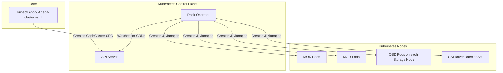

# Rook Exploration

[`Rook`](https://rook.io/) is an open-source cloud-native storage orchestrator for Kubernetes. It provides a framework to build storage operators, with its most mature and popular implementation being the operator for Ceph. Rook is a CNCF Graduated project.

## What Problem Does Rook Solve?

While Kubernetes provides a powerful platform for running stateless applications, managing stateful applications, especially those requiring persistent and resilient storage, is complex. Rook solves this by extending Kubernetes with custom resource definitions (CRDs) and an operator to automate the deployment, configuration, and management of distributed storage systems like Ceph.

It turns a complex storage system into a self-managing, self-scaling, and self-healing service within your Kubernetes cluster, providing:
*   Block storage for Pods (`ReadWriteOnce`).
*   Shared file storage for Pods (`ReadWriteMany`).
*   S3-compatible object storage.

## Architecture & Components: The Operator Model

Rook follows the Kubernetes operator pattern. The core component is the Rook Operator, which runs as a Pod in the cluster. It watches for Rook-specific CRDs (like `CephCluster`, `CephBlockPool`, etc.) and takes action to make the desired state a reality.

The main components deployed and managed by the Rook Operator for a Ceph cluster are:
*   **Rook Operator:** The main control loop that automates everything.
*   **MONs (Monitors):** Maintain the map of the Ceph cluster state.
*   **MGRs (Managers):** Provide additional management and monitoring services.
*   **OSDs (Object Storage Daemons):** The core component that stores the actual data on a physical or virtual disk.
*   **CSI Driver:** The Container Storage Interface (CSI) driver that allows Kubernetes Pods to consume storage provisioned by Rook/Ceph.

## Verifiable Demo

> **Demo Status: Unsuccessful**
> A verifiable demo for Rook was attempted but was not successful due to persistent environment and resource issues within the Minikube setup. The complexity of running a distributed storage system like Ceph within a resource-constrained local environment proved to be unstable.
