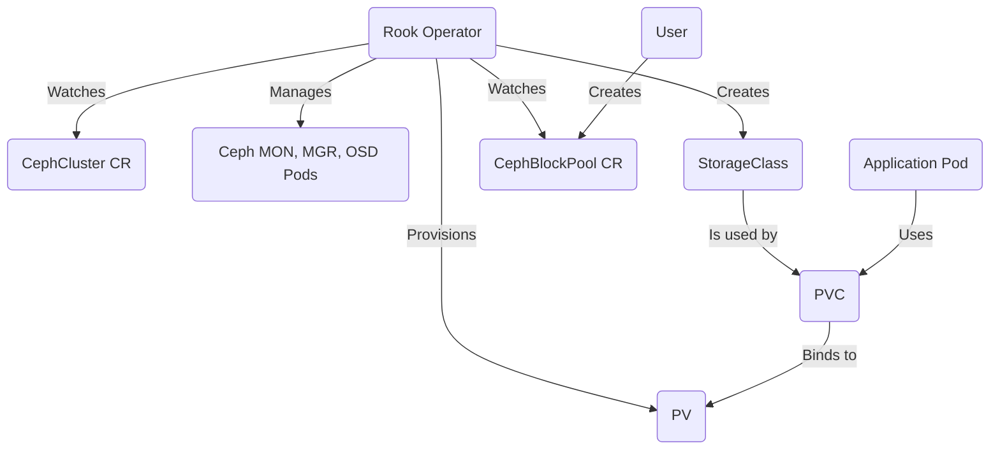

# Rook Exploration

[`Rook`](https://rook.io/) is an open-source **cloud-native storage orchestrator** for Kubernetes. It turns distributed storage systems (like Ceph, a popular open-source storage platform) into self-managing, self-scaling, and self-healing storage services. Rook is a CNCF Graduated project.

## What Problem Does Rook Solve?

While Kubernetes is excellent at managing stateless applications, managing stateful applications, especially those that require persistent storage, can be very complex. Kubernetes provides basic storage primitives like `PersistentVolumes` (PVs) and `PersistentVolumeClaims` (PVCs), but it doesn't provide the actual storage itself. You need a separate storage system.

Setting up and managing a distributed storage system like Ceph is a highly specialized and difficult task, requiring deep expertise.

Rook solves this problem by automating the entire lifecycle of a storage cluster within Kubernetes. It uses the power of the Kubernetes operator pattern to handle the deployment, configuration, scaling, and management of the storage software. In simple terms, **Rook makes it easy to run a production-grade storage system inside your Kubernetes cluster.**

### Use Cases
Rook provides three main types of storage that can be consumed by your applications:
*   **Block Storage:** Provides a block device that can be attached to a single pod (ReadWriteOnce), similar to an AWS EBS volume or a traditional SAN. This is perfect for databases like PostgreSQL or MySQL.
*   **Shared Filesystem:** Provides a network filesystem that can be mounted by many pods simultaneously (ReadWriteMany), similar to AWS EFS or an NFS share. This is great for web servers that need to share content or for applications that need concurrent access to the same data.
*   **Object Storage:** Provides an S3-compatible object storage service, similar to AWS S3 or MinIO. This is ideal for storing backups, images, videos, and other unstructured data.

## Architecture & Components (with Ceph)

Rook uses an operator to manage a Ceph cluster. Ceph is a powerful, distributed storage system that provides all three types of storage.

1.  **Rook Operator:** This is the brain of the system. It's a pod running in your cluster that watches for Rook's custom resources (CRDs).
2.  **`CephCluster` CRD:** This is the primary resource you create. It tells the Rook Operator to deploy and manage a full Ceph cluster. The operator will automatically create all the necessary pods for the Ceph components.
3.  **Ceph Components (managed by the Operator):**
    *   **MONs (Monitors):** Maintain the map of the cluster state.
    *   **MGRs (Managers):** Provide additional management and monitoring services.
    *   **OSDs (Object Storage Daemons):** These are the workhorses. Each OSD is responsible for storing data on a physical disk. The operator creates one OSD pod for each available disk or directory you provide.
4.  **`CephBlockPool` & `StorageClass`:** After the cluster is running, you create a `CephBlockPool` resource. This tells Ceph to create a pool for storing block data. The Rook Operator then creates a corresponding Kubernetes `StorageClass`.
5.  **`PersistentVolumeClaim` (PVC):** Your applications can now request storage by creating a standard Kubernetes PVC that references the `StorageClass` created by Rook. Rook will automatically provision a `PersistentVolume` (PV) from the block pool and bind it to the PVC.



## Verifiable Demo: Dynamic Provisioning of Block Storage

This demo will provide a realistic example of using Rook to provide persistent block storage for an application.

### Manual Walkthrough

#### Step 1: Start Minikube & Install Rook
This will start a new cluster and clone the Rook repository, as the installation is done via standard manifests.

```bash
# Start Minikube with sufficient resources
minikube start --profile rook-demo --cpus 4 --memory 8192

# Clone the Rook repository
git clone --single-branch --branch v1.14.0 https://github.com/rook/rook.git
cd rook/deploy/examples
```

#### Step 2: Install the Rook Operator and Cluster
We will now apply the manifests to create the Rook system namespaces, the operator, and a simple Ceph cluster.

```bash
# Install the CRDs and the Rook Operator
kubectl apply -f crds.yaml
kubectl apply -f common.yaml
kubectl apply -f operator.yaml

# Install the Ceph Cluster
# This manifest is configured for a simple, single-node cluster like Minikube
kubectl apply -f cluster.yaml
```

#### Step 3: Verify the Installation
Wait for all the Rook and Ceph pods to be ready. This can take several minutes as many components are started.

```bash
# Watch the pods in the rook-ceph namespace until they are all Running/Completed
kubectl get pods -n rook-ceph -w
```

#### Step 4: Create the StorageClass
Now we create the resources that allow our applications to request storage.

```bash
# Create the Block Pool and corresponding StorageClass
kubectl apply -f storageclass.yaml
```

#### Step 5: Create an Application with a PersistentVolumeClaim
We will deploy a simple MySQL database that requests persistent storage using the `StorageClass` we just created.

Create a file named `mysql.yaml` in the same directory (`rook/deploy/examples`):
```yaml
apiVersion: v1
kind: PersistentVolumeClaim
metadata:
  name: mysql-pv-claim
spec:
  storageClassName: rook-ceph-block
  accessModes:
    - ReadWriteOnce
  resources:
    requests:
      storage: 1Gi
---
apiVersion: apps/v1
kind: Deployment
metadata:
  name: mysql
spec:
  selector:
    matchLabels:
      app: mysql
  template:
    metadata:
      labels:
        app: mysql
    spec:
      containers:
      - name: mysql
        image: mysql:8.0
        env:
        - name: MYSQL_ROOT_PASSWORD
          value: "password"
        ports:
        - containerPort: 3306
        volumeMounts:
        - name: mysql-persistent-storage
          mountPath: /var/lib/mysql
      volumes:
      - name: mysql-persistent-storage
        persistentVolumeClaim:
          claimName: mysql-pv-claim
```
Apply it to the cluster:
```bash
kubectl apply -f mysql.yaml
```

#### Step 6: Verify the Storage
1.  **Check the PVC:** Verify that your `PersistentVolumeClaim` was successfully created and bound to a `PersistentVolume`.
    ```bash
    kubectl get pvc mysql-pv-claim
    ```
    The status should be `Bound`.

2.  **Check the Pod:** Wait for the MySQL pod to start.
    ```bash
    kubectl get pods -w
    ```
    Once the MySQL pod is `Running`, it means it has successfully mounted the persistent block storage provided by Rook/Ceph. This proves the entire workflow is functional.

#### Step 7: Cleanup
```bash
# Navigate out of the rook directory before deleting the cluster
cd ../../..
minikube delete --profile rook-demo
rm -rf rook
```
