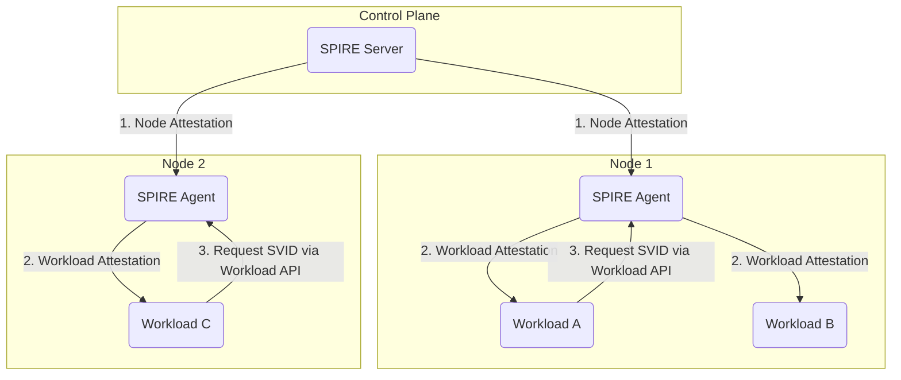

# SPIFFE Exploration

[`SPIFFE`](https://spiffe.io/) (the **S**ecure **P**roduction **I**dentity **F**ramework **F**or **E**veryone) is a set of open-source standards for securely identifying software systems in dynamic and heterogeneous environments. SPIFFE is a CNCF Graduated project.

## What Problem Does SPIFFE Solve?

In a modern, cloud-native environment (like Kubernetes), services are ephemeral and dynamic. A pod's IP address can change every time it restarts, and it can be running on any number of nodes. This makes traditional methods of identification, like IP-based firewall rules or access control lists (ACLs), very difficult to manage and insecure.

How can `Service A` securely prove its identity to `Service B` and establish a trusted connection, without relying on IP addresses or network location?

SPIFFE solves this "service identity" problem by providing a framework for establishing a strong, provable, and short-lived cryptographic identity for every workload (e.g., a pod, a virtual machine, or a process).

### Use Cases
*   **Zero-Trust Networking:** Instead of trusting the network, services can establish trust directly with each other using cryptographic proof of identity.
*   **Secure Service-to-Service Communication (mTLS):** Services can get TLS certificates based on their SPIFFE ID to encrypt all communication.
*   **Securely Issuing Secrets:** A secret management tool (like HashiCorp Vault) can issue secrets only to workloads that present a valid and expected SPIFFE ID.
*   **Cross-Cluster/Cross-Cloud Communication:** SPIFFE provides a universal identity plane that can work across different Kubernetes clusters, clouds, and even on-premise environments.

## Architecture & Components (SPIFFE & SPIRE)

SPIFFE is the *standard*, and **SPIRE** (**S**PIFFE **R**untime **E**nvironment) is the production-ready *implementation* of that standard. When we talk about the architecture, we are talking about SPIRE.

1.  **SPIRE Server:** This is the central component and acts as the Certificate Authority (CA) for the identity domain. It is responsible for minting and signing all the identities. It exposes the Registration API.
2.  **SPIRE Agent:** A daemon that runs on every node where a workload needs an identity. The agent's job is to:
    *   Attest the identity of the node itself to the SPIRE Server.
    *   Discover the workloads running on the node.
    *   Attest the identity of those workloads (e.g., by asking the `kubelet` what pod is running with a given process ID).
    *   Expose the **Workload API** to those workloads.
3.  **Workload API:** A local Unix Domain Socket (UDS) that workloads can connect to. Workloads use this API to request their identity documents from the local SPIRE Agent.
4.  **SVID (SPIFFE Verifiable Identity Document):** The actual identity document. It is a short-lived X.509 certificate (or a JWT) with a special URI in the subject field, known as the **SPIFFE ID**.
    *   Example SPIFFE ID: `spiffe://example.org/ns/default/pod/my-app`



## Verifiable Demo: Obtaining a Workload SVID

This demo will provide a verifiable, local example of the core SPIRE workflow. We will run the SPIRE Server and Agent locally (as processes, not in Kubernetes) and register a workload to see it receive its unique SPIFFE ID.

### Manual Walkthrough

#### Step 1: Download and Extract SPIRE
We will download the SPIRE binaries for this demo.

```bash
# Download the SPIRE 1.8.3 binaries for Linux
curl -L https://github.com/spiffe/spire/releases/download/v1.8.3/spire-1.8.3-linux-amd64-musl.tar.gz -o spire.tar.gz

# Extract the binaries
tar -xzf spire.tar.gz
```

#### Step 2: Start the SPIRE Server
**Open a new terminal for this and leave it running.** This terminal will be our SPIRE Server.

```bash
# Navigate into the extracted directory
cd spire-1.8.3

# Start the SPIRE Server in the foreground
./bin/spire-server run
```
You will see the server start up and listen for connections.

#### Step 3: Start the SPIRE Agent
**Open another new terminal.** This terminal will be our SPIRE Agent.

```bash
# Navigate into the extracted directory
cd spire-1.8.3

# The agent needs a "join token" to prove its identity to the server.
# Go to your SERVER terminal and run this command to generate a token:
./bin/spire-server token generate -spiffeID spiffe://example.org/my-agent

# It will output a token. Copy it.

# Now, back in your AGENT terminal, start the agent, pasting the token you just copied:
./bin/spire-agent run -joinToken <YOUR_TOKEN_HERE>
```
You will see the agent start up and connect to the server.

#### Step 4: Register a Workload
Now we need to tell the SPIRE Server what a valid workload looks like. We will register a workload based on its Unix group ID.

1.  **Find your user's group ID:** In any terminal, run the command `id -g`. This will output a number (e.g., `1000`).
2.  **Register the workload:** In your **SERVER terminal**, run the following command, replacing `1000` with the group ID you just found. This command tells the server, "Any process running under group ID `1000` should be given the SPIFFE ID `spiffe://example.org/my-workload`."
    ```bash
    ./bin/spire-server entry create \
        -spiffeID spiffe://example.org/my-workload \
        -parentID spiffe://example.org/my-agent \
        -selector unix:gid:1000
    ```

#### Step 5: Fetch the Workload's Identity (SVID)
Finally, we will act as the workload and ask the SPIRE Agent for our identity.

In your **AGENT terminal** (or any other terminal), run this command:
```bash
# Navigate into the extracted directory
cd spire-1.8.3

# Use the spire-agent API to fetch the SVID for our workload
./bin/spire-agent api fetch x509
```
The command will successfully connect to the agent's Workload API and print the signed X.509 certificate (the SVID) to the console. The output will include the certificate chain and will show a `SPIFFE ID` of `spiffe://example.org/my-workload`. This proves the entire workflow is functional.

#### Step 6: Cleanup
1.  Press `Ctrl+C` in the SERVER and AGENT terminals to stop the processes.
2.  You can remove the `spire-1.8.3` directory and the `spire.tar.gz` file.
```bash
rm -rf spire-1.8.3 spire.tar.gz
```
