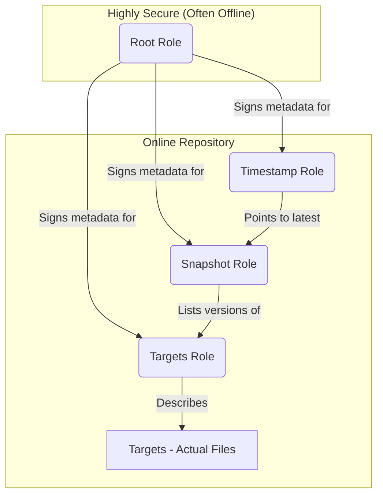

# TUF (The Update Framework) Exploration

[`TUF`](https://theupdateframework.io/) is a security framework that protects software update systems from a wide range of attacks, including those that compromise the repository or signing keys. TUF provides a flexible framework and specification that developers can adopt into any software update system. TUF is a CNCF Graduated project.

## What Problem Does TUF Solve?

When a user downloads a software update, how can they be sure it's the correct, untampered-with software? Attackers can compromise repository servers, signing keys, or intercept network traffic to deliver malicious updates. TUF is designed to mitigate these risks by providing a resilient system of trust.

It protects against:
*   **Arbitrary software installation:** An attacker cannot install arbitrary software on a user's machine.
*   **Rollback attacks:** An attacker cannot trick a client into installing an older, potentially vulnerable version of a package.
*   **Indefinite freeze attacks:** An attacker cannot prevent a user from receiving new updates indefinitely.
*   **Key compromise:** The system remains secure even if some signing keys are compromised, thanks to a separation of roles and key rotation capabilities.

## Architecture & Components: Roles and Trust

TUF's security is built on a separation of duties. It defines several roles, each with its own signing key and a specific set of responsibilities. This limits the impact of a key compromise; an attacker who steals one key can only perform the limited actions of that role.

The core roles are:
*   **Root:** The root of trust. Its only job is to sign the metadata for the other top-level roles. It is kept highly secure and often offline.
*   **Timestamp:** Signs a file containing the latest snapshot checksum, protecting against freeze attacks. It is frequently resigned.
*   **Snapshot:** Signs a file that lists the versions of all other metadata files (except `timestamp.json`), protecting against mix-and-match attacks.
*   **Targets:** Signs the metadata that describes the actual content (the "targets" or files) available for download. This is where you find the file hashes and sizes.



## Verifiable Demo: Securing a File with python-tuf

> **Demo Status: Unsuccessful**
> The following demo could not be successfully run due to persistent Python environment issues with the `securesystemslib` dependency (`ModuleNotFoundError`). The steps and code below represent a theoretically correct walkthrough based on the library's documentation and API for `tuf==6.0.0`, but could not be verified in practice.

This demo will provide a hands-on example of using the `python-tuf` library to create a secure TUF repository and then use a client to verify and download a file.

### Manual Walkthrough

#### Step 1: Setup and Installation

This demo requires Python and the `tuf` library. We will also create a directory structure to represent the repository and the client.

```bash
# Install python-tuf
pip install tuf

# Create the directory structure
mkdir -p tuf/demo/repository/staged/targets
mkdir -p tuf/demo/client
touch tuf/demo/repository/staged/targets/myfile.txt
echo "This is a test file" > tuf/demo/repository/staged/targets/myfile.txt
```

#### Step 2: Create the TUF Repository

We will use a Python script to programmatically create the TUF repository, generate the keys for each role, and sign the initial metadata.

Create a file named `tuf/demo/create_repository.py` with the following content:

```python
from datetime import datetime, timezone
import os

from securesystemslib.interface import (
    generate_and_write_ecdsa_keypair,
    import_ecdsa_privatekey_from_file,
)
from tuf.api.metadata import Root, Snapshot, Targets, Timestamp

# Create directories
repository_dir = os.path.abspath("repository/staged")
keystore_dir = os.path.abspath("keystore")
metadata_dir = os.path.join(repository_dir, "metadata")
targets_dir = os.path.join(repository_dir, "targets")
os.makedirs(keystore_dir, exist_ok=True)


# 1. Create keys and a root metadata file
root_path = os.path.join(keystore_dir, "root")
targets_path = os.path.join(keystore_dir, "targets")
snapshot_path = os.path.join(keystore_dir, "snapshot")
timestamp_path = os.path.join(keystore_dir, "timestamp")

root_key = generate_and_write_ecdsa_keypair(root_path, password="password")
targets_key = generate_and_write_ecdsa_keypair(targets_path, password="password")
snapshot_key = generate_and_write_ecdsa_keypair(snapshot_path, password="password")
timestamp_key = generate_and_write_ecdsa_keypair(timestamp_path, password="password")

root = Root(
    expires=datetime.now(timezone.utc).replace(microsecond=0) + (datetime(2030, 1, 1, 0, 0) - datetime.now()),
)
root.add_key(root_key, "root")
root.add_key(targets_key, "targets")
root.add_key(snapshot_key, "snapshot")
root.add_key(timestamp_key, "timestamp")

root.add_role("root", [root_key.keyid], 1)
root.add_role("targets", [targets_key.keyid], 1)
root.add_role("snapshot", [snapshot_key.keyid], 1)
root.add_role("timestamp", [timestamp_key.keyid], 1)

root_priv_key = import_ecdsa_privatekey_from_file(root_path, password="password")
root.sign(root_priv_key)
root.to_file(os.path.join(metadata_dir, "root.json"))

# 2. Create and sign other metadata
targets = Targets()
targets.add_target("myfile.txt", os.path.join(targets_dir, "myfile.txt"))
targets_priv_key = import_ecdsa_privatekey_from_file(targets_path, password="password")
targets.sign(targets_priv_key)
targets.to_file(os.path.join(metadata_dir, "targets.json"))

snapshot = Snapshot()
snapshot.add_meta("targets.json", targets.version)
snapshot_priv_key = import_ecdsa_privatekey_from_file(snapshot_path, password="password")
snapshot.sign(snapshot_priv_key)
snapshot.to_file(os.path.join(metadata_dir, "snapshot.json"))

timestamp = Timestamp()
timestamp.add_meta("snapshot.json", snapshot.version)
timestamp_priv_key = import_ecdsa_privatekey_from_file(timestamp_path, password="password")
timestamp.sign(timestamp_priv_key)
timestamp.to_file(os.path.join(metadata_dir, "timestamp.json"))

print("TUF repository created and signed.")
```

Run the script to create the repository:

```bash
python tuf/demo/create_repository.py
```

#### Step 3: Run the TUF Client

Now, we will simulate a client that wants to securely download `myfile.txt`. The client will need the `root.json` file to begin the chain of trust.

Create a file named `tuf/demo/run_client.py` with the following content:

```python
import os
import shutil
from tuf.ngclient import Updater

# Setup the client environment
client_dir = os.path.abspath("client")
repository_dir = os.path.abspath("repository/staged")
metadata_dir = os.path.join(client_dir, "metadata")
targets_dir = os.path.join(client_dir, "targets")

# Create directories
os.makedirs(metadata_dir, exist_ok=True)
os.makedirs(targets_dir, exist_ok=True)

# The client must be bootstrapped with the root metadata file
shutil.copy(
    os.path.join(repository_dir, "metadata", "root.json"),
    os.path.join(metadata_dir, "root.json"),
)

# Instantiate the updater
updater = Updater(
    metadata_dir=metadata_dir,
    metadata_base_url=f"file://{repository_dir}/metadata",
    target_dir=targets_dir,
    target_base_url=f"file://{repository_dir}/targets",
)

# Refresh the metadata to get the latest versions
updater.refresh()

# Download the target file
target_info = updater.get_targetinfo("myfile.txt")
if target_info:
    path = updater.download_target(target_info)
    print(f"Successfully downloaded and verified: {path}")

    with open(path, "r") as f:
        print(f"File content: {f.read()}")
else:
    print("Target not found.")

```

Run the client script:

```bash
python tuf/demo/run_client.py
```

You should see output confirming that the file was successfully downloaded and verified, along with its content. This proves that the TUF client was able to use the chain of trust, starting from `root.json`, to securely download the target file.

#### Step 4: Cleanup

```bash
rm -rf tuf/
```
